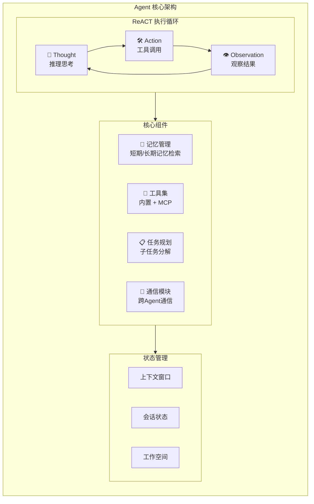
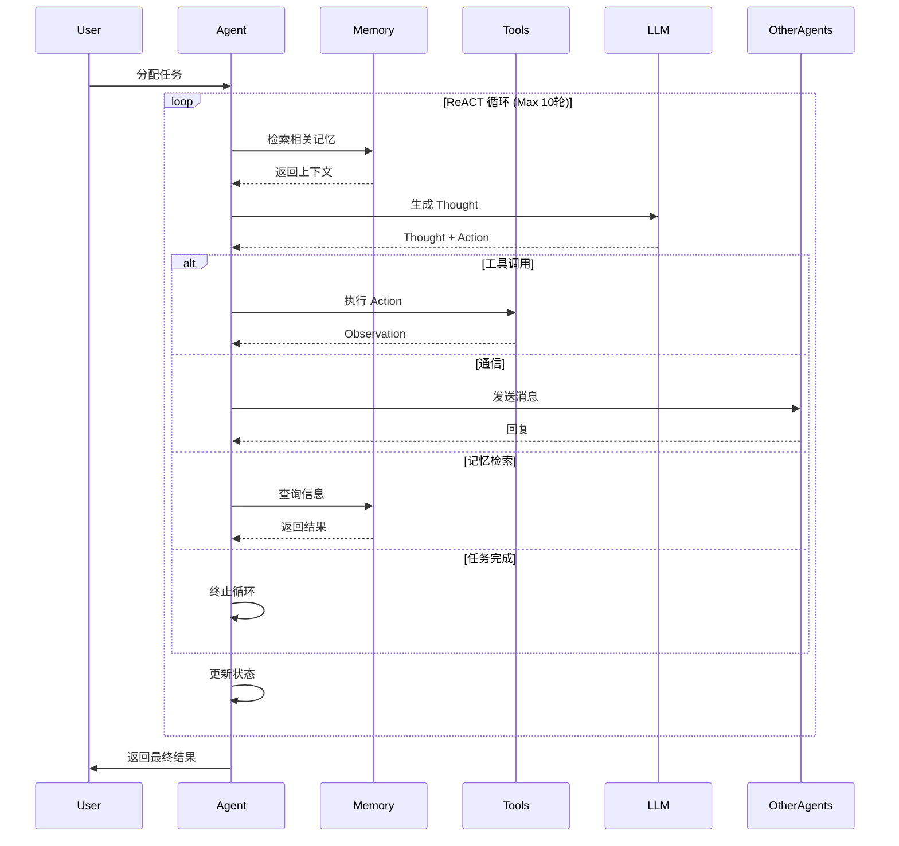
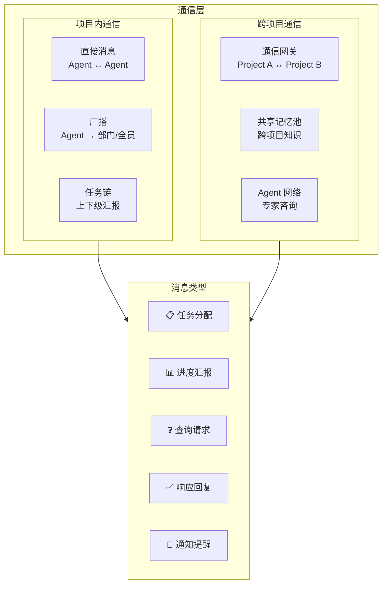
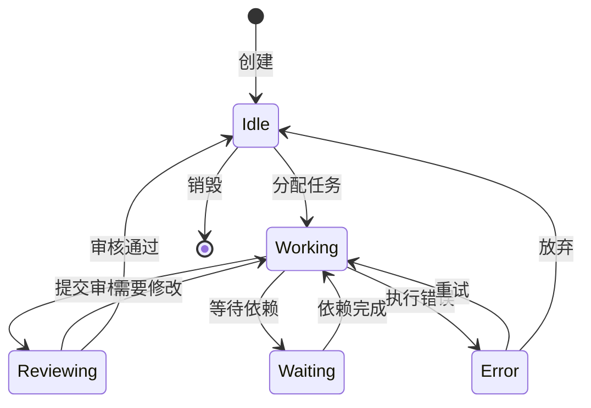

# BeesTown Agent 架构设计

## 1. 概述

BeesTown Agent 采用 **ReACT (Reasoning + Acting)** 模式，结合工具调用和记忆检索，实现自主决策和任务执行。同时支持跨项目 Agent 通信，构建分布式协作网络。



---

## 2. ReACT 执行模式

### 2.1 ReACT 循环定义

```typescript
interface ReACTLoop {
  // 思考阶段：分析当前状态，决定下一步行动
  think(state: AgentState): Promise<Thought>;
  
  // 行动阶段：执行工具调用
  act(thought: Thought): Promise<ActionResult>;
  
  // 观察阶段：处理执行结果
  observe(result: ActionResult): Promise<Observation>;
  
  // 循环控制
  shouldContinue(observation: Observation): boolean;
}

interface Thought {
  content: string;           // 思考内容
  reasoning: string;         // 推理过程
  plan: string[];            // 执行计划
  nextAction: Action;        // 下一步行动
  confidence: number;        // 置信度
}

interface Action {
  type: 'tool_call' | 'communicate' | 'retrieve_memory' | 'delegate' | 'complete';
  target?: string;           // 目标（工具名/Agent ID）
  parameters: Record<string, any>;
  expectedOutcome: string;
}

interface Observation {
  success: boolean;
  result: any;
  error?: string;
  learnings: string[];
}
```

### 2.2 ReACT 执行流程



### 2.3 ReACT Agent 实现

```typescript
class ReACTAgent {
  private id: string;
  private config: AgentConfig;
  private memory: AgentMemory;
  private toolRegistry: ToolRegistry;
  private communicator: AgentCommunicator;
  private llm: LLMClient;
  
  private state: AgentState = {
    status: 'idle',
    currentTask: null,
    context: [],
    iterationCount: 0
  };

  async execute(task: Task): Promise<TaskResult> {
    this.state.status = 'working';
    this.state.currentTask = task;
    
    const maxIterations = 10;
    const context: ReACTContext = {
      task,
      history: [],
      memories: await this.loadRelevantMemories(task)
    };

    try {
      while (this.state.iterationCount < maxIterations) {
        // 1. Thought: 推理思考
        const thought = await this.think(context);
        
        // 2. Action: 执行行动
        const actionResult = await this.act(thought);
        
        // 3. Observation: 观察结果
        const observation = await this.observe(actionResult);
        
        // 更新上下文
        context.history.push({ thought, actionResult, observation });
        this.state.iterationCount++;
        
        // 检查是否完成
        if (thought.nextAction.type === 'complete' || observation.success && this.isTaskComplete(context)) {
          return this.finalizeTask(context, 'completed');
        }
        
        // 检查是否卡住
        if (this.isStuck(context)) {
          return this.finalizeTask(context, 'stuck');
        }
      }
      
      return this.finalizeTask(context, 'max_iterations');
      
    } catch (error) {
      return this.finalizeTask(context, 'error', error);
    } finally {
      this.state.status = 'idle';
      this.state.iterationCount = 0;
    }
  }

  private async think(context: ReACTContext): Promise<Thought> {
    const prompt = this.buildThoughtPrompt(context);
    
    const response = await this.llm.complete({
      model: this.config.model,
      messages: [
        { role: 'system', content: this.config.systemPrompt },
        { role: 'user', content: prompt }
      ],
      tools: this.toolRegistry.getToolDescriptions(),
      temperature: 0.7
    });

    return this.parseThought(response);
  }

  private async act(thought: Thought): Promise<ActionResult> {
    const action = thought.nextAction;
    
    switch (action.type) {
      case 'tool_call':
        return await this.toolRegistry.execute(action.target!, action.parameters);
        
      case 'communicate':
        return await this.communicator.sendMessage(
          action.target!,
          action.parameters.message,
          action.parameters.context
        );
        
      case 'retrieve_memory':
        const memories = await this.memory.retrieve(action.parameters.query);
        return { success: true, result: memories };
        
      case 'delegate':
        return await this.delegateTask(action.target!, action.parameters);
        
      case 'complete':
        return { success: true, result: action.parameters.result };
        
      default:
        throw new Error(`Unknown action type: ${action.type}`);
    }
  }

  private async observe(result: ActionResult): Promise<Observation> {
    // 分析执行结果
    const observation: Observation = {
      success: result.success,
      result: result.result,
      error: result.error,
      learnings: []
    };

    // 提取学习点
    if (result.success) {
      observation.learnings = await this.extractLearnings(result);
    }

    // 存储到记忆
    await this.memory.store({
      type: 'observation',
      content: JSON.stringify(observation),
      importance: result.success ? 0.5 : 0.8
    });

    return observation;
  }

  private buildThoughtPrompt(context: ReACTContext): string {
    return `
你是 ${this.config.name}，角色是 ${this.config.role}。

当前任务：${context.task.description}

相关记忆：
${context.memories.map(m => `- ${m.content}`).join('\n')}

执行历史：
${context.history.map((h, i) => `
第${i + 1}轮：
思考：${h.thought.content}
行动：${JSON.stringify(h.thought.nextAction)}
结果：${h.observation.success ? '成功' : '失败'} - ${JSON.stringify(h.observation.result)}
`).join('\n')}

请分析当前情况，决定下一步行动：
1. Thought: 你的推理过程
2. Action: 下一步要执行的行动（tool_call / communicate / retrieve_memory / delegate / complete）
3. 如果是工具调用，指定工具名称和参数

以 JSON 格式返回你的决策。
    `.trim();
  }

  private isStuck(context: ReACTContext): boolean {
    // 检测是否陷入循环或卡住
    const recentHistory = context.history.slice(-3);
    
    // 检查重复动作
    const actions = recentHistory.map(h => JSON.stringify(h.thought.nextAction));
    if (new Set(actions).size === 1 && actions.length === 3) {
      return true;
    }
    
    // 检查无进展
    if (recentHistory.every(h => !h.observation.success)) {
      return true;
    }
    
    return false;
  }

  private isTaskComplete(context: ReACTContext): boolean {
    // 使用 LLM 判断任务是否完成
    // 简化版：检查是否有明确的完成标记
    const lastObservation = context.history[context.history.length - 1]?.observation;
    return lastObservation?.result?.taskComplete === true;
  }
}
```

---

## 3. 跨项目 Agent 通信

### 3.1 通信架构



### 3.2 通信协议

```typescript
interface AgentMessage {
  id: string;                    // 消息唯一ID
  
  // 路由信息
  header: {
    from: AgentAddress;          // 发送方地址
    to: AgentAddress;            // 接收方地址
    timestamp: number;
    priority: 'low' | 'normal' | 'high' | 'urgent';
    ttl: number;                 // 生存时间
  };
  
  // 消息内容
  body: {
    type: MessageType;
    content: string;
    payload?: any;               // 附加数据
    context?: MessageContext;    // 上下文信息
  };
  
  // 元数据
  meta: {
    threadId?: string;           // 对话线程ID
    replyTo?: string;            // 回复哪条消息
    taskId?: string;             // 关联任务ID
    projectId?: string;          // 关联项目ID
  };
}

interface AgentAddress {
  projectId: string;
  agentId: string;
  departmentId?: string;
}

type MessageType = 
  | 'task_assignment'      // 任务分配
  | 'task_report'          // 任务汇报
  | 'query'                // 查询请求
  | 'response'             // 响应回复
  | 'notification'         // 通知
  | 'consultation'         // 咨询请求
  | 'knowledge_share';     // 知识分享

interface MessageContext {
  urgency: number;             // 紧急程度 0-1
  requiresResponse: boolean;   // 是否需要回复
  responseDeadline?: number;   // 回复截止时间
  relatedFiles?: string[];     // 相关文件
  relatedMemories?: string[];  // 相关记忆ID
}
```

### 3.3 通信管理器

```typescript
class AgentCommunicator {
  private messageQueue: MessageQueue;
  private storage: BeesTownStorage;
  private eventBus: EventBus;
  
  // 消息处理器映射
  private handlers: Map<MessageType, MessageHandler> = new Map();

  constructor(config: CommunicatorConfig) {
    this.messageQueue = new MessageQueue();
    this.storage = config.storage;
    this.eventBus = config.eventBus;
    
    this.setupDefaultHandlers();
    this.startMessageProcessor();
  }

  // 发送消息
  async sendMessage(
    to: AgentAddress,
    content: string,
    options: SendOptions = {}
  ): Promise<MessageResult> {
    const message: AgentMessage = {
      id: generateId(),
      header: {
        from: this.getSelfAddress(),
        to,
        timestamp: Date.now(),
        priority: options.priority || 'normal',
        ttl: options.ttl || 24 * 60 * 60 * 1000
      },
      body: {
        type: options.type || 'notification',
        content,
        payload: options.payload,
        context: options.context
      },
      meta: {
        threadId: options.threadId,
        replyTo: options.replyTo,
        taskId: options.taskId,
        projectId: options.projectId
      }
    };

    // 存储消息
    await this.storage.storeMessage(message);
    
    // 如果是同项目，直接投递
    if (message.header.to.projectId === this.getSelfAddress().projectId) {
      await this.deliverLocal(message);
    } else {
      // 跨项目通信
      await this.deliverCrossProject(message);
    }

    return { success: true, messageId: message.id };
  }

  // 接收消息
  async receiveMessage(agentId: string): Promise<AgentMessage[]> {
    return await this.storage.getUnreadMessages(agentId);
  }

  // 广播消息（部门/项目）
    async broadcast(
    scope: 'department' | 'project' | 'all',
    content: string,
    options: BroadcastOptions = {}
  ): Promise<void> {
    const targets = await this.getBroadcastTargets(scope, options);
    
    for (const target of targets) {
      await this.sendMessage(target, content, {
        ...options,
        type: 'notification'
      });
    }
  }

  // 咨询专家（跨项目）
  async consultExpert(
    expertise: string,
    question: string,
    options: ConsultOptions = {}
  ): Promise<ConsultationResult> {
    // 查找具有相关专长的 Agent
    const experts = await this.findExperts(expertise, options);
    
    if (experts.length === 0) {
      return { success: false, error: 'No expert found' };
    }

    // 向专家发送咨询请求
    const responses = await Promise.all(
      experts.map(expert => 
        this.sendMessage(expert, question, {
          type: 'consultation',
          priority: 'high',
          context: {
            requiresResponse: true,
            responseDeadline: Date.now() + (options.timeout || 5 * 60 * 1000)
          }
        })
      )
    );

    // 等待回复
    const answers = await this.waitForResponses(
      responses.map(r => r.messageId),
      options.timeout
    );

    return {
      success: true,
      answers: answers.map(a => ({
        expert: a.from,
        answer: a.body.content,
        confidence: a.body.payload?.confidence || 0.5
      }))
    };
  }

  // 消息处理器
  private setupDefaultHandlers(): void {
    // 任务分配处理
    this.handlers.set('task_assignment', async (message) => {
      const agent = await this.getAgent(message.header.to.agentId);
      await agent.acceptTask(message.body.payload.task);
    });

    // 任务汇报处理
    this.handlers.set('task_report', async (message) => {
      await this.handleTaskReport(message);
    });

    // 咨询请求处理
    this.handlers.set('consultation', async (message) => {
      const agent = await this.getAgent(message.header.to.agentId);
      const answer = await agent.answerConsultation(message.body.content);
      
      await this.sendMessage(message.header.from, answer, {
        type: 'response',
        replyTo: message.id
      });
    });
  }

  // 消息处理循环
  private async startMessageProcessor(): Promise<void> {
    while (true) {
      const message = await this.messageQueue.dequeue();
      
      try {
        const handler = this.handlers.get(message.body.type);
        if (handler) {
          await handler(message);
        } else {
          // 默认处理：存储并通知
          await this.storage.markMessageAsRead(message.id);
          this.eventBus.emit('message:received', message);
        }
      } catch (error) {
        console.error('Message processing error:', error);
        await this.handleMessageError(message, error);
      }
    }
  }

  // 跨项目通信
  private async deliverCrossProject(message: AgentMessage): Promise<void> {
    // 通过共享存储或消息队列实现
    const targetProject = message.header.to.projectId;
    
    // 存储到共享消息池
    await this.storage.storeCrossProjectMessage(targetProject, message);
    
    // 通知目标项目
    this.eventBus.emit('crossproject:message', {
      targetProject,
      messageId: message.id
    });
  }

  // 查找专家
  private async findExperts(
    expertise: string,
    options: ConsultOptions
  ): Promise<AgentAddress[]> {
    // 搜索所有项目中的专家
    const experts = await this.storage.searchAgents({
      skills: { $contains: expertise },
      availability: 'available',
      limit: options.maxExperts || 3
    });

    return experts.map(e => ({
      projectId: e.projectId,
      agentId: e.id
    }));
  }
}
```

---

## 4. Agent 生命周期管理

### 4.1 状态机



### 4.2 生命周期管理器

```typescript
class AgentLifecycleManager {
  private agents: Map<string, ReACTAgent> = new Map();
  private storage: BeesTownStorage;

  async createAgent(config: AgentConfig): Promise<ReACTAgent> {
    const agent = new ReACTAgent(config);
    
    // 初始化记忆
    await agent.initializeMemory();
    
    // 注册到管理器
    this.agents.set(agent.id, agent);
    
    // 持久化
    await this.storage.createAgent({
      id: agent.id,
      name: agent.name,
      role: agent.role,
      config: agent.config
    });
    
    return agent;
  }

  async activateAgent(agentId: string): Promise<void> {
    const agent = this.agents.get(agentId);
    if (!agent) throw new Error(`Agent ${agentId} not found`);
    
    agent.state.status = 'idle';
    await this.storage.updateAgentState(agentId, { status: 'idle' });
  }

  async pauseAgent(agentId: string): Promise<void> {
    const agent = this.agents.get(agentId);
    if (!agent) return;
    
    // 保存当前状态
    await agent.saveState();
    agent.state.status = 'paused';
    
    await this.storage.updateAgentState(agentId, { status: 'paused' });
  }

  async resumeAgent(agentId: string): Promise<void> {
    const agent = this.agents.get(agentId);
    if (!agent) {
      // 从存储恢复
      const config = await this.storage.getAgent(agentId);
      const newAgent = new ReACTAgent(config);
      await newAgent.loadState();
      this.agents.set(agentId, newAgent);
    } else {
      agent.state.status = 'idle';
    }
  }

  async destroyAgent(agentId: string): Promise<void> {
    const agent = this.agents.get(agentId);
    if (agent) {
      // 归档记忆
      await agent.archiveMemories();
      
      // 清理资源
      await agent.cleanup();
      
      // 从管理器移除
      this.agents.delete(agentId);
    }
    
    // 标记为已销毁
    await this.storage.updateAgentState(agentId, { status: 'destroyed' });
  }
}
```

---

## 5. 工具系统集成

### 5.1 工具注册表

```typescript
class ToolRegistry {
  private tools: Map<string, Tool> = new Map();
  private mcpClients: Map<string, MCPClient> = new Map();

  registerTool(tool: Tool): void {
    this.tools.set(tool.name, tool);
  }

  registerMCP(serverConfig: MCPConfig): void {
    const client = new MCPClient(serverConfig);
    this.mcpClients.set(serverConfig.name, client);
    
    // 自动注册 MCP 工具
    client.listTools().then(tools => {
      for (const tool of tools) {
        this.tools.set(`mcp:${serverConfig.name}:${tool.name}`, {
          ...tool,
          execute: (params) => client.callTool(tool.name, params)
        });
      }
    });
  }

  async execute(toolName: string, parameters: any): Promise<ToolResult> {
    const tool = this.tools.get(toolName);
    if (!tool) {
      throw new Error(`Tool ${toolName} not found`);
    }

    try {
      const result = await tool.execute(parameters);
      return { success: true, result };
    } catch (error) {
      return { success: false, error: error.message };
    }
  }

  getToolDescriptions(): ToolDescription[] {
    return Array.from(this.tools.values()).map(tool => ({
      name: tool.name,
      description: tool.description,
      parameters: tool.parameters
    }));
  }
}
```

### 5.2 内置工具集

```typescript
const BUILTIN_TOOLS: Tool[] = [
  {
    name: 'file_read',
    description: '读取文件内容',
    parameters: {
      type: 'object',
      properties: {
        path: { type: 'string', description: '文件路径' }
      },
      required: ['path']
    },
    execute: async ({ path }) => {
      const content = await fs.readFile(path, 'utf-8');
      return { content };
    }
  },
  
  {
    name: 'file_write',
    description: '写入文件内容',
    parameters: {
      type: 'object',
      properties: {
        path: { type: 'string' },
        content: { type: 'string' }
      },
      required: ['path', 'content']
    },
    execute: async ({ path, content }) => {
      await fs.writeFile(path, content);
      return { success: true };
    }
  },

  {
    name: 'code_search',
    description: '搜索代码',
    parameters: {
      type: 'object',
      properties: {
        query: { type: 'string' },
        language: { type: 'string' }
      },
      required: ['query']
    },
    execute: async ({ query, language }) => {
      // 使用 ripgrep 或类似工具
      const results = await searchCode(query, language);
      return { results };
    }
  },

  {
    name: 'send_message',
    description: '向其他 Agent 发送消息',
    parameters: {
      type: 'object',
      properties: {
        to: { type: 'string', description: '目标 Agent ID' },
        content: { type: 'string' },
        type: { type: 'string', enum: ['query', 'task', 'response'] }
      },
      required: ['to', 'content']
    },
    execute: async ({ to, content, type }) => {
      return await communicator.sendMessage({ agentId: to }, content, { type });
    }
  }
];
```

---

## 6. 记忆集成

### 6.1 Agent 记忆管理

```typescript
class AgentMemory {
  private agentId: string;
  private projectId: string;
  private storage: BeesTownStorage;

  async retrieve(query: string, options: RetrieveOptions = {}): Promise<Memory[]> {
    // 1. 检索短期记忆（向量数据库）
    const shortTerm = await this.storage.shortTerm.retrieve(query, {
      agentId: this.agentId,
      limit: options.limit || 10
    });

    // 2. 检索长期记忆（SQLite）
    const longTerm = await this.storage.longTerm.retrieveLongTermMemories({
      projectId: this.projectId,
      agentId: this.agentId,
      limit: options.limit || 10
    });

    // 3. 检索部门共享记忆
    const deptMemory = await this.getDepartmentMemory();

    // 合并并按相关性排序
    return this.mergeAndRank([...shortTerm, ...longTerm, ...deptMemory], query);
  }

  async store(memory: MemoryInput): Promise<void> {
    // 评估重要性
    const importance = await this.assessImportance(memory);

    if (importance > 0.7) {
      // 重要记忆同时存储到长期记忆
      await this.storage.longTerm.storeLongTermMemory({
        ...memory,
        agentId: this.agentId,
        projectId: this.projectId,
        importance
      });
    }

    // 始终存储到短期记忆
    await this.storage.shortTerm.store({
      ...memory,
      agentId: this.agentId,
      projectId: this.projectId,
      metadata: { importance }
    });
  }

  private async getDepartmentMemory(): Promise<Memory[]> {
    const agent = await this.storage.getAgent(this.agentId);
    if (!agent.departmentId) return [];

    return await this.storage.longTerm.retrieveLongTermMemories({
      projectId: this.projectId,
      departmentId: agent.departmentId,
      memoryType: 'department'
    });
  }
}
```

---

## 7. 总结

BeesTown Agent 架构的核心特性：

1. **ReACT 模式**：思考-行动-观察循环，自主决策
2. **跨项目通信**：支持 Agent 跨项目协作和咨询
3. **工具集成**：内置工具 + MCP 扩展
4. **分层记忆**：个人 + 部门 + 项目三级记忆
5. **生命周期管理**：完整的创建-激活-暂停-销毁流程
6. **状态机驱动**：清晰的状态转换和错误处理
