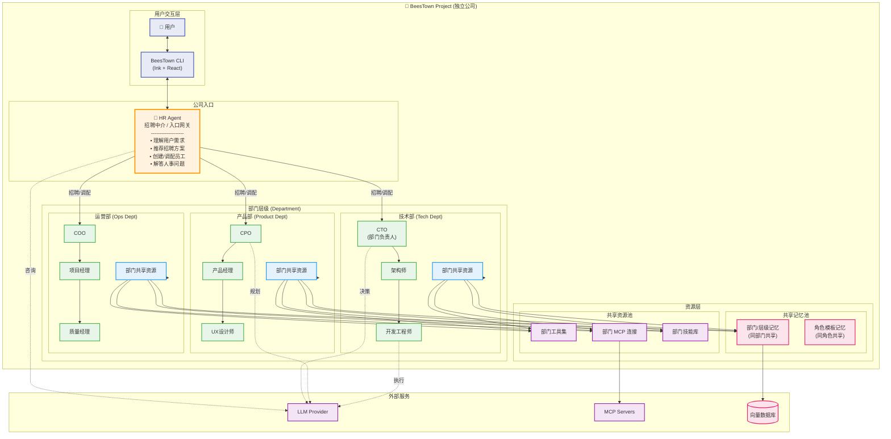
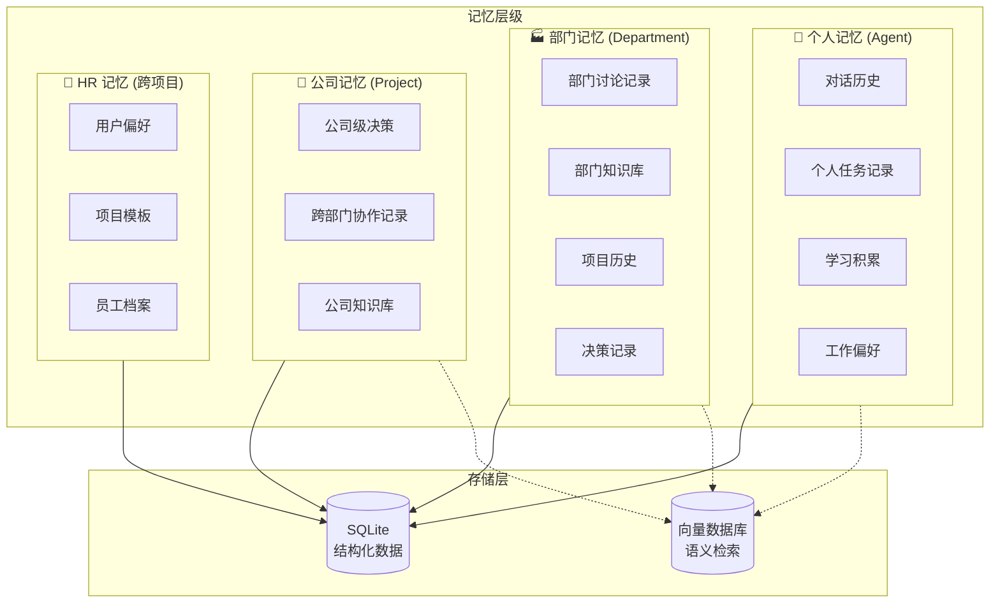

# BeesTown 架构设计文档

## 1. 项目愿景

BeesTown 是一个**AI Agent 集群协同办公平台**，每个项目都是一个独立的"公司"。用户通过 **HR Agent** 作为入口，以自然语言或手动方式招聘、管理员工（Agent），构建组织架构，实现代码开发、文件操作、项目管理等任务的自动化协作。

### 核心理念
- **公司隐喻**：每个项目 = 一家独立公司
- **HR 为入口**：HR Agent 是用户的第一接触点，负责招聘和人员管理
- **层级化管理**：清晰的上下级汇报关系和信息流
- **双重记忆**：部门/层级共享记忆 + 个人独立记忆
- **资源分层**：工具、MCP、技能可在部门/个人层面配置

---

## 2. 系统架构概览



---

## 3. 核心概念设计

### 3.1 项目 = 公司模型

每个 BeesTown 项目是一个完全独立的"公司"实体：

```typescript
interface BeesTownProject {
  id: string;                    // 项目唯一标识
  name: string;                  // 公司名称
  description: string;           // 项目描述
  
  // 公司入口
  hr: HRAgent;                   // HR Agent (固定存在)
  
  // 组织架构
  departments: Department[];     // 部门列表
  agents: Map<string, Agent>;    // 所有员工 (Agent)
  hierarchy: OrganizationTree;   // 汇报关系树
  
  // 公司级共享资源
  sharedResources: SharedResources;
  
  // 项目状态
  status: 'active' | 'paused' | 'archived';
  createdAt: Date;
  updatedAt: Date;
}
```

### 3.2 部门模型 (Department)

部门是资源共享的容器，同部门员工共享工具、MCP、技能和记忆：

```typescript
interface Department {
  id: string;
  name: string;                  // 如 "技术部"
  code: string;                  // 如 "tech"
  description: string;
  
  // 部门层级
  level: number;                 // 0=公司级, 1=一级部门, 2=二级部门
  parentId?: string;             // 上级部门
  
  // 部门负责人
  head?: Agent;                  // 部门负责人 (CTO/CPO/COO等)
  
  // 部门成员
  members: Agent[];
  
  // ===== 部门共享资源 =====
  shared: DepartmentSharedResources;
}

interface DepartmentSharedResources {
  // 共享记忆 (部门内所有成员可访问)
  memory: {
    shortTerm: Message[];        // 近期部门讨论
    longTerm: KnowledgeBase;     // 部门知识库
    decisions: DecisionRecord[]; // 部门决策历史
    projects: ProjectRecord[];   // 部门项目历史
  };
  
  // 共享工具 (部门成员默认拥有)
  tools: Tool[];
  
  // 共享 MCP 连接
  mcpConnections: MCPConfig[];
  
  // 共享技能库
  skills: Skill[];
  
  // 共享提示词模板
  promptTemplate: string;        // 部门级系统提示词增强
}
```

### 3.3 Agent (员工) 模型

每个 Agent 是一个"员工"，拥有个人独立资源，同时继承部门共享资源：

```typescript
interface Agent {
  id: string;
  name: string;                  // 员工姓名
  role: Role;                    // 角色定义
  
  // 组织架构信息
  departmentId: string;          // 所属部门
  level: number;                 // 层级 (0-3)
  reportsTo: string;             // 直接上级ID
  subordinates: string[];        // 下属IDs
  
  // ===== 个人独立资源 =====
  personal: PersonalResources;
  
  // ===== 继承的共享资源 (来自部门) =====
  shared: InheritedSharedResources;
  
  // 工作状态
  state: AgentState;
  performance: PerformanceMetrics;
}

interface PersonalResources {
  // 个人独立记忆
  memory: {
    conversations: Message[];    // 个人对话历史
    tasks: TaskRecord[];         // 个人任务记录
    learnings: Learning[];       // 个人学习积累
    preferences: Preference;     // 个人工作偏好
  };
  
  // 个人专属工具 (覆盖或扩展部门工具)
  exclusiveTools: Tool[];
  
  // 个人 MCP 连接 (除部门共享外)
  personalMCP: MCPConfig[];
  
  // 个人技能 (除部门共享外)
  personalSkills: Skill[];
  
  // 个人提示词定制
  personalPrompt: string;
}
```

### 3.4 资源继承与覆盖机制

**资源冲突解决规则**：
1. **记忆**：个人 > 部门 > 公司，逐层查找
2. **工具**：同名工具，个人覆盖部门，部门覆盖公司
3. **技能**：技能可叠加，同名技能参数合并
4. **MCP**：连接池合并，同名配置个人优先

---

## 4. 子系统架构文档

BeesTown 的详细架构设计分布在以下子文档中：

| 文档 | 路径 | 内容概述 |
|------|------|---------|
| **存储架构** | [`STORAGE_ARCHITECTURE.md`](./STORAGE_ARCHITECTURE.md) | 向量数据库(短期记忆) + SQLite(长期记忆)，Token/时间/文件操作记录 |
| **Agent架构** | [`AGENT_ARCHITECTURE.md`](./AGENT_ARCHITECTURE.md) | ReACT执行模式、跨项目通信、工具集成 |
| **LLM架构** | [`LLM_ARCHITECTURE.md`](./LLM_ARCHITECTURE.md) | OpenAI兼容接口、多提供商支持、通信记录存储 |
| **文件操作架构** | [`FILE_OPERATIONS_ARCHITECTURE.md`](./FILE_OPERATIONS_ARCHITECTURE.md) | Claude CLI/Codex/Trae风格文件操作、安全机制、智能编辑 |
| **CLI架构** | [`CLI_ARCHITECTURE.md`](./CLI_ARCHITECTURE.md) | Ink+React终端UI、命令系统、状态管理、事件系统 |
| **任务系统架构** | [`TASK_SYSTEM_ARCHITECTURE.md`](./TASK_SYSTEM_ARCHITECTURE.md) | 任务流转、调度器、执行引擎、汇报链 |
| **特殊Agent架构** | [`SPECIAL_AGENTS_ARCHITECTURE.md`](./SPECIAL_AGENTS_ARCHITECTURE.md) | HR/架构师/测试员三个必存Agent的详细设计 |

---

## 5. 信息流与汇报机制

### 5.1 信息流动规则

**信息流规则**：
1. **汇报线**：信息沿汇报链路上下流动
2. **跨部门协作**：通过共同上级或指定接口人
3. **紧急通道**：可设置紧急汇报机制，跳过中间层级
4. **信息共享**：部门内默认共享，跨部门需授权

### 5.2 任务分配与执行流程

详见 [`TASK_SYSTEM_ARCHITECTURE.md`](./TASK_SYSTEM_ARCHITECTURE.md) 第3章

---

## 6. 记忆系统架构

### 6.1 三层记忆模型



### 6.2 记忆访问权限

详见 [`STORAGE_ARCHITECTURE.md`](./STORAGE_ARCHITECTURE.md) 第2-3章

---

## 7. CLI 架构与交互

### 7.1 启动流程

```bash
# 创建新项目 (新公司)
$ beestown init my-project
🐝 欢迎来到 BeesTown！
🤝 我是您的 HR Alice，让我们开始组建团队吧！

# 进入项目 (进入公司)
$ beestown enter my-project
🐝 已进入项目: my-project
🤝 HR Alice: "您好！今天有什么可以帮您的？"

# 直接执行命令
$ beestown "招聘一名 React 前端工程师"
🤝 HR Alice: "好的，我正在为您招聘..."
✅ 已创建前端工程师 Bob
   部门: 技术部
   上级: CTO
   技能: React, TypeScript, Tailwind
```

### 7.2 交互模式

详见 [`CLI_ARCHITECTURE.md`](./CLI_ARCHITECTURE.md) 第4章

---

## 8. 目录结构

```
beestown/
├── src/
│   ├── cli/                      # CLI 入口和界面
│   │   ├── index.ts             # 入口
│   │   ├── commands/            # 命令定义
│   │   ├── components/          # Ink UI 组件
│   │   └── hooks/               # React hooks
│   │
│   ├── core/                     # 核心引擎
│   │   ├── project/             # 项目/公司管理
│   │   ├── hr/                  # HR Agent
│   │   ├── organization/        # 组织架构
│   │   ├── agent/               # Agent (员工) 运行时
│   │   ├── task/                # 任务系统
│   │   └── memory/              # 记忆系统
│   │
│   ├── resources/                # 资源管理
│   │   ├── skills/              # 技能定义
│   │   ├── tools/               # 工具实现
│   │   └── mcp/                 # MCP 集成
│   │
│   ├── llm/                      # LLM 集成
│   ├── storage/                  # 数据持久化
│   └── types/                    # 类型定义
│
├── templates/                    # 项目模板
│   ├── projects/                # 项目类型模板
│   ├── departments/             # 部门模板
│   └── roles/                   # 角色模板
│
└── package.json
```

---

## 9. 使用场景示例

### 场景 1：启动新项目

```bash
$ beestown init ecommerce-project
🐝 欢迎来到 BeesTown！
🤝 HR Alice: "您好！我是您的专属 HR。请告诉我您想做什么项目？"

$ beestown "我要做一个电商网站，需要前后端"
🤝 HR Alice: "了解了！根据您的需求，我推荐以下团队配置：

   💡 推荐方案：
   ├─ 技术部
   │  ├─ CTO x1 (技术负责人)
   │  ├─ 前端工程师 x2 (React)
   │  └─ 后端工程师 x2 (Node.js)
   └─ 产品部
      ├─ 产品经理 x1
      └─ UI设计师 x1

   预计团队规模：7人
   是否确认招聘？"

$ beestown "确认，帮我招聘"
🤝 HR Alice: "好的，正在为您组建团队..."

✅ 已创建技术部
✅ 已任命 CTO (David)
✅ 已招聘前端工程师 (Alice, Bob)
✅ 已招聘后端工程师 (Charlie, Diana)
✅ 已创建产品部
✅ 已招聘产品经理 (Eve)
✅ 已招聘UI设计师 (Frank)

🎉 团队组建完成！输入 'beestown org chart' 查看组织架构
```

### 场景 2：通过 HR 分配任务

```bash
$ beestown "让前端团队实现用户登录页面"
🤝 HR Alice: "收到，我将为您转达给技术部"

📨 任务流转：
HR → CTO: "需要开发登录页面"
CTO → 前端组长: "分配登录页面开发任务"
前端组长 → Alice: "实现登录表单UI"
前端组长 → Bob: "实现登录逻辑和API对接"

✅ 任务已分配
   负责人: Alice, Bob
   截止时间: 2024-01-20
   状态: 进行中
```

---

## 10. 扩展性设计

### 10.1 插件系统

```typescript
interface BeesTownPlugin {
  name: string;
  version: string;
  
  // 注册新部门类型
  registerDepartments?: () => DepartmentTemplate[];
  
  // 注册新角色
  registerRoles?: () => RoleDefinition[];
  
  // 注册新技能
  registerSkills?: () => SkillDefinition[];
  
  // 注册新工具
  registerTools?: () => ToolDefinition[];
  
  // HR 增强
  enhanceHR?: (hr: HRAgent) => HRAgent;
  
  // 生命周期钩子
  onProjectCreate?: (project: Project) => void;
  onAgentHire?: (agent: Agent) => void;
  onTaskComplete?: (task: Task) => void;
}
```

---

## 11. 未来规划

### Phase 1: MVP (核心功能)
- [ ] CLI 基础框架
- [ ] HR Agent 入口
- [ ] 基础招聘/解雇
- [ ] 简单部门管理
- [ ] 文件/代码工具

### Phase 2: 智能增强
- [ ] HR NLP 自然语言理解
- [ ] 智能团队推荐
- [ ] 自动任务分解
- [ ] 记忆系统完善
- [ ] 跨部门协作

### Phase 3: 生态扩展
- [ ] 插件市场
- [ ] 更多部门模板
- [ ] 角色市场
- [ ] Web 可视化界面
- [ ] 多项目协作

### Phase 4: 企业级
- [ ] 权限管理 (RBAC)
- [ ] 审计日志
- [ ] 性能分析
- [ ] 云同步
- [ ] API 接口

---

## 12. 总结

BeesTown 的核心理念是 **"每个项目 = 一家独立公司"**：

1. **HR 为唯一入口**：所有人事操作通过 HR Agent，像真实的 HR 部门
2. **清晰的组织架构**：部门 - 层级 - 个人，权责分明
3. **双重资源体系**：部门共享 + 个人独立，灵活配置
4. **自然语言驱动**：用说话的方式管理团队
5. **记忆分层管理**：个人/部门/公司/HR 四级记忆

这个架构让 AI Agent 管理像经营一家真实公司一样直观，HR Agent 作为中介和顾问，帮助用户高效地组建和管理 AI 团队。

---

## 附录：架构文档索引

### 核心架构
- [存储架构](./STORAGE_ARCHITECTURE.md) - 数据持久化设计（向量DB + SQLite）
- [记忆系统架构](./MEMORY_SYSTEM_ARCHITECTURE.md) - **新增** - 四层记忆模型、访问控制、生命周期
- [Agent架构](./AGENT_ARCHITECTURE.md) - Agent 运行时设计（ReACT模式、通信）
- [LLM架构](./LLM_ARCHITECTURE.md) - LLM 集成设计（OpenAI兼容、多提供商）

### 功能架构
- [CLI架构](./CLI_ARCHITECTURE.md) - 命令行界面设计（Ink+React）
- [任务系统架构](./TASK_SYSTEM_ARCHITECTURE.md) - 任务流转与调度
- [Tools架构](./TOOLS_ARCHITECTURE.md) - **核心** - 工具系统（Read/Edit/Bash/Grep等内置工具 + MCP工具）
- [文件操作架构](./FILE_OPERATIONS_ARCHITECTURE.md) - 文件系统操作详细设计

### 集成架构
- [MCP集成架构](./MCP_INTEGRATION_ARCHITECTURE.md) - MCP连接、权限控制、审计
- [Skills架构](./SKILLS_ARCHITECTURE.md) - 技能系统、权限控制、继承组合

### 特殊组件
- [特殊Agent架构](./SPECIAL_AGENTS_ARCHITECTURE.md) - HR/架构师/测试员详细设计
