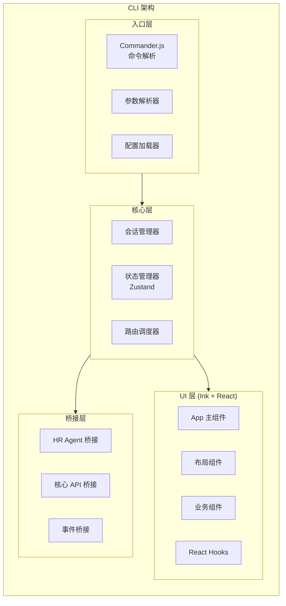

# BeesTown CLI 架构设计

## 1. 概述

BeesTown CLI 是基于 Ink + React 的终端用户界面，提供直观的交互式体验，支持自然语言命令和结构化命令两种模式。



---

## 2. 技术栈

| 层级 | 技术 | 用途 |
|------|------|------|
| 运行时 | Node.js / Bun | JavaScript 运行时 |
| 语言 | TypeScript | 类型安全 |
| UI 框架 | Ink | React for Terminal |
| 状态管理 | Zustand | 全局状态 |
| 命令解析 | Commander.js | CLI 命令解析 |
| 样式 | Chalk + Figlet | 终端样式 |

---

## 3. 命令系统

### 3.1 命令分类

```typescript
// 命令类型定义
interface CLICommand {
  name: string;
  description: string;
  category: CommandCategory;
  arguments?: ArgumentDef[];
  options?: OptionDef[];
  handler: CommandHandler;
  // 是否可以通过自然语言触发
  naturalLanguageSupport: boolean;
  // 示例
  examples?: string[];
}

type CommandCategory = 
  | 'project'      // 项目管理
  | 'organization' // 组织管理
  | 'agent'        // Agent 管理
  | 'task'         // 任务管理
  | 'resource'     // 资源管理
  | 'system';      // 系统命令

// 命令注册表
class CommandRegistry {
  private commands: Map<string, CLICommand> = new Map();
  private nlPatterns: Map<string, string> = new Map(); // 自然语言模式 -> 命令名

  register(command: CLICommand): void {
    this.commands.set(command.name, command);
    
    // 注册自然语言模式
    if (command.naturalLanguageSupport) {
      this.registerNLPatterns(command);
    }
  }

  // 解析输入
  parse(input: string): ParsedCommand {
    // 1. 尝试匹配结构化命令
    const structured = this.parseStructured(input);
    if (structured) return structured;

    // 2. 尝试匹配自然语言
    const natural = this.parseNaturalLanguage(input);
    if (natural) return natural;

    // 3. 作为 HR 对话处理
    return { type: 'hr_conversation', raw: input };
  }

  private parseStructured(input: string): ParsedCommand | null {
    // 使用 Commander.js 解析
    const parts = input.trim().split(/\s+/);
    const commandName = parts[0];
    
    const command = this.commands.get(commandName);
    if (!command) return null;

    return {
      type: 'structured',
      command: commandName,
      args: this.parseArgs(parts.slice(1), command),
      options: this.parseOptions(parts.slice(1), command)
    };
  }

  private parseNaturalLanguage(input: string): ParsedCommand | null {
    // 使用模式匹配
    for (const [pattern, commandName] of this.nlPatterns) {
      const regex = new RegExp(pattern, 'i');
      const match = input.match(regex);
      if (match) {
        return {
          type: 'natural_language',
          command: commandName,
          entities: this.extractEntities(match),
          raw: input
        };
      }
    }
    return null;
  }
}
```

### 3.2 命令实现

```typescript
// 项目级命令
const PROJECT_COMMANDS: CLICommand[] = [
  {
    name: 'init',
    description: '创建新项目（新公司）',
    category: 'project',
    arguments: [
      { name: 'name', description: '项目名称', required: true }
    ],
    options: [
      { name: '--template', alias: '-t', description: '使用模板' },
      { name: '--description', alias: '-d', description: '项目描述' }
    ],
    handler: async (args, options) => {
      const project = await createProject(args.name, options);
      return { success: true, project };
    },
    naturalLanguageSupport: true,
    examples: [
      'beestown init my-project',
      'beestown init ecommerce --template web-app'
    ]
  },
  
  {
    name: 'enter',
    description: '进入项目',
    category: 'project',
    arguments: [
      { name: 'name', description: '项目名称', required: true }
    ],
    handler: async (args) => {
      await enterProject(args.name);
      return { success: true, message: `已进入项目: ${args.name}` };
    },
    naturalLanguageSupport: true,
    examples: ['beestown enter my-project']
  },
  
  {
    name: 'list',
    description: '列出所有项目',
    category: 'project',
    options: [
      { name: '--all', alias: '-a', description: '显示所有项目（包括归档）' }
    ],
    handler: async (_, options) => {
      const projects = await listProjects(options.all);
      return { success: true, projects };
    },
    naturalLanguageSupport: true,
    examples: ['beestown list', 'beestown list --all']
  }
];

// Agent 管理命令
const AGENT_COMMANDS: CLICommand[] = [
  {
    name: 'agent:list',
    description: '列出所有员工',
    category: 'agent',
    options: [
      { name: '--dept', alias: '-d', description: '按部门筛选' },
      { name: '--role', alias: '-r', description: '按角色筛选' }
    ],
    handler: async (_, options) => {
      const agents = await listAgents(options);
      return { success: true, agents };
    },
    naturalLanguageSupport: true,
    examples: ['beestown agent:list', 'beestown agent:list --dept 技术部']
  },
  
  {
    name: 'agent:show',
    description: '查看 Agent 详情',
    category: 'agent',
    arguments: [
      { name: 'name', description: 'Agent 名称', required: true }
    ],
    handler: async (args) => {
      const agent = await getAgentDetails(args.name);
      return { success: true, agent };
    },
    naturalLanguageSupport: true,
    examples: ['beestown agent:show Alice']
  }
];
```

---

## 4. UI 组件架构

### 4.1 组件层次

```typescript
// 主应用组件
const App: React.FC = () => {
  const { currentProject, mode } = useBeesTownStore();

  return (
    <Box flexDirection="column" height="100%">
      <Header />
      
      {mode === 'chat' && <HRChatPanel />}
      {mode === 'org' && <OrgChartView />}
      {mode === 'tasks' && <TaskBoard />}
      {mode === 'agents' && <AgentListView />}
      
      <InputBar />
      <StatusBar />
    </Box>
  );
};

// Header 组件
const Header: React.FC = () => {
  const { currentProject, stats } = useBeesTownStore();

  return (
    <Box borderStyle="single" paddingX={1}>
      <Text bold color="yellow">
        🐝 BeesTown
      </Text>
      {currentProject && (
        <>
          <Text> | </Text>
          <Text color="cyan">{currentProject.name}</Text>
          <Text> | </Text>
          <Text>员工: {stats.agentCount}</Text>
          <Text> | </Text>
          <Text>任务: {stats.activeTasks}</Text>
        </>
      )}
    </Box>
  );
};

// HR 对话面板
const HRChatPanel: React.FC = () => {
  const { messages, isTyping } = useHRChat();
  const scrollRef = useRef<ScrollArea>();

  useEffect(() => {
    scrollRef.current?.scrollToEnd();
  }, [messages]);

  return (
    <ScrollArea ref={scrollRef} flexGrow={1}>
      {messages.map((msg, idx) => (
        <MessageBubble key={idx} message={msg} />
      ))}
      {isTyping && <TypingIndicator />}
    </ScrollArea>
  );
};

// 组织架构视图
const OrgChartView: React.FC = () => {
  const { hierarchy } = useOrganization();

  return (
    <Box flexGrow={1} padding={1}>
      <TreeView data={hierarchy}>
        {(node) => (
          <OrgNode 
            name={node.name}
            role={node.role}
            department={node.department}
            level={node.level}
          />
        )}
      </TreeView>
    </Box>
  );
};

// 任务看板
const TaskBoard: React.FC = () => {
  const { tasks, columns } = useTaskBoard();

  return (
    <Box flexGrow={1} flexDirection="row">
      {columns.map((column) => (
        <TaskColumn key={column.id} title={column.name}>
          {tasks
            .filter((t) => t.status === column.id)
            .map((task) => (
              <TaskCard key={task.id} task={task} />
            ))}
        </TaskColumn>
      ))}
    </Box>
  );
};

// 输入栏
const InputBar: React.FC = () => {
  const [input, setInput] = useState('');
  const { executeCommand } = useCommandExecutor();

  const handleSubmit = () => {
    if (input.trim()) {
      executeCommand(input);
      setInput('');
    }
  };

  return (
    <Box borderStyle="single" paddingX={1}>
      <Text>{'>'}</Text>
      <TextInput
        value={input}
        onChange={setInput}
        onSubmit={handleSubmit}
        placeholder="输入命令或与 HR 对话..."
      />
    </Box>
  );
};
```

### 4.2 状态管理

```typescript
// Zustand Store
interface BeesTownState {
  // 当前项目
  currentProject: Project | null;
  
  // UI 状态
  mode: 'chat' | 'org' | 'tasks' | 'agents' | 'settings';
  isLoading: boolean;
  error: string | null;
  
  // 统计数据
  stats: {
    agentCount: number;
    activeTasks: number;
    tokenUsage: number;
  };
  
  // 操作
  setProject: (project: Project) => void;
  setMode: (mode: BeesTownState['mode']) => void;
  updateStats: () => Promise<void>;
}

const useBeesTownStore = create<BeesTownState>((set, get) => ({
  currentProject: null,
  mode: 'chat',
  isLoading: false,
  error: null,
  stats: { agentCount: 0, activeTasks: 0, tokenUsage: 0 },

  setProject: (project) => set({ currentProject: project }),
  
  setMode: (mode) => set({ mode }),
  
  updateStats: async () => {
    const { currentProject } = get();
    if (!currentProject) return;
    
    const stats = await fetchProjectStats(currentProject.id);
    set({ stats });
  }
}));

// HR 聊天状态
interface HRChatState {
  messages: Message[];
  isTyping: boolean;
  context: ConversationContext;
  
  sendMessage: (content: string) => Promise<void>;
  clearHistory: () => void;
}

const useHRChat = create<HRChatState>((set, get) => ({
  messages: [],
  isTyping: false,
  context: { history: [], entities: {} },

  sendMessage: async (content) => {
    // 添加用户消息
    set((state) => ({
      messages: [...state.messages, { role: 'user', content }],
      isTyping: true
    }));

    // 调用 HR Agent
    const response = await hrAgent.processMessage(content, get().context);

    // 添加 HR 回复
    set((state) => ({
      messages: [...state.messages, { role: 'assistant', content: response.content }],
      isTyping: false,
      context: response.updatedContext
    }));
  },

  clearHistory: () => set({ messages: [], context: { history: [], entities: {} } })
}));
```

---

## 5. 会话管理

```typescript
class SessionManager {
  private currentSession: Session | null = null;
  private storage: Storage;

  // 创建新会话
  async createSession(projectId: string): Promise<Session> {
    const session: Session = {
      id: generateId(),
      projectId,
      startTime: Date.now(),
      commands: [],
      state: {}
    };

    this.currentSession = session;
    await this.storage.saveSession(session);

    return session;
  }

  // 恢复会话
  async resumeSession(sessionId: string): Promise<Session | null> {
    const session = await this.storage.getSession(sessionId);
    if (session) {
      this.currentSession = session;
    }
    return session;
  }

  // 记录命令
  async recordCommand(command: ParsedCommand, result: CommandResult): Promise<void> {
    if (!this.currentSession) return;

    this.currentSession.commands.push({
      timestamp: Date.now(),
      command,
      result,
      duration: result.duration
    });

    await this.storage.updateSession(this.currentSession);
  }

  // 获取会话历史
  async getSessionHistory(projectId: string): Promise<Session[]> {
    return this.storage.getSessionsByProject(projectId);
  }
}
```

---

## 6. 事件系统

```typescript
// 事件总线
class CLIEventBus {
  private listeners: Map<string, Set<EventHandler>> = new Map();

  on(event: string, handler: EventHandler): () => void {
    if (!this.listeners.has(event)) {
      this.listeners.set(event, new Set());
    }
    this.listeners.get(event)!.add(handler);

    return () => this.off(event, handler);
  }

  off(event: string, handler: EventHandler): void {
    this.listeners.get(event)?.delete(handler);
  }

  emit(event: string, data?: any): void {
    this.listeners.get(event)?.forEach((handler) => {
      try {
        handler(data);
      } catch (error) {
        console.error(`Event handler error for ${event}:`, error);
      }
    });
  }
}

// 核心事件
interface CLIEventMap {
  'project:created': { projectId: string; name: string };
  'project:entered': { projectId: string };
  'agent:hired': { agentId: string; name: string; role: string };
  'agent:fired': { agentId: string; name: string };
  'task:assigned': { taskId: string; assigneeId: string };
  'task:completed': { taskId: string; result: any };
  'command:executed': { command: string; duration: number };
  'error': { message: string; stack?: string };
}

// 使用示例
const eventBus = new CLIEventBus();

// 监听项目创建
eventBus.on('project:created', ({ projectId, name }) => {
  console.log(`Project ${name} created with ID ${projectId}`);
});

// 监听错误
eventBus.on('error', ({ message }) => {
  // 显示错误提示
  render(<ErrorToast message={message} />);
});
```

---

## 7. 配置管理

```typescript
interface CLIConfig {
  // 外观
  theme: 'dark' | 'light';
  colors: {
    primary: string;
    success: string;
    warning: string;
    error: string;
  };
  
  // 行为
  autoComplete: boolean;
  confirmDestructive: boolean;
  defaultView: 'chat' | 'org' | 'tasks';
  
  // LLM
  defaultModel: string;
  temperature: number;
  maxTokens: number;
  
  // 路径
  projectsDir: string;
  backupDir: string;
  
  // 快捷键
  keybindings: {
    switchToChat: string;
    switchToOrg: string;
    switchToTasks: string;
    clearScreen: string;
  };
}

class ConfigManager {
  private config: CLIConfig;
  private configPath: string;

  constructor() {
    this.configPath = path.join(os.homedir(), '.beestown', 'config.json');
    this.config = this.loadConfig();
  }

  private loadConfig(): CLIConfig {
    try {
      const content = fs.readFileSync(this.configPath, 'utf-8');
      return { ...this.getDefaultConfig(), ...JSON.parse(content) };
    } catch {
      return this.getDefaultConfig();
    }
  }

  private getDefaultConfig(): CLIConfig {
    return {
      theme: 'dark',
      colors: {
        primary: '#2196F3',
        success: '#4CAF50',
        warning: '#FF9800',
        error: '#F44336'
      },
      autoComplete: true,
      confirmDestructive: true,
      defaultView: 'chat',
      defaultModel: 'gpt-4',
      temperature: 0.7,
      maxTokens: 4000,
      projectsDir: path.join(os.homedir(), '.beestown', 'projects'),
      backupDir: path.join(os.homedir(), '.beestown', 'backups'),
      keybindings: {
        switchToChat: 'ctrl+c',
        switchToOrg: 'ctrl+o',
        switchToTasks: 'ctrl+t',
        clearScreen: 'ctrl+l'
      }
    };
  }

  get<K extends keyof CLIConfig>(key: K): CLIConfig[K] {
    return this.config[key];
  }

  set<K extends keyof CLIConfig>(key: K, value: CLIConfig[K]): void {
    this.config[key] = value;
    this.saveConfig();
  }

  private saveConfig(): void {
    fs.mkdirSync(path.dirname(this.configPath), { recursive: true });
    fs.writeFileSync(this.configPath, JSON.stringify(this.config, null, 2));
  }
}
```

---

## 8. 总结

BeesTown CLI 架构的核心设计：

1. **双模式支持**：结构化命令 + 自然语言对话
2. **React 组件化**：Ink 提供声明式 UI 开发体验
3. **状态管理**：Zustand 提供简洁的全局状态
4. **事件驱动**：松耦合的组件通信机制
5. **会话持久化**：支持会话恢复和历史追溯
6. **可配置化**：灵活的用户自定义配置
