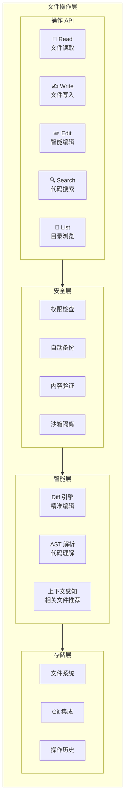

# BeesTown 文件操作架构设计

## 1. 概述

BeesTown 文件操作架构参考 Claude CLI、Codex、Trae 等主流 AI 编程工具的实现，提供安全、高效、智能的文件读写和代码编辑能力。



---

## 2. 核心操作接口

### 2.1 文件读取 (Read)

```typescript
interface ReadOperation {
  // 基础读取
  read(params: ReadParams): Promise<ReadResult>;
  
  // 批量读取
  readMultiple(paths: string[]): Promise<ReadResult[]>;
  
  // 智能读取（带上下文）
  readWithContext(path: string, options: ContextOptions): Promise<ContextualReadResult>;
}

interface ReadParams {
  path: string;
  offset?: number;           // 起始行号
  limit?: number;            // 读取行数
  encoding?: string;         // 编码，默认 utf-8
}

interface ReadResult {
  path: string;
  content: string;
  lines: string[];           // 按行分割
  totalLines: number;
  size: number;              // 文件大小（字节）
  encoding: string;
  lastModified: number;
  language?: string;         // 检测到的编程语言
}

interface ContextualReadResult extends ReadResult {
  relatedFiles: string[];    // 相关文件推荐
  symbols: SymbolInfo[];     // 文件中的符号定义
  imports: string[];         // 导入的模块
  exports: string[];         // 导出的内容
}
```

### 2.2 文件写入 (Write)

```typescript
interface WriteOperation {
  // 完整写入
  write(params: WriteParams): Promise<WriteResult>;
  
  // 追加写入
  append(params: AppendParams): Promise<WriteResult>;
  
  // 创建文件（如果不存在）
  create(path: string, content: string): Promise<WriteResult>;
}

interface WriteParams {
  path: string;
  content: string;
  encoding?: string;
  backup?: boolean;          // 是否创建备份
  validate?: boolean;        // 是否验证内容
}

interface WriteResult {
  success: boolean;
  path: string;
  bytesWritten: number;
  backupPath?: string;       // 备份文件路径
  hash: string;              // 内容哈希
  error?: string;
}
```

### 2.3 智能编辑 (Edit)

```typescript
interface EditOperation {
  // 基于搜索替换的编辑
  edit(params: EditParams): Promise<EditResult>;
  
  // 多行编辑
  editMultiLine(params: MultiLineEditParams): Promise<EditResult>;
  
  // 基于行号的编辑
  editByLine(params: LineEditParams): Promise<EditResult>;
  
  // 批量编辑
  editBatch(edits: EditParams[]): Promise<BatchEditResult>;
}

interface EditParams {
  path: string;
  oldString: string;         // 要替换的内容
  newString: string;         // 新内容
  occurrence?: number;       // 替换第几个匹配项，默认第一个
  all?: boolean;             // 是否替换所有匹配项
}

interface MultiLineEditParams {
  path: string;
  oldBlock: string;          // 要替换的代码块
  newBlock: string;          // 新代码块
  fuzzy?: boolean;           // 是否模糊匹配
}

interface LineEditParams {
  path: string;
  startLine: number;         // 起始行号（1-based）
  endLine?: number;          // 结束行号
  newContent: string;        // 新内容
}

interface EditResult {
  success: boolean;
  path: string;
  changes: ChangeInfo[];
  diff: string;              // unified diff 格式
  error?: string;
}

interface ChangeInfo {
  line: number;
  type: 'added' | 'removed' | 'modified';
  oldContent?: string;
  newContent?: string;
}
```

### 2.4 代码搜索 (Search)

```typescript
interface SearchOperation {
  // 文本搜索
  grep(params: GrepParams): Promise<SearchResult[]>;
  
  // 语义搜索（基于向量）
  semanticSearch(query: string): Promise<SemanticResult[]>;
  
  // 符号搜索
  findSymbol(name: string): Promise<SymbolLocation[]>;
  
  // 引用查找
  findReferences(symbol: string): Promise<ReferenceLocation[]>;
}

interface GrepParams {
  pattern: string;
  path?: string;             // 搜索路径
  glob?: string;             // 文件匹配模式
  ignoreCase?: boolean;
  regex?: boolean;
  maxResults?: number;
}

interface SearchResult {
  path: string;
  line: number;
  column: number;
  match: string;
  context: string;           // 上下文行
}

interface SemanticResult {
  path: string;
  relevance: number;
  snippet: string;
  explanation: string;
}
```

---

## 3. 安全机制

### 3.1 权限管理

```typescript
class FilePermissionManager {
  private allowedPaths: Set<string> = new Set();
  private blockedPaths: Set<string> = new Set([
    '.git',
    'node_modules',
    '.env',
    '*.key',
    '*.pem'
  ]);

  // 检查操作权限
  async checkPermission(operation: string, path: string): Promise<boolean> {
    // 检查是否在允许列表
    const isAllowed = this.isPathAllowed(path);
    if (!isAllowed) {
      throw new PermissionDeniedError(`Access denied: ${path}`);
    }

    // 检查是否在阻止列表
    if (this.isPathBlocked(path)) {
      throw new PermissionDeniedError(`Path blocked: ${path}`);
    }

    // 敏感操作额外确认
    if (this.isSensitiveOperation(operation, path)) {
      return await this.requestUserConfirmation(operation, path);
    }

    return true;
  }

  // 添加允许路径
  allowPath(path: string): void {
    this.allowedPaths.add(path);
  }

  // 检查路径是否在允许范围内
  private isPathAllowed(path: string): boolean {
    if (this.allowedPaths.size === 0) return true;
    
    for (const allowed of this.allowedPaths) {
      if (path.startsWith(allowed)) return true;
    }
    return false;
  }

  // 检查路径是否被阻止
  private isPathBlocked(path: string): boolean {
    for (const blocked of this.blockedPaths) {
      if (path.includes(blocked)) return true;
      // 支持 glob 模式
      if (this.matchGlob(path, blocked)) return true;
    }
    return false;
  }

  private isSensitiveOperation(operation: string, path: string): boolean {
    const sensitiveOps = ['delete', 'write', 'edit'];
    const sensitivePaths = ['.env', 'config', 'password'];
    
    return sensitiveOps.includes(operation) && 
           sensitivePaths.some(p => path.includes(p));
  }
}
```

### 3.2 自动备份

```typescript
class FileBackupManager {
  private backupDir: string;
  private maxBackups: number = 10;

  constructor(backupDir: string) {
    this.backupDir = backupDir;
    fs.mkdirSync(backupDir, { recursive: true });
  }

  // 创建备份
  async createBackup(filePath: string): Promise<string> {
    const content = await fs.readFile(filePath, 'utf-8');
    const hash = crypto.createHash('md5').update(content).digest('hex');
    const timestamp = Date.now();
    const backupName = `${path.basename(filePath)}.${timestamp}.${hash}.bak`;
    const backupPath = path.join(this.backupDir, backupName);

    await fs.writeFile(backupPath, content);
    
    // 清理旧备份
    await this.cleanupOldBackups(filePath);

    return backupPath;
  }

  // 恢复备份
  async restoreBackup(filePath: string, backupPath: string): Promise<void> {
    const content = await fs.readFile(backupPath, 'utf-8');
    await fs.writeFile(filePath, content);
  }

  // 获取备份列表
  async getBackups(filePath: string): Promise<BackupInfo[]> {
    const fileName = path.basename(filePath);
    const backups = await fs.readdir(this.backupDir);
    
    return backups
      .filter(b => b.startsWith(fileName))
      .map(b => {
        const parts = b.split('.');
        return {
          path: path.join(this.backupDir, b),
          timestamp: parseInt(parts[parts.length - 3]),
          hash: parts[parts.length - 2]
        };
      })
      .sort((a, b) => b.timestamp - a.timestamp);
  }

  private async cleanupOldBackups(filePath: string): Promise<void> {
    const backups = await this.getBackups(filePath);
    
    if (backups.length > this.maxBackups) {
      const toDelete = backups.slice(this.maxBackups);
      for (const backup of toDelete) {
        await fs.unlink(backup.path);
      }
    }
  }
}
```

---

## 4. 智能编辑引擎

### 4.1 Diff 引擎

```typescript
class DiffEngine {
  // 生成 unified diff
  generateDiff(oldContent: string, newContent: string, filePath: string): string {
    const diff = createPatch(
      filePath,
      oldContent,
      newContent,
      'old',
      'new'
    );
    return diff;
  }

  // 应用 diff
  applyDiff(content: string, diff: string): string {
    const result = applyPatch(content, diff);
    if (result === false) {
      throw new Error('Failed to apply patch');
    }
    return result;
  }

  // 智能匹配（处理缩进、空白字符等）
  fuzzyMatch(content: string, search: string): MatchResult {
    // 精确匹配
    if (content.includes(search)) {
      return { found: true, index: content.indexOf(search), exact: true };
    }

    // 忽略空白字符匹配
    const normalizedContent = this.normalizeWhitespace(content);
    const normalizedSearch = this.normalizeWhitespace(search);
    
    if (normalizedContent.includes(normalizedSearch)) {
      return { found: true, index: normalizedContent.indexOf(normalizedSearch), exact: false };
    }

    // 相似度匹配
    const similarity = this.calculateSimilarity(content, search);
    if (similarity > 0.8) {
      return { found: true, index: 0, exact: false, similarity };
    }

    return { found: false };
  }

  private normalizeWhitespace(str: string): string {
    return str.replace(/\s+/g, ' ').trim();
  }

  private calculateSimilarity(a: string, b: string): number {
    // 使用 Levenshtein 距离计算相似度
    const distance = levenshteinDistance(a, b);
    const maxLength = Math.max(a.length, b.length);
    return 1 - distance / maxLength;
  }
}
```

### 4.2 AST 感知编辑

```typescript
class ASTAwareEditor {
  private parsers: Map<string, Parser> = new Map();

  constructor() {
    // 初始化各语言解析器
    this.parsers.set('typescript', new TypeScriptParser());
    this.parsers.set('javascript', new JavaScriptParser());
    this.parsers.set('python', new PythonParser());
    // ...
  }

  // 获取文件的 AST
  async parseFile(filePath: string, content: string): Promise<ASTNode> {
    const ext = path.extname(filePath);
    const language = this.getLanguageFromExt(ext);
    const parser = this.parsers.get(language);
    
    if (!parser) {
      throw new Error(`No parser available for ${language}`);
    }

    return parser.parse(content);
  }

  // 在 AST 中查找节点
  findNode(ast: ASTNode, predicate: (node: ASTNode) => boolean): ASTNode | null {
    if (predicate(ast)) return ast;
    
    for (const child of ast.children || []) {
      const found = this.findNode(child, predicate);
      if (found) return found;
    }
    
    return null;
  }

  // 安全编辑（保持 AST 完整性）
  async safeEdit(
    filePath: string,
    content: string,
    edit: ASTEdit
  ): Promise<string> {
    const ast = await this.parseFile(filePath, content);
    
    // 验证编辑不会破坏 AST
    const validation = this.validateEdit(ast, edit);
    if (!validation.valid) {
      throw new Error(`Invalid edit: ${validation.error}`);
    }

    // 应用编辑
    return this.applyASTEdit(content, ast, edit);
  }

  // 获取编辑影响范围
  getEditImpact(ast: ASTNode, edit: ASTEdit): ImpactAnalysis {
    const affectedNodes = this.findAffectedNodes(ast, edit);
    
    return {
      affectedFiles: this.findRelatedFiles(affectedNodes),
      breakingChanges: this.detectBreakingChanges(affectedNodes),
      suggestedTests: this.findRelatedTests(affectedNodes)
    };
  }
}
```

---

## 5. 文件操作管理器

```typescript
class FileOperationsManager {
  private permissionManager: FilePermissionManager;
  private backupManager: FileBackupManager;
  private diffEngine: DiffEngine;
  private astEditor: ASTAwareEditor;
  private storage: BeesTownStorage;

  constructor(config: FileOpsConfig, storage: BeesTownStorage) {
    this.permissionManager = new FilePermissionManager();
    this.backupManager = new FileBackupManager(config.backupDir);
    this.diffEngine = new DiffEngine();
    this.astEditor = new ASTAwareEditor();
    this.storage = storage;
  }

  // 读取文件
  async read(params: ReadParams): Promise<ReadResult> {
    await this.permissionManager.checkPermission('read', params.path);

    const content = await fs.readFile(params.path, params.encoding || 'utf-8');
    const lines = content.split('\n');
    
    // 处理 offset 和 limit
    const startLine = (params.offset || 1) - 1;
    const endLine = params.limit ? startLine + params.limit : lines.length;
    const selectedLines = lines.slice(startLine, endLine);

    const result: ReadResult = {
      path: params.path,
      content: selectedLines.join('\n'),
      lines: selectedLines,
      totalLines: lines.length,
      size: Buffer.byteLength(content),
      encoding: params.encoding || 'utf-8',
      lastModified: (await fs.stat(params.path)).mtimeMs,
      language: this.detectLanguage(params.path)
    };

    // 记录操作
    await this.logOperation('read', params.path, { success: true });

    return result;
  }

  // 写入文件
  async write(params: WriteParams): Promise<WriteResult> {
    await this.permissionManager.checkPermission('write', params.path);

    // 创建备份
    let backupPath: string | undefined;
    if (params.backup !== false && await this.fileExists(params.path)) {
      backupPath = await this.backupManager.createBackup(params.path);
    }

    // 验证内容
    if (params.validate) {
      const validation = await this.validateContent(params.path, params.content);
      if (!validation.valid) {
        return {
          success: false,
          path: params.path,
          bytesWritten: 0,
          error: validation.error
        };
      }
    }

    // 写入文件
    await fs.writeFile(params.path, params.content, params.encoding || 'utf-8');

    const result: WriteResult = {
      success: true,
      path: params.path,
      bytesWritten: Buffer.byteLength(params.content),
      backupPath,
      hash: crypto.createHash('sha256').update(params.content).digest('hex')
    };

    // 记录操作
    await this.logOperation('write', params.path, result);

    return result;
  }

  // 编辑文件
  async edit(params: EditParams): Promise<EditResult> {
    await this.permissionManager.checkPermission('edit', params.path);

    // 读取原文件
    const content = await fs.readFile(params.path, 'utf-8');
    
    // 创建备份
    const backupPath = await this.backupManager.createBackup(params.path);

    // 查找并替换
    let newContent: string;
    const changes: ChangeInfo[] = [];

    if (params.all) {
      // 替换所有匹配项
      newContent = content.split(params.oldString).join(params.newString);
      const count = (content.match(new RegExp(params.oldString, 'g')) || []).length;
      for (let i = 0; i < count; i++) {
        changes.push({
          line: this.findLineNumber(content, params.oldString, i),
          type: 'modified'
        });
      }
    } else {
      // 替换指定匹配项
      const occurrence = params.occurrence || 1;
      let index = -1;
      let currentOccurrence = 0;
      
      while ((index = content.indexOf(params.oldString, index + 1)) !== -1) {
        currentOccurrence++;
        if (currentOccurrence === occurrence) {
          newContent = content.slice(0, index) + params.newString + content.slice(index + params.oldString.length);
          changes.push({
            line: this.findLineNumber(content, params.oldString, occurrence - 1),
            type: 'modified',
            oldContent: params.oldString,
            newContent: params.newString
          });
          break;
        }
      }

      if (currentOccurrence < occurrence) {
        return {
          success: false,
          path: params.path,
          changes: [],
          diff: '',
          error: `Occurrence ${occurrence} not found`
        };
      }
    }

    // 生成 diff
    const diff = this.diffEngine.generateDiff(content, newContent!, params.path);

    // 写入新内容
    await fs.writeFile(params.path, newContent!, 'utf-8');

    const result: EditResult = {
      success: true,
      path: params.path,
      changes,
      diff
    };

    // 记录操作
    await this.logOperation('edit', params.path, result);

    return result;
  }

  // 搜索代码
  async grep(params: GrepParams): Promise<SearchResult[]> {
    const { pattern, path = '.', glob = '*', ignoreCase = false, regex = false, maxResults = 100 } = params;

    const results: SearchResult[] = [];
    const files = await this.globFiles(path, glob);

    for (const file of files) {
      if (results.length >= maxResults) break;

      const content = await fs.readFile(file, 'utf-8');
      const lines = content.split('\n');

      const flags = ignoreCase ? 'gi' : 'g';
      const searchPattern = regex ? new RegExp(pattern, flags) : new RegExp(this.escapeRegex(pattern), flags);

      lines.forEach((line, index) => {
        if (searchPattern.test(line)) {
          results.push({
            path: file,
            line: index + 1,
            column: line.search(searchPattern) + 1,
            match: line.match(searchPattern)![0],
            context: this.getContextLines(lines, index)
          });
        }
      });
    }

    return results.slice(0, maxResults);
  }

  // 列出目录
  async list(dirPath: string): Promise<ListResult> {
    await this.permissionManager.checkPermission('list', dirPath);

    const entries = await fs.readdir(dirPath, { withFileTypes: true });
    
    const files: FileInfo[] = [];
    const directories: DirectoryInfo[] = [];

    for (const entry of entries) {
      const fullPath = path.join(dirPath, entry.name);
      const stats = await fs.stat(fullPath);

      if (entry.isDirectory()) {
        directories.push({
          name: entry.name,
          path: fullPath,
          itemCount: (await fs.readdir(fullPath)).length
        });
      } else {
        files.push({
          name: entry.name,
          path: fullPath,
          size: stats.size,
          lastModified: stats.mtimeMs,
          language: this.detectLanguage(entry.name)
        });
      }
    }

    return {
      path: dirPath,
      files: files.sort((a, b) => a.name.localeCompare(b.name)),
      directories: directories.sort((a, b) => a.name.localeCompare(b.name))
    };
  }

  // 辅助方法
  private async logOperation(
    operation: string,
    filePath: string,
    result: any
  ): Promise<void> {
    await this.storage.logFileOperation({
      operation,
      filePath,
      timestamp: Date.now(),
      success: result.success,
      error: result.error,
      contentHash: result.hash
    });
  }

  private detectLanguage(fileName: string): string | undefined {
    const ext = path.extname(fileName);
    const languageMap: Record<string, string> = {
      '.ts': 'typescript',
      '.tsx': 'typescript',
      '.js': 'javascript',
      '.jsx': 'javascript',
      '.py': 'python',
      '.java': 'java',
      '.go': 'go',
      '.rs': 'rust'
    };
    return languageMap[ext];
  }

  private findLineNumber(content: string, search: string, occurrence: number): number {
    const lines = content.split('\n');
    let count = 0;
    
    for (let i = 0; i < lines.length; i++) {
      if (lines[i].includes(search)) {
        if (count === occurrence) return i + 1;
        count++;
      }
    }
    return -1;
  }

  private getContextLines(lines: string[], index: number, contextSize: number = 2): string {
    const start = Math.max(0, index - contextSize);
    const end = Math.min(lines.length, index + contextSize + 1);
    return lines.slice(start, end).join('\n');
  }

  private escapeRegex(str: string): string {
    return str.replace(/[.*+?^${}()|[\]\\]/g, '\\$&');
  }

  private async fileExists(filePath: string): Promise<boolean> {
    try {
      await fs.access(filePath);
      return true;
    } catch {
      return false;
    }
  }

  private async globFiles(basePath: string, pattern: string): Promise<string[]> {
    // 使用 glob 库实现
    const { glob } = await import('glob');
    return glob(pattern, { cwd: basePath, absolute: true });
  }
}
```

---

## 6. 总结

BeesTown 文件操作架构的核心特性：

1. **安全优先**：权限检查、自动备份、内容验证
2. **智能编辑**：Diff 引擎、AST 感知、模糊匹配
3. **完整记录**：所有操作可追溯、可回滚
4. **高效搜索**：文本搜索、语义搜索、符号搜索
5. **多语言支持**：AST 解析支持多种编程语言
6. **Git 集成**：与版本控制无缝协作
