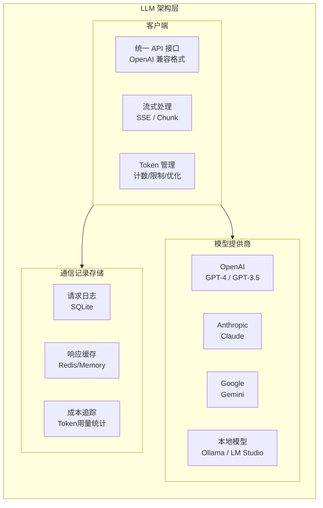

# BeesTown LLM 架构设计

## 1. 概述

BeesTown 采用 OpenAI 兼容的 API 调用模式，支持多模型提供商，实现统一的 LLM 调用接口和完整的通信记录存储。



---

## 2. 统一 LLM 客户端

### 2.1 接口设计

```typescript
interface LLMClient {
  // 标准对话完成
  complete(params: CompletionParams): Promise<CompletionResponse>;
  
  // 流式对话
  completeStream(params: CompletionParams): AsyncIterable<StreamChunk>;
  
  // 嵌入向量
  embed(text: string): Promise<number[]>;
  
  // 多模态（如果支持）
  completeMultimodal?(params: MultimodalParams): Promise<CompletionResponse>;
}

interface CompletionParams {
  model: string;                    // 模型标识
  messages: Message[];              // 对话历史
  temperature?: number;             // 温度
  maxTokens?: number;               // 最大Token数
  tools?: ToolDefinition[];         // 可用工具
  toolChoice?: 'auto' | 'none' | { type: 'function', function: { name: string } };
  responseFormat?: { type: 'json_object' | 'text' };
  stream?: boolean;                 // 是否流式
}

interface Message {
  role: 'system' | 'user' | 'assistant' | 'tool';
  content: string;
  name?: string;                    // tool 调用时的工具名
  toolCalls?: ToolCall[];           // assistant 的工具调用
  toolCallId?: string;              // tool 响应时的调用ID
}

interface ToolCall {
  id: string;
  type: 'function';
  function: {
    name: string;
    arguments: string;              // JSON 字符串
  };
}

interface CompletionResponse {
  id: string;
  model: string;
  choices: {
    index: number;
    message: Message;
    finishReason: 'stop' | 'length' | 'tool_calls' | 'content_filter';
  }[];
  usage: TokenUsage;
  created: number;
}

interface StreamChunk {
  id: string;
  model: string;
  choices: {
    index: number;
    delta: Partial<Message>;
    finishReason?: string;
  }[];
  usage?: TokenUsage;               // 仅在最后一块
}

interface TokenUsage {
  promptTokens: number;
  completionTokens: number;
  totalTokens: number;
}
```

### 2.2 OpenAI 提供商实现

```typescript
class OpenAIProvider implements LLMClient {
  private client: OpenAI;
  private config: ProviderConfig;
  private storage: LLMStorage;

  constructor(config: ProviderConfig, storage: LLMStorage) {
    this.client = new OpenAI({
      apiKey: config.apiKey,
      baseURL: config.baseURL,        // 支持自定义端点
      timeout: config.timeout || 60000
    });
    this.config = config;
    this.storage = storage;
  }

  async complete(params: CompletionParams): Promise<CompletionResponse> {
    const requestId = generateId();
    const startTime = Date.now();

    try {
      // 记录请求
      await this.storage.logRequest({
        id: requestId,
        provider: 'openai',
        model: params.model,
        messages: params.messages,
        tools: params.tools,
        timestamp: startTime
      });

      // 调用 OpenAI API
      const response = await this.client.chat.completions.create({
        model: params.model,
        messages: this.convertMessages(params.messages),
        temperature: params.temperature ?? 0.7,
        max_tokens: params.maxTokens,
        tools: params.tools ? this.convertTools(params.tools) : undefined,
        tool_choice: params.toolChoice,
        response_format: params.responseFormat,
        stream: false
      });

      // 转换响应格式
      const result = this.convertResponse(response);

      // 记录响应
      await this.storage.logResponse({
        requestId,
        response: result,
        latency: Date.now() - startTime,
        timestamp: Date.now()
      });

      // 记录 Token 使用
      await this.storage.recordTokenUsage({
        requestId,
        provider: 'openai',
        model: params.model,
        inputTokens: result.usage.promptTokens,
        outputTokens: result.usage.completionTokens,
        totalTokens: result.usage.totalTokens,
        cost: this.calculateCost(params.model, result.usage)
      });

      return result;

    } catch (error) {
      await this.storage.logError({
        requestId,
        error: error.message,
        timestamp: Date.now()
      });
      throw error;
    }
  }

  async *completeStream(params: CompletionParams): AsyncIterable<StreamChunk> {
    const requestId = generateId();
    const startTime = Date.now();
    let totalTokens = { prompt: 0, completion: 0 };

    try {
      const stream = await this.client.chat.completions.create({
        model: params.model,
        messages: this.convertMessages(params.messages),
        temperature: params.temperature ?? 0.7,
        max_tokens: params.maxTokens,
        tools: params.tools ? this.convertTools(params.tools) : undefined,
        stream: true
      });

      for await (const chunk of stream) {
        const converted = this.convertStreamChunk(chunk);
        
        // 累加 Token（估算）
        if (chunk.choices[0]?.delta?.content) {
          totalTokens.completion += this.estimateTokens(chunk.choices[0].delta.content);
        }

        yield converted;
      }

      // 记录流式请求完成
      await this.storage.logStreamComplete({
        requestId,
        model: params.model,
        totalTokens,
        duration: Date.now() - startTime
      });

    } catch (error) {
      await this.storage.logError({
        requestId,
        error: error.message,
        isStream: true,
        timestamp: Date.now()
      });
      throw error;
    }
  }

  async embed(text: string): Promise<number[]> {
    const response = await this.client.embeddings.create({
      model: 'text-embedding-3-small',
      input: text
    });

    return response.data[0].embedding;
  }

  // 辅助方法
  private convertMessages(messages: Message[]): any[] {
    return messages.map(m => ({
      role: m.role,
      content: m.content,
      name: m.name,
      tool_calls: m.toolCalls?.map(tc => ({
        id: tc.id,
        type: tc.type,
        function: tc.function
      })),
      tool_call_id: m.toolCallId
    }));
  }

  private convertTools(tools: ToolDefinition[]): any[] {
    return tools.map(t => ({
      type: 'function',
      function: {
        name: t.name,
        description: t.description,
        parameters: t.parameters
      }
    }));
  }

  private convertResponse(response: any): CompletionResponse {
    return {
      id: response.id,
      model: response.model,
      choices: response.choices.map((c: any) => ({
        index: c.index,
        message: {
          role: c.message.role,
          content: c.message.content,
          toolCalls: c.message.tool_calls?.map((tc: any) => ({
            id: tc.id,
            type: tc.type,
            function: tc.function
          }))
        },
        finishReason: c.finish_reason
      })),
      usage: {
        promptTokens: response.usage.prompt_tokens,
        completionTokens: response.usage.completion_tokens,
        totalTokens: response.usage.total_tokens
      },
      created: response.created
    };
  }

  private convertStreamChunk(chunk: any): StreamChunk {
    return {
      id: chunk.id,
      model: chunk.model,
      choices: chunk.choices.map((c: any) => ({
        index: c.index,
        delta: {
          role: c.delta?.role,
          content: c.delta?.content,
          toolCalls: c.delta?.tool_calls?.map((tc: any) => ({
            id: tc.id,
            type: tc.type,
            function: tc.function
          }))
        },
        finishReason: c.finish_reason
      }))
    };
  }

  private calculateCost(model: string, usage: TokenUsage): number {
    const pricing: Record<string, { input: number; output: number }> = {
      'gpt-4': { input: 0.03, output: 0.06 },
      'gpt-4-turbo': { input: 0.01, output: 0.03 },
      'gpt-4o': { input: 0.005, output: 0.015 },
      'gpt-3.5-turbo': { input: 0.0005, output: 0.0015 },
      'text-embedding-3-small': { input: 0.00002, output: 0 }
    };

    const price = pricing[model] || pricing['gpt-3.5-turbo'];
    return (usage.promptTokens * price.input + usage.completionTokens * price.output) / 1000;
  }

  private estimateTokens(text: string): number {
    // 简单估算：平均 4 个字符 1 个 token
    return Math.ceil(text.length / 4);
  }
}
```

---

## 3. 多提供商管理

### 3.1 提供商路由

```typescript
class LLMRouter {
  private providers: Map<string, LLMClient> = new Map();
  private defaultProvider: string;
  private storage: LLMStorage;

  constructor(config: RouterConfig, storage: LLMStorage) {
    this.storage = storage;
    
    // 初始化各提供商
    for (const [name, providerConfig] of Object.entries(config.providers)) {
      this.providers.set(name, this.createProvider(name, providerConfig, storage));
    }
    
    this.defaultProvider = config.defaultProvider;
  }

  async complete(params: CompletionParams & { provider?: string }): Promise<CompletionResponse> {
    const providerName = params.provider || this.selectProvider(params);
    const provider = this.providers.get(providerName);
    
    if (!provider) {
      throw new Error(`Provider ${providerName} not found`);
    }

    // 检查 Token 限制
    await this.checkTokenLimit(params);

    try {
      return await provider.complete(params);
    } catch (error) {
      // 故障转移
      if (this.shouldFailover(error)) {
        return await this.failover(params, providerName);
      }
      throw error;
    }
  }

  async *completeStream(params: CompletionParams & { provider?: string }): AsyncIterable<StreamChunk> {
    const providerName = params.provider || this.selectProvider(params);
    const provider = this.providers.get(providerName);
    
    if (!provider) {
      throw new Error(`Provider ${providerName} not found`);
    }

    yield* provider.completeStream(params);
  }

  // 智能提供商选择
  private selectProvider(params: CompletionParams): string {
    // 根据模型选择提供商
    const modelProviderMap: Record<string, string> = {
      'gpt-4': 'openai',
      'gpt-4-turbo': 'openai',
      'gpt-4o': 'openai',
      'gpt-3.5-turbo': 'openai',
      'claude-3-opus': 'anthropic',
      'claude-3-sonnet': 'anthropic',
      'gemini-pro': 'google'
    };

    return modelProviderMap[params.model] || this.defaultProvider;
  }

  // 故障转移
  private async failover(params: CompletionParams, failedProvider: string): Promise<CompletionResponse> {
    console.warn(`Provider ${failedProvider} failed, trying fallback...`);
    
    // 尝试其他提供商
    for (const [name, provider] of this.providers) {
      if (name === failedProvider) continue;
      
      try {
        // 转换模型名称
        const fallbackParams = this.translateModel(params, failedProvider, name);
        return await provider.complete(fallbackParams);
      } catch (error) {
        continue;
      }
    }

    throw new Error('All providers failed');
  }

  // 模型名称转换
  private translateModel(
    params: CompletionParams,
    fromProvider: string,
    toProvider: string
  ): CompletionParams {
    const modelMap: Record<string, Record<string, string>> = {
      openai: {
        'gpt-4': 'claude-3-opus',
        'gpt-3.5-turbo': 'claude-3-sonnet'
      },
      anthropic: {
        'claude-3-opus': 'gpt-4',
        'claude-3-sonnet': 'gpt-3.5-turbo'
      }
    };

    return {
      ...params,
      model: modelMap[toProvider]?.[params.model] || params.model
    };
  }

  private createProvider(name: string, config: ProviderConfig, storage: LLMStorage): LLMClient {
    switch (name) {
      case 'openai':
        return new OpenAIProvider(config, storage);
      case 'anthropic':
        return new AnthropicProvider(config, storage);
      case 'google':
        return new GoogleProvider(config, storage);
      default:
        throw new Error(`Unknown provider: ${name}`);
    }
  }

  private async checkTokenLimit(params: CompletionParams): Promise<void> {
    // 检查项目/Agent 的 Token 限制
    const limit = await this.storage.getTokenLimit(params);
    const current = await this.storage.getCurrentTokenUsage(params);
    
    if (current + (params.maxTokens || 4000) > limit) {
      throw new Error('Token limit exceeded');
    }
  }

  private shouldFailover(error: any): boolean {
    // 判断是否应该故障转移
    return error.status === 429 || error.status >= 500 || error.code === 'ECONNREFUSED';
  }
}
```

---

## 4. 通信记录存储

### 4.1 数据模型

```typescript
// 请求记录
interface LLMRequestRecord {
  id: string;
  provider: string;
  model: string;
  agentId?: string;
  projectId?: string;
  taskId?: string;
  sessionId?: string;
  
  // 请求内容
  messages: Message[];
  tools?: ToolDefinition[];
  temperature?: number;
  maxTokens?: number;
  
  // 元数据
  timestamp: number;
  ip?: string;
  userAgent?: string;
}

// 响应记录
interface LLMResponseRecord {
  requestId: string;
  
  // 响应内容
  response: CompletionResponse;
  
  // 性能指标
  latency: number;                  // 延迟（毫秒）
  timeToFirstToken?: number;        // 首 token 时间
  tokensPerSecond?: number;         // 生成速度
  
  // 元数据
  timestamp: number;
  cached: boolean;                  // 是否来自缓存
}

// Token 使用记录
interface TokenUsageRecord {
  id: string;
  requestId: string;
  provider: string;
  model: string;
  agentId?: string;
  projectId?: string;
  
  // Token 统计
  inputTokens: number;
  outputTokens: number;
  totalTokens: number;
  
  // 成本
  costUsd: number;
  
  // 元数据
  timestamp: number;
}

// 错误记录
interface LLMErrorRecord {
  requestId: string;
  provider: string;
  model: string;
  error: string;
  errorCode?: string;
  statusCode?: number;
  isStream: boolean;
  timestamp: number;
}
```

### 4.2 存储实现

```typescript
class LLMStorage {
  private db: Database;

  constructor(dbPath: string) {
    this.db = new Database(dbPath);
    this.initTables();
  }

  private initTables(): void {
    this.db.exec(`
      CREATE TABLE IF NOT EXISTS llm_requests (
        id TEXT PRIMARY KEY,
        provider TEXT NOT NULL,
        model TEXT NOT NULL,
        agent_id TEXT,
        project_id TEXT,
        task_id TEXT,
        session_id TEXT,
        messages_json TEXT NOT NULL,
        tools_json TEXT,
        temperature REAL,
        max_tokens INTEGER,
        timestamp INTEGER NOT NULL,
        ip TEXT,
        user_agent TEXT
      );

      CREATE TABLE IF NOT EXISTS llm_responses (
        request_id TEXT PRIMARY KEY,
        response_json TEXT NOT NULL,
        latency INTEGER NOT NULL,
        time_to_first_token INTEGER,
        tokens_per_second REAL,
        timestamp INTEGER NOT NULL,
        cached BOOLEAN DEFAULT FALSE,
        FOREIGN KEY (request_id) REFERENCES llm_requests(id)
      );

      CREATE TABLE IF NOT EXISTS token_usage (
        id TEXT PRIMARY KEY,
        request_id TEXT NOT NULL,
        provider TEXT NOT NULL,
        model TEXT NOT NULL,
        agent_id TEXT,
        project_id TEXT,
        input_tokens INTEGER NOT NULL,
        output_tokens INTEGER NOT NULL,
        total_tokens INTEGER NOT NULL,
        cost_usd REAL NOT NULL,
        timestamp INTEGER NOT NULL,
        FOREIGN KEY (request_id) REFERENCES llm_requests(id)
      );

      CREATE TABLE IF NOT EXISTS llm_errors (
        request_id TEXT PRIMARY KEY,
        provider TEXT NOT NULL,
        model TEXT NOT NULL,
        error TEXT NOT NULL,
        error_code TEXT,
        status_code INTEGER,
        is_stream BOOLEAN DEFAULT FALSE,
        timestamp INTEGER NOT NULL,
        FOREIGN KEY (request_id) REFERENCES llm_requests(id)
      );

      -- 索引
      CREATE INDEX IF NOT EXISTS idx_requests_agent ON llm_requests(agent_id, timestamp);
      CREATE INDEX IF NOT EXISTS idx_requests_project ON llm_requests(project_id, timestamp);
      CREATE INDEX IF NOT EXISTS idx_token_usage_agent ON token_usage(agent_id, timestamp);
      CREATE INDEX IF NOT EXISTS idx_token_usage_project ON token_usage(project_id, timestamp);
    `);
  }

  async logRequest(record: LLMRequestRecord): Promise<void> {
    const stmt = this.db.prepare(`
      INSERT INTO llm_requests 
      (id, provider, model, agent_id, project_id, task_id, session_id, messages_json, tools_json, temperature, max_tokens, timestamp)
      VALUES (?, ?, ?, ?, ?, ?, ?, ?, ?, ?, ?, ?)
    `);

    stmt.run(
      record.id,
      record.provider,
      record.model,
      record.agentId,
      record.projectId,
      record.taskId,
      record.sessionId,
      JSON.stringify(record.messages),
      record.tools ? JSON.stringify(record.tools) : null,
      record.temperature,
      record.maxTokens,
      record.timestamp
    );
  }

  async logResponse(record: LLMResponseRecord): Promise<void> {
    const stmt = this.db.prepare(`
      INSERT INTO llm_responses 
      (request_id, response_json, latency, timestamp, cached)
      VALUES (?, ?, ?, ?, ?)
    `);

    stmt.run(
      record.requestId,
      JSON.stringify(record.response),
      record.latency,
      record.timestamp,
      record.cached
    );
  }

  async recordTokenUsage(record: TokenUsageRecord): Promise<void> {
    const stmt = this.db.prepare(`
      INSERT INTO token_usage 
      (id, request_id, provider, model, agent_id, project_id, input_tokens, output_tokens, total_tokens, cost_usd, timestamp)
      VALUES (?, ?, ?, ?, ?, ?, ?, ?, ?, ?, ?)
    `);

    stmt.run(
      record.id,
      record.requestId,
      record.provider,
      record.model,
      record.agentId,
      record.projectId,
      record.inputTokens,
      record.outputTokens,
      record.totalTokens,
      record.costUsd,
      record.timestamp
    );
  }

  async logError(record: LLMErrorRecord): Promise<void> {
    const stmt = this.db.prepare(`
      INSERT INTO llm_errors 
      (request_id, provider, model, error, error_code, status_code, is_stream, timestamp)
      VALUES (?, ?, ?, ?, ?, ?, ?, ?)
    `);

    stmt.run(
      record.requestId,
      record.provider,
      record.model,
      record.error,
      record.errorCode,
      record.statusCode,
      record.isStream,
      record.timestamp
    );
  }

  // 查询方法
  async getAgentTokenUsage(agentId: string, startTime: number, endTime: number): Promise<TokenStats> {
    const query = `
      SELECT 
        SUM(input_tokens) as total_input,
        SUM(output_tokens) as total_output,
        SUM(total_tokens) as total_tokens,
        SUM(cost_usd) as total_cost,
        COUNT(*) as request_count,
        model
      FROM token_usage
      WHERE agent_id = ? AND timestamp BETWEEN ? AND ?
      GROUP BY model
    `;

    return this.db.prepare(query).all(agentId, startTime, endTime);
  }

  async getProjectTokenUsage(projectId: string, days: number = 30): Promise<TokenStats> {
    const startTime = Date.now() - days * 24 * 60 * 60 * 1000;
    
    const query = `
      SELECT 
        DATE(timestamp / 1000, 'unixepoch') as date,
        SUM(total_tokens) as daily_tokens,
        SUM(cost_usd) as daily_cost
      FROM token_usage
      WHERE project_id = ? AND timestamp >= ?
      GROUP BY date
      ORDER BY date DESC
    `;

    return this.db.prepare(query).all(projectId, startTime);
  }

  async getRequestHistory(options: QueryOptions): Promise<RequestHistory[]> {
    let query = `
      SELECT 
        r.*,
        res.latency,
        res.cached,
        t.input_tokens,
        t.output_tokens,
        t.cost_usd
      FROM llm_requests r
      LEFT JOIN llm_responses res ON r.id = res.request_id
      LEFT JOIN token_usage t ON r.id = t.request_id
      WHERE 1=1
    `;
    const params: any[] = [];

    if (options.agentId) {
      query += ' AND r.agent_id = ?';
      params.push(options.agentId);
    }

    if (options.projectId) {
      query += ' AND r.project_id = ?';
      params.push(options.projectId);
    }

    if (options.startTime) {
      query += ' AND r.timestamp >= ?';
      params.push(options.startTime);
    }

    if (options.endTime) {
      query += ' AND r.timestamp <= ?';
      params.push(options.endTime);
    }

    query += ' ORDER BY r.timestamp DESC';

    if (options.limit) {
      query += ' LIMIT ?';
      params.push(options.limit);
    }

    return this.db.prepare(query).all(...params);
  }
}
```

---

## 5. 响应缓存

```typescript
class LLMResponseCache {
  private cache: Map<string, CacheEntry> = new Map();
  private maxSize: number = 1000;
  private defaultTTL: number = 60 * 60 * 1000; // 1小时

  // 生成缓存键
  private generateKey(params: CompletionParams): string {
    const keyData = {
      model: params.model,
      messages: params.messages,
      temperature: params.temperature,
      maxTokens: params.maxTokens,
      tools: params.tools?.map(t => t.name).sort()
    };
    return crypto.createHash('sha256').update(JSON.stringify(keyData)).digest('hex');
  }

  async get(params: CompletionParams): Promise<CompletionResponse | null> {
    const key = this.generateKey(params);
    const entry = this.cache.get(key);

    if (!entry) return null;

    if (Date.now() > entry.expiresAt) {
      this.cache.delete(key);
      return null;
    }

    entry.accessCount++;
    entry.lastAccessed = Date.now();

    return entry.response;
  }

  async set(params: CompletionParams, response: CompletionResponse, ttl?: number): Promise<void> {
    // 只缓存非流式、非工具调用的响应
    if (params.stream || response.choices[0]?.message?.toolCalls) {
      return;
    }

    const key = this.generateKey(params);

    // LRU 淘汰
    if (this.cache.size >= this.maxSize) {
      this.evictLRU();
    }

    this.cache.set(key, {
      response,
      createdAt: Date.now(),
      expiresAt: Date.now() + (ttl || this.defaultTTL),
      accessCount: 0,
      lastAccessed: Date.now()
    });
  }

  private evictLRU(): void {
    let oldestKey: string | null = null;
    let oldestTime = Infinity;

    for (const [key, entry] of this.cache.entries()) {
      if (entry.lastAccessed < oldestTime) {
        oldestTime = entry.lastAccessed;
        oldestKey = key;
      }
    }

    if (oldestKey) {
      this.cache.delete(oldestKey);
    }
  }
}
```

---

## 6. 总结

BeesTown LLM 架构的核心设计：

1. **OpenAI 兼容接口**：统一 API，支持多提供商
2. **流式支持**：SSE 流式输出，实时响应
3. **完整记录**：请求/响应/Token/错误全记录
4. **智能路由**：自动选择提供商，故障转移
5. **响应缓存**：减少重复请求，降低成本
6. **成本追踪**：精确的 Token 和成本统计
