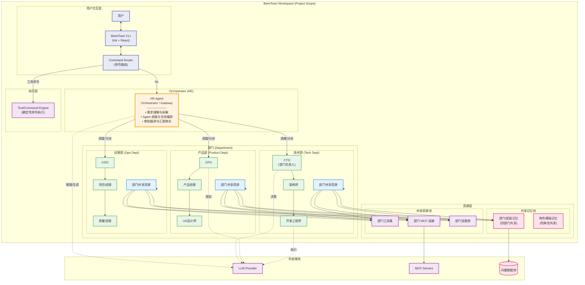
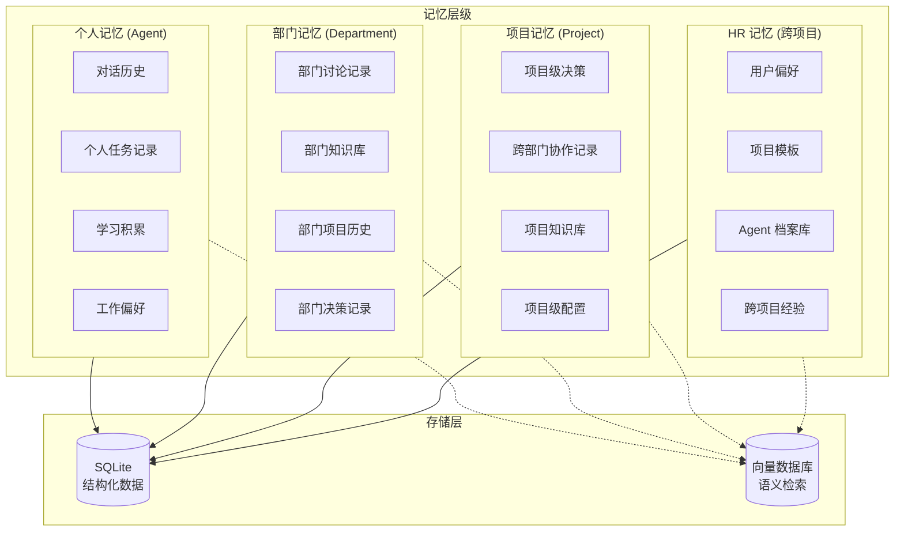
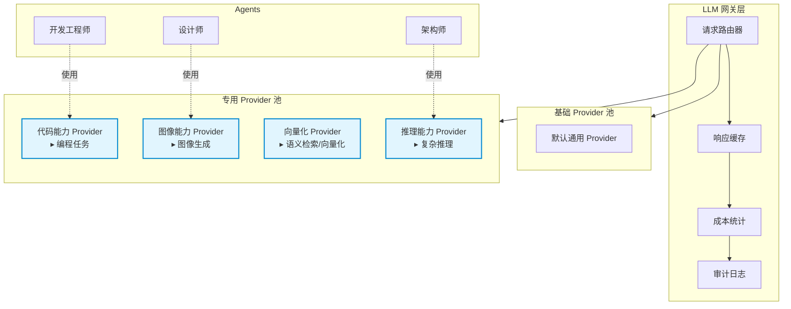

# BeesTown 架构设计文档

## 1. 项目愿景

BeesTown 是一个**面向多 Agent 协作的本地 CLI 工具**：用于创建或接管一个项目工作区，并在该工作区内持续进行开发、重构、调试、文件操作与项目管理。

BeesTown 以“组织结构/权限等级/审批链路”作为运行时建模方式，用于表达 Agent 之间的职责划分、资源继承与权限控制。

当前产品边界默认设定为：**仅支持单人类用户（单操作者）**，所有审批最终由同一个人类用户确认。

### 核心理念
- **双通道路由**：确定性工具命令直达执行引擎；自然语言（NL）请求进入编排/协调 Agent
- **编排入口（HR）**：统一的自然语言入口，负责需求理解、任务拆解、Agent 调度与审批编排
- **层级化信息流**：信息沿汇报链路流动，跨域协作通过接口人或共同上级
- **分层资源模型**：工具、MCP、技能与记忆支持项目/部门/个人层级组合与覆盖
- **分级审批**：工具调用按权限级别执行审批，确保高风险操作可控、可审计
- **目录即项目**：以当前打开目录为项目作用域，项目数据落在 `.bees/`

---

## 2. 系统架构概览



---

## 3. 核心概念设计

### 3.1 项目（被管理工作区）模型

每个 BeesTown 项目是一个被 CLI 管理的工作区实体，可用于创建新项目或接管既有项目进行持续维护。项目在运行时提供组织结构、资源继承与审批链路，用于支撑多 Agent 协作与可控执行。

```typescript
interface BeesTownProject {
  id: string;                    // 项目唯一标识
  name: string;                  // 项目名称
  description: string;           // 项目描述
  kind?: 'new' | 'existing';     // 创建新项目 / 进入维护既有项目（可选，用于语义表达）
  
  // 编排入口
  hr: HRAgent;                   // Orchestrator Agent (固定存在)
  
  // 组织架构
  departments: Department[];     // 部门列表
  agents: Map<string, Agent>;    // 所有 Agent
  hierarchy: OrganizationTree;   // 汇报关系树
  
  // 项目级共享资源
  sharedResources: SharedResources;
  
  // 项目状态
  status: 'active' | 'paused' | 'archived';
  createdAt: Date;
  updatedAt: Date;
}
```

项目级共享资源用于表达“默认对项目内所有 Agent 可用”的资源（例如默认工具集、默认 MCP、项目级记忆/规则）。为减少两套容器并存的复杂度，推荐将其实现为一个特殊的“项目根部门”（`kind='project'`）：

- 项目级资源 = 项目根部门的 `shared`
- 业务部门（如技术部/产品部/运营部）在其 `shared` 之上叠加与覆盖

这样资源继承链路保持一致：项目级（项目根部门）→ 部门 → 个人。

### 3.2 部门模型 (Department)

部门是资源共享的容器，同部门 Agent 共享工具、MCP、技能和记忆：

```typescript
interface Department {
  id: string;
  name: string;                  // 如 "技术部"
  code: string;                  // 如 "tech"
  description: string;
  kind: 'project' | 'department';
  parentId?: string;             // 上级部门（用于组织结构与资源继承，不用于权限）
  
  // 部门负责人
  head?: Agent;                  // 部门负责人 (CTO/CPO/COO等)
  
  // 部门成员
  members: Agent[];
  
  // ===== 部门共享资源 =====
  shared: DepartmentSharedResources;
}

interface DepartmentSharedResources {
  // 共享记忆 (部门内所有成员可访问)
  memory: {
    shortTerm: Message[];        // 近期部门讨论
    longTerm: KnowledgeBase;     // 部门知识库
    decisions: DecisionRecord[]; // 部门决策历史
    projects: ProjectRecord[];   // 部门项目历史
  };
  
  // 共享工具 (部门成员默认拥有)
  tools: Tool[];
  
  // 共享 MCP 连接
  mcpConnections: MCPConfig[];
  
  // 共享技能库
  skills: Skill[];
  
  // 共享提示词模板
  promptTemplate: string;        // 部门级系统提示词增强
}
```

### 3.3 Agent 模型

每个 Agent 是一个具备角色能力与资源配置的执行单元，拥有个人独立资源，同时继承部门共享资源：

```typescript
interface Agent {
  id: string;
  name: string;                  // Agent 名称
  role: Role;                    // 角色定义
  
  // 组织架构信息
  departmentId: string;          // 所属部门
  level: number;                 // 权限等级 (LV0-LV3)
  reportsTo: string;             // 直接上级ID
  subordinates: string[];        // 下属IDs
  
  // ===== 个人独立资源 =====
  personal: PersonalResources;
  
  // ===== 继承的共享资源 (来自部门) =====
  shared: InheritedSharedResources;
  
  // 工作状态
  state: AgentState;
  performance: PerformanceMetrics;
}

interface PersonalResources {
  // 个人独立记忆
  memory: {
    conversations: Message[];    // 个人对话历史
    tasks: TaskRecord[];         // 个人任务记录
    learnings: Learning[];       // 个人学习积累
    preferences: Preference;     // 个人工作偏好
  };
  
  // 个人专属工具 (覆盖或扩展部门工具)
  exclusiveTools: Tool[];
  
  // 个人 MCP 连接 (除部门共享外)
  personalMCP: MCPConfig[];
  
  // 个人技能 (除部门共享外)
  personalSkills: Skill[];
  
  // 个人提示词定制
  personalPrompt: string;
}
```

### 3.4 资源继承与覆盖机制

**资源冲突解决规则**：
1. **记忆**：个人 > 部门 > 项目，逐层查找
2. **工具**：同名工具，个人覆盖部门，部门覆盖项目
3. **技能**：技能可叠加；同名技能以更高权限层级为准（项目/部门优先，个人层同名不生效）
4. **MCP**：连接池合并，同名配置个人优先

### 3.4.1 资源适用范围（Level / Department）

每个 Agent 具有 `level` 与 `departmentId` 两个关键属性。资源（工具、技能、MCP 等）除继承关系外，还需要声明自己的**适用范围**，用于决定某个 Agent 是否“可见/可用”该资源。

```typescript
interface ApplicabilityScope {
  levels?: number[];        // 允许的层级列表；不填表示不限制
  departments?: string[];   // 允许的部门ID列表；不填表示不限制
}

interface ToolDefinition {
  name: string;
  scope?: ApplicabilityScope;
}

interface SkillDefinition {
  name: string;
  scope?: ApplicabilityScope;
}
```

对某个 Agent 计算可用资源时，建议流程为：

1. 先按继承链路合并（项目级/部门/个人）并做冲突解决
2. 再按资源的 `scope` 过滤：`level` 与 `departmentId` 同时满足才可用

### 3.5 命令路由与审批模型

BeesTown CLI 支持两条输入通道，以保持"传统命令行的可预测性"与"自然语言协作"的一致体验：

1. **工具命令直达（Deterministic Commands）**：用户显式调用工具/命令时，CLI 直接进入命令系统与执行引擎，不经过 HR 的自然语言理解流程。  
   - 适用：`beestown org chart`、`beestown grep ...`、`beestown run ...` 等确定性命令
2. **自然语言经 HR（NL → HR）**：当输入为自然语言需求时，由 HR 负责理解、招聘/调配、任务分发与跨角色协作编排。  
   - 适用：`beestown "招聘一名 React 前端工程师"`、`beestown "让前端团队实现用户登录页面"`

#### 3.5.1 输入判定（参考 Claude Code / Qwen CLI 风格）

CLI 对用户输入优先做"能否确定解析"的判定：

1. **可确定解析为已注册子命令/工具调用**：进入工具命令通道（不经过 HR）
2. **无法解析或存在歧义**：fallback 为自然语言（NL → HR），避免误执行

#### 3.5.2 HR 的混合策略与可解释人员规划

HR 的"需求理解/团队推荐/人员规划"采用混合策略：规则/约束兜底 + LLM 做理解与拆解。优先级上以可解释的硬约束为边界，LLM 只在规则空间内生成方案。

人员规划与推荐理由基于任务拆解与容量约束推导：

- 优先拆解为互不干涉的任务并行分配
- 单个工人 Agent（例如前端）的 to-do list 最多 5 个
- 单个 Agent 的上下文 + 本次输入不超过 150K
- 单个 Agent 的 ReAct 次数控制在 8–12 次
- 若项目经理 Agent 的规划超过以上限制，则需要增加更多工人 Agent
- HR 需要与项目经理 Agent 沟通任务与人员需求，完成团队规模规划

同时，引入基于组织层级的**分级审批**来约束工具调用：

- **LV0：人类用户**（最终授权者，当前仅单人类用户/单操作者）
- **LV1：HR、项目管理/项目经理**（面向组织协调的一级 Agent）
- **LV2+：下级执行型 Agent**（如架构师/开发/测试等）

审批规则（默认）：

1. **批准者判定**：以 `reportsTo` 为准，部门内部按 LV3→LV2→LV1 层级递进；跨部门场景由项目经理/架构设计定义信息流转规则
2. **下级 Agent 调用工具需要其直接上级批准**
3. **LV1（HR/项目管理）调用工具需要 LV0（人类用户）批准**
4. **LV2+（开发/测试等）无需直接请求人类批准**，但必须经由上级 Agent 审批后方可执行
5. **工具审批范围**：仅危险操作需要上级批准；查看/读取类工具无需批准

**工具风险分级**：

| 风险等级 | 工具类型 | 示例 | 审批要求 |
|---------|---------|------|---------|
| **高危** | 破坏性操作 | 删除文件/目录、格式化、系统命令 | 需 LV1 上级批准 |
| **中危** | 写入/修改操作 | 编辑文件、创建目录、安装依赖 | 需 LV2 上级批准 |
| **低危** | 读取/查询操作 | 读取文件、搜索、查看日志 | 无需批准 |
| **网络** | 外部请求 | HTTP 请求、API 调用、下载 | 需 LV1 上级批准（默认安全策略） |

**范围限制（白名单）**：
- 文件系统：默认仅限项目目录内操作（`projectRoot/.bees/` 除外）
- 网络：默认禁止外部请求，可通过白名单配置允许特定域名
- 命令执行：默认禁止系统级命令，可通过白名单配置允许特定命令

该模型用于在保持自动化执行效率的同时，确保高权限操作可控、可审计。

### 3.6 任务系统与行动树

#### 3.6.1 任务事件模型

任务以**事件（Event）**形式存在，通过 `taskId` 对每个 Agent 的执行行为进行编码：

```typescript
interface TaskEvent {
  taskId: string;                // 任务唯一标识
  type: TaskType;                // 任务类型：plan | execute | review | approve
  assignee: string;              // 被分配 Agent ID
  
  // 输入输出
  input: TaskInput;              // 任务输入（目标、上下文、依赖）
  output?: TaskOutput;           // 任务输出（产物、总结、状态）
  
  // 任务关系
  parentTaskId?: string;         // 父任务ID（形成任务树）
  dependencies: string[];        // 依赖的任务ID列表
  
  // 状态管理
  status: 'pending' | 'in_progress' | 'completed' | 'failed' | 'blocked';
  createdAt: Date;
  startedAt?: Date;
  completedAt?: Date;
  
  // 产物链接
  artifacts: Artifact[];         // 任务产物（文件、文档、代码等）
}

interface TaskInput {
  objective: string;             // 任务目标
  acceptanceCriteria: string[];  // 验收标准
  context: ContextSnapshot;      // 上下文快照
  constraints: Constraint[];     // 约束条件
}

interface TaskOutput {
  summary: string;               // 执行摘要
  decisions: Decision[];         // 关键决策记录
  deliverables: string[];        // 交付物清单
  nextSteps?: string[];          // 后续建议
}
```

#### 3.6.2 行动树（Action Tree）

每个 Agent 构建**行动树**，记录接收任务、输入输出、信息流向、内部每次 ReAct 流程的树状结构：

```typescript
interface ActionTree {
  root: ActionNode;              // 根节点（接收的任务）
  nodes: Map<string, ActionNode>;
}

interface ActionNode {
  id: string;
  type: 'receive' | 'think' | 'tool_call' | 'observe' | 'respond' | 'delegate';
  
  // 节点内容
  input: string;                 // 输入信息
  output?: string;               // 输出信息
  
  // 关系
  parentId?: string;             // 父节点
  children: string[];            // 子节点
  
  // ReAct 特定字段
  thought?: string;              // 思考过程（think 节点）
  action?: ToolCall;             // 工具调用（tool_call 节点）
  observation?: string;          // 观察结果（observe 节点）
  
  // 元数据
  timestamp: Date;
  tokenUsage?: number;           // Token 消耗
  duration?: number;             // 执行耗时(ms)
}
```

**行动树可视化示例**：

```
[Receive] 接收任务: 实现用户登录页面
    ├── [Think] 分析需求
    │   └── 需要: 1)UI组件 2)表单验证 3)API对接
    ├── [Delegate] 委派子任务给组件库
    │   └── [Observe] 获取Button/Input组件文档
    ├── [Think] 设计页面结构
    ├── [ToolCall] 读取现有认证代码
    │   └── [Observe] 发现已有auth.ts
    ├── [Think] 决定复用现有逻辑
    ├── [ToolCall] 编辑 LoginPage.tsx
    │   └── [Observe] 文件写入成功
    └── [Respond] 汇报完成
        └── 产物: LoginPage.tsx, auth.ts(修改)
```

#### 3.6.3 并发控制与资源锁定

支持**并发执行**，但需通过项目管理 Agent 进行严格规划：

**资源锁定策略**：
- **规划阶段锁定**：同部门文件只允许单个 Agent 修改
- 项目管理 Agent 需仔细规划每个文件的使用顺序及读取顺序
- 冲突预防 > 冲突检测 > 冲突解决

```typescript
interface ResourceLock {
  resourceId: string;            // 资源标识（文件路径、PRD ID等）
  resourceType: 'file' | 'document' | 'config' | 'database';
  taskId: string;                // 占用任务ID
  agentId: string;               // 占用 Agent ID
  lockType: 'read' | 'write' | 'exclusive';
  acquiredAt: Date;
  expiresAt: Date;               // 锁过期时间（防止死锁）
}
```

**冲突处理优先级**：
1. **预防**：规划阶段识别潜在冲突，通过任务编排避免
2. **检测**：执行前检查资源锁状态，冲突时排队或重试
3. **解决**：若发生冲突，上报上级 Agent 仲裁

#### 3.6.4 汇报机制

**结构化汇报为主**，自由文本补充：

```typescript
interface Report {
  // 结构化摘要（默认展示）
  summary: {
    taskId: string;
    status: TaskStatus;
    completionRate: number;      // 完成百分比
    keyDecisions: Decision[];    // 关键决策
    blockers?: string[];         // 阻塞项
  };
  
  // 详细执行日志（存储但不默认展示）
  executionLog: ActionTree;
  
  // 自由文本补充（可选）
  narrative?: string;
}
```

**CLI 展示策略**：
- 人类操作者只需接收项目管理 Agent 的汇报（结构化摘要 + 关键决策点）
- Agent 级详细执行日志存储在 SQLite 中，可通过 `--verbose` 查看

### 3.7 安全基线与权限模型

#### 3.7.1 安全基线

**默认安全（限制多、显式放权）**策略：

```typescript
interface SecurityBaseline {
  // 文件系统安全
  fileSystem: {
    allowedPaths: string[];      // 允许访问的路径（默认仅项目目录）
    blockedPaths: string[];      // 禁止访问的路径
    requireConfirmation: string[]; // 需二次确认的操作（删除、覆盖等）
  };
  
  // 命令执行安全
  commandExecution: {
    allowedCommands: string[];   // 允许执行的命令白名单
    blockedCommands: string[];   // 禁止执行的命令黑名单
    requireConfirmation: string[]; // 需二次确认的危险命令
  };
  
  // 网络访问安全
  network: {
    allowedHosts: string[];      // 允许访问的主机
    blockedHosts: string[];      // 禁止访问的主机
    requireConfirmation: boolean; // 外部网络请求需确认
  };
  
  // 审计日志
  audit: {
    logAllOperations: boolean;   // 记录所有操作
    logLevel: 'debug' | 'info' | 'warn' | 'error';
    retentionDays: number;       // 日志保留天数
  };
}
```

**基线规则**：
1. 默认只允许在项目目录内读写（`projectRoot/.bees/` 配置目录除外）
2. 危险命令（删除、系统命令等）需上级批准
3. 所有变更写审计日志
4. 敏感操作（权限提升、外部网络等）需显式授权
5. 支持白名单配置：允许特定域名、特定命令、特定路径

#### 3.7.2 最小权限模型

**最小权限模型以最小执行单元（单个 Agent）为基础**：

```typescript
interface PermissionModel {
  // 基础权限（每个 Agent 独立）
  basePermissions: Permission[];
  
  // 继承权限（来自部门/项目）
  inheritedPermissions: Permission[];
  
  // 临时权限（任务级别动态授权）
  temporaryPermissions: {
    permissions: Permission[];
    grantedBy: string;           // 授权人
    grantedAt: Date;
    expiresAt: Date;             // 临时权限过期时间
    taskId: string;              // 关联任务
  }[];
}

interface Permission {
  resource: string;              // 资源标识
  action: 'read' | 'write' | 'execute' | 'delete' | 'admin';
  scope?: ApplicabilityScope;    // 适用范围
  conditions?: Condition[];      // 附加条件
}
```

**权限继承链**：
- 个人权限 → 部门权限 → 项目权限（逐层累积）
- 同权限冲突时，**个人 > 部门 > 项目**（覆盖原则）
- 每层级固定权限，需显式申请提升

---
## 4. 子系统架构文档
BeesTown 的详细架构设计分布在以下子文档中：

| 文档 | 路径 | 内容概述 |
|------|------|---------|
| **存储架构** | [`STORAGE_ARCHITECTURE.md`](./STORAGE_ARCHITECTURE.md) | 向量数据库(短期记忆) + SQLite(长期记忆)，Token/时间/文件操作记录 |
| **Agent架构** | [`AGENT_ARCHITECTURE.md`](./AGENT_ARCHITECTURE.md) | ReACT执行模式、跨项目通信、工具集成 |
| **LLM架构** | [`LLM_ARCHITECTURE.md`](./LLM_ARCHITECTURE.md) | OpenAI兼容接口、多提供商支持、通信记录存储 |
| **文件操作架构** | [`FILE_OPERATIONS_ARCHITECTURE.md`](./FILE_OPERATIONS_ARCHITECTURE.md) | Claude CLI/Codex/Trae风格文件操作、安全机制、智能编辑 |
| **CLI架构** | [`CLI_ARCHITECTURE.md`](./CLI_ARCHITECTURE.md) | Ink+React终端UI、命令系统、状态管理、事件系统 |
| **任务系统架构** | [`TASK_SYSTEM_ARCHITECTURE.md`](./TASK_SYSTEM_ARCHITECTURE.md) | 任务流转、调度器、执行引擎、汇报链 |
| **特殊Agent架构** | [`SPECIAL_AGENTS_ARCHITECTURE.md`](./SPECIAL_AGENTS_ARCHITECTURE.md) | HR/架构师/测试员三个必存Agent的详细设计 |

---

## 5. 信息流与汇报机制

### 5.1 信息流动规则

**信息流规则**：
1. **汇报线**：信息沿 `reportsTo` 链路上下流动
2. **跨部门协作**：允许跨部门，由项目经理/架构设计定义跨部门信息流转规则，开放不同部门 Agent 之间的信息交互
3. **紧急通道**：仅在以下情况由**人类用户**触发，直接指定接收方（可跨层级/跨部门）：
   - 上级 Agent 不可用（错误/超时/无响应）
   - 时间敏感事件（安全/系统故障）
   - 审批链断裂（中间层级失败/循环）
4. **信息共享**：部门内默认共享，跨部门需授权

### 5.2 任务分配与执行流程

详见 [`TASK_SYSTEM_ARCHITECTURE.md`](./TASK_SYSTEM_ARCHITECTURE.md) 第3章

---

## 6. 记忆系统架构

### 6.1 四层记忆模型

记忆系统采用**四层架构**，每层记忆独立但可继承，层级划分非固定，根据项目需求动态调整：



**四层记忆定义**：

| 层级 | 范围 | 存储内容 | 访问权限 |
|------|------|----------|----------|
| **个人记忆** | 单个 Agent | 对话历史、任务记录、学习积累、工作偏好 | 仅该 Agent |
| **部门记忆** | 同部门 Agent | 部门讨论、知识库、项目历史、决策记录 | 部门内共享 |
| **项目记忆** | 全项目 Agent | 项目级决策、跨部门协作、项目知识库 | 项目内共享 |
| **HR 记忆** | 跨项目 | 用户偏好、项目模板、Agent 档案、跨项目经验 | HR + 授权访问 |

### 6.2 记忆继承与访问控制

**记忆继承链**：
- 读取时：**个人 → 部门 → 项目 → HR**（逐层查找，找到即止）
- 写入时：仅写入当前层级，不影响上层
- 层级划分**非固定**，可根据项目规模和复杂度动态调整

```typescript
interface MemoryLayer {
  layer: 'personal' | 'department' | 'project' | 'hr';
  agentId?: string;              // 个人层：所属 Agent
  departmentId?: string;         // 部门层：所属部门
  projectId?: string;            // 项目层：所属项目
  
  // 记忆内容
  shortTerm: VectorMemory;       // 向量数据库存储（语义检索）
  longTerm: StructuredMemory;    // SQLite 存储（结构化数据）
}

interface VectorMemory {
  // 向量库存储：用于语义检索的短期记忆
  conversationEmbeddings: Embedding[];  // 对话片段 embedding
  knowledgeEmbeddings: Embedding[];     // 知识条目 embedding
  fileEmbeddings: Embedding[];          // 文件片段 embedding
}

interface StructuredMemory {
  // SQLite 存储：结构化长期记忆
  events: Event[];               // 事件日志
  tasks: TaskRecord[];           // 任务记录
  decisions: Decision[];         // 决策记录
  indices: Index[];              // 索引数据
}
```

### 6.3 存储策略

**向量数据库（短期记忆）**：
- 存储内容：对话片段、知识条目、文件片段的 embedding
- 用途：语义检索、相似度匹配、上下文召回
- 生命周期：定期清理过期数据，重要内容升维到长期记忆

**SQLite（长期记忆）**：
- 存储内容：事件日志、任务记录、决策记录、索引
- 用途：精确查询、历史追溯、审计分析
- 生命周期：持久化存储，按保留策略归档

### 6.4 记忆访问权限

详见 [`STORAGE_ARCHITECTURE.md`](./STORAGE_ARCHITECTURE.md) 第2-3章

---

## 7. CLI 架构与交互

### 7.1 启动流程

```bash
# 创建新项目
$ beestown init my-project

欢迎来到 BeesTown
HR: 已初始化项目工作区

# 进入项目
$ beestown enter my-project

已进入项目: my-project
HR: 请描述你的需求，或直接输入确定性命令

# 直接执行命令
$ beestown "招聘一名 React 前端工程师"

HR: 正在创建并配置 Agent...
已创建 Agent: Bob
   部门: 技术部
   上级: CTO
   技能: React, TypeScript, Tailwind
```

### 7.2 项目作用域与 `.bees/` 目录约定

BeesTown 以用户“当前打开/进入的目录”作为项目作用域（Project Scope）：

1. **项目级数据落地位置**：与该项目相关的配置、记忆、技能等 CLI 数据，统一存放在项目目录下的 `.bees/` 子目录中。
2. **外部文件访问**：允许通过绝对路径访问项目目录外的文件，但项目级数据（配置、记忆、技能等）仍只写入当前项目的 `.bees/`，不在外部目录创建或散落状态文件。

### 7.3 交互模式

详见 [`CLI_ARCHITECTURE.md`](./CLI_ARCHITECTURE.md) 第4章

---

## 8. LLM Provider 架构

### 8.1 核心设计理念

LLM Provider 以“能力画像（Capability Profile）”形式注册，系统支持为不同任务类型选择不同 Provider。默认使用基础 Provider，遇到编程、图像生成、向量化等任务时切换到对应的专用 Provider。



### 8.2 Provider 能力画像模型

```typescript
interface LLMProvider {
  id: string;
  name: string;                  // Provider 名称：如 "CodeExpert-Claude"
  type: 'base' | 'specialized';  // 基础型 / 专用型
  
  // 能力定义
  capabilities: Capability[];    // 声明的能力列表
  specialties: string[];         // 专长领域标签
  
  // 配置
  config: ProviderConfig;        // API 配置
  model: ModelConfig;            // 模型参数
  
  // 状态
  status: 'active' | 'inactive' | 'error';
  usageStats: UsageStatistics;   // 使用统计
}

interface Capability {
  type: 'code' | 'image' | 'vector' | 'reasoning' | 'chat';
  priority: number;              // 能力优先级（用于自动选择）
  supportedFormats: string[];    // 支持的输入/输出格式
  maxTokens: number;
  costPer1KTokens: number;
}

interface ProviderConfig {
  provider: 'openai' | 'anthropic' | 'google' | 'local' | 'custom';
  apiKey?: string;               // 从环境变量或密钥管理读取
  baseUrl?: string;              // 自定义 API 地址
  timeout: number;
  retryPolicy: RetryPolicy;
}

interface ModelConfig {
  model: string;                 // 模型名称
  temperature: number;
  maxTokens: number;
  topP?: number;
  frequencyPenalty?: number;
  presencePenalty?: number;
}
```

### 8.3 Agent-Provider 映射配置

每个 Agent 可配置一个或多个 Provider，支持主备和场景切换：

```typescript
interface AgentProviderConfig {
  agentId: string;
  
  // 默认 Provider（通用对话）
  defaultProvider: string;
  
  // 场景特定 Provider 映射
  scenarioProviders: Map<TaskType, string>;
  
  // 示例：
  // - code_review → "CodeExpert-Claude"
  // - image_gen → "ImageExpert-DALLE"
  // - embedding → "VectorExpert-OpenAI"
  
  // 回退策略
  fallback: {
    onError: 'retry' | 'fallback_to_default' | 'escalate';
    maxRetries: number;
  };
}

// 预定义场景映射模板
const ScenarioTemplates: Record<string, TaskType[]> = {
  'frontend_dev': ['code', 'review', 'test'],
  'designer': ['image_gen', 'ui_review', 'asset_optimize'],
  'architect': ['reasoning', 'design_review', 'tech_decision'],
};
```

### 8.4 Provider 配置流程

**方式一：用户手动配置**

```bash
# 查看可用 Provider
$ beestown provider list

# 创建新的 Provider
$ beestown provider create "CodeExpert-Claude" \
    --provider anthropic \
    --model claude-3-5-sonnet-20241022 \
    --capability code:10,review:9 \
    --specialty "React,TypeScript,Node.js"

# 为 Agent 分配 Provider
$ beestown agent config-provider Bob \
    --default "CodeExpert-Claude" \
    --scenario image_gen:"ImageExpert-DALLE"
```

**方式二：HR 自动推荐**

```typescript
interface ProviderRecommendation {
  agentId: string;
  recommendedProviders: {
    default: string;
    scenarios: Map<TaskType, string>;
  };
  reasoning: string;             // 推荐理由
  estimatedCost: CostEstimate;   // 预估成本
  alternatives: string[];        // 备选方案
}

// HR 自动推荐流程
async function recommendProviders(agent: Agent, task: Task): Promise<ProviderRecommendation> {
  // 1. 分析 Agent 角色和任务类型
  // 2. 匹配最适合的 Provider 能力
  // 3. 计算成本预估
  // 4. 生成推荐理由
  // 5. 等待用户确认
}
```

**配置确认流程**：

```
HR: 根据 Bob（前端工程师）的职责，推荐以下 Provider 配置：

   推荐方案：
   ├─ 默认 Provider: CodeExpert-Claude
   │  └─ 模型: claude-3-5-sonnet
   │  └─ 专长: React, TypeScript, Vue
   │
   ├─ 代码审查场景: CodeReviewer-GPT4
   │  └─ 模型: gpt-4-turbo
   │
   └─ 图像生成场景: ImageExpert-DALLE
      └─ 模型: dall-e-3

   预估月度成本: $45-60
   是否确认此配置？

$ beestown "确认"
已为 Bob 配置 Provider
```

### 8.5 可复现与回放

**必须持久化的数据**：

```typescript
interface LLMInteractionRecord {
  recordId: string;
  timestamp: Date;
  
  // 请求信息
  request: {
    providerId: string;
    model: string;
    prompt: string;
    systemPrompt?: string;
    temperature: number;
    maxTokens: number;
    tools?: ToolDefinition[];
  };
  
  // 响应信息
  response: {
    content: string;
    toolCalls?: ToolCall[];
    finishReason: string;
  };
  
  // 元数据
  metadata: {
    agentId: string;
    taskId: string;
    tokenUsage: {
      prompt: number;
      completion: number;
      total: number;
    };
    cost: number;
    latency: number;
  };
  
  // 用于回放
  contextSnapshot: ContextSnapshot;
}

// 回放功能
async function replayInteraction(recordId: string): Promise<void> {
  // 1. 加载历史记录
  // 2. 还原上下文
  // 3. 使用相同参数重新执行
  // 4. 对比新旧结果
}
```

---

## 9. 目录结构

```
beestown/
├── src/
│   ├── cli/                      # CLI 入口和界面
│   │   ├── index.ts             # 入口
│   │   ├── commands/            # 命令定义
│   │   ├── components/          # Ink UI 组件
│   │   └── hooks/               # React hooks
│   │
│   ├── core/                     # 核心引擎
│   │   ├── project/             # 项目管理
│   │   ├── hr/                  # HR Agent
│   │   ├── organization/        # 组织架构
│   │   ├── agent/               # Agent 运行时
│   │   ├── task/                # 任务系统
│   │   └── memory/              # 记忆系统
│   │
│   ├── resources/                # 资源管理
│   │   ├── skills/              # 技能定义
│   │   ├── tools/               # 工具实现
│   │   └── mcp/                 # MCP 集成
│   │
│   ├── llm/                      # LLM 集成
│   ├── storage/                  # 数据持久化
│   └── types/                    # 类型定义
│
├── templates/                    # 项目模板
│   ├── projects/                # 项目类型模板
│   ├── departments/             # 部门模板
│   └── roles/                   # 角色模板
│
└── package.json
```

---

## 10. 使用场景示例

### 场景 1：启动新项目

```bash
$ beestown init ecommerce-project

欢迎来到 BeesTown
HR: 请描述项目目标与约束

$ beestown "我要做一个电商网站，需要前后端"
HR: 已理解需求，建议如下团队配置：

   推荐方案：
   ├─ 技术部
   │  ├─ CTO x1 (技术负责人)
   │  ├─ 前端工程师 x2 (React)
   │  └─ 后端工程师 x2 (Node.js)
   └─ 产品部
      ├─ 产品经理 x1
      └─ UI设计师 x1

   预计团队规模：7人
   是否确认创建以上 Agent？"

$ beestown "确认，帮我招聘"
HR: 正在创建并配置 Agent...

已创建技术部
已任命 CTO (David)
已创建前端工程师 Agent (Alice, Bob)
已创建后端工程师 Agent (Charlie, Diana)
已创建产品部
已创建产品经理 Agent (Eve)
已创建 UI 设计师 Agent (Frank)

团队创建完成。输入 'beestown org chart' 查看组织架构
```

### 场景 2：通过 HR 分配任务

```bash
$ beestown "让前端团队实现用户登录页面"
HR: 已接收需求，开始任务拆解与分派

任务流转：
HR → CTO: "需要开发登录页面"
CTO → 前端组长: "分配登录页面开发任务"
前端组长 → Alice: "实现登录表单UI"
前端组长 → Bob: "实现登录逻辑和API对接"

任务已分配
   负责人: Alice, Bob
   截止时间: 2024-01-20
   状态: 进行中
```

---

## 11. 未来规划

### Phase 1: MVP (核心功能)
- [ ] CLI 基础框架
- [ ] HR Agent 入口
- [ ] Agent 创建/移除
- [ ] 简单部门管理
- [ ] 文件/代码工具

### Phase 2: 智能增强
- [ ] HR NLP 自然语言理解
- [ ] Agent/Provider 配置推荐
- [ ] 自动任务分解
- [ ] 记忆系统完善

### Phase 3: 生态扩展
- [ ] 更多部门模板
- [ ] 角色市场
- [ ] Web 可视化界面
- [ ] 多项目协作

### Phase 4: 企业级
- [ ] 权限管理 (RBAC)
- [ ] 审计日志
- [ ] 性能分析
- [ ] 云同步
- [ ] API 接口

---

## 12. 总结

BeesTown 的目标是将多 Agent 协作能力以可控、可审计、可扩展的方式落地到本地 CLI 工作流中：

1. **双通道路由**：确定性命令与自然语言编排并存
2. **组织与审批**：基于层级链路进行任务分派与工具调用审批
3. **资源与记忆分层**：项目/部门/个人/跨项目层级可组合，支持覆盖与过滤
4. **任务可追踪**：任务事件 + 行动树记录执行过程与信息流
5. **多 Provider 支持**：按任务类型选择最合适的 LLM Provider，并支持回放

---

## 附录：架构文档索引

### 核心架构
- [存储架构](./STORAGE_ARCHITECTURE.md) - 数据持久化设计（向量DB + SQLite）
- [记忆系统架构](./MEMORY_SYSTEM_ARCHITECTURE.md) - **新增** - 四层记忆模型、访问控制、生命周期
- [Agent架构](./AGENT_ARCHITECTURE.md) - Agent 运行时设计（ReACT模式、通信）
- [LLM架构](./LLM_ARCHITECTURE.md) - LLM 集成设计（OpenAI兼容、多提供商）

### 功能架构
- [CLI架构](./CLI_ARCHITECTURE.md) - 命令行界面设计（Ink+React）
- [任务系统架构](./TASK_SYSTEM_ARCHITECTURE.md) - 任务流转与调度
- [Tools架构](./TOOLS_ARCHITECTURE.md) - **核心** - 工具系统（Read/Edit/Bash/Grep等内置工具 + MCP工具）
- [文件操作架构](./FILE_OPERATIONS_ARCHITECTURE.md) - 文件系统操作详细设计

### 集成架构
- [MCP集成架构](./MCP_INTEGRATION_ARCHITECTURE.md) - MCP连接、权限控制、审计
- [Skills架构](./SKILLS_ARCHITECTURE.md) - 技能系统、权限控制、继承组合

### 特殊组件
- [特殊Agent架构](./SPECIAL_AGENTS_ARCHITECTURE.md) - HR/架构师/测试员详细设计
