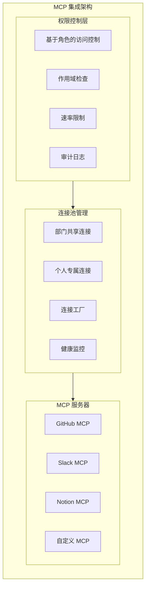

# BeesTown MCP 集成架构设计

## 1. 概述

MCP (Model Context Protocol) 是 BeesTown 连接外部服务的标准协议。每个 Agent 可以拥有个人 MCP 连接，同时继承部门的共享 MCP 连接。



---

## 2. MCP 配置模型

### 2.1 基础配置

```typescript
interface MCPConfig {
  id: string;
  name: string;                    // 连接名称，如 "github-main"
  serverType: string;              // 服务器类型，如 "github"
  
  // 连接配置
  transport: 'stdio' | 'sse' | 'http';
  command?: string;                // stdio 模式命令
  args?: string[];                 // 命令参数
  url?: string;                    // sse/http 模式 URL
  
  // 认证
  auth: MCPAuthConfig;
  
  // 权限控制
  permissions: MCPPermissions;
  
  // 作用域
  scope: 'personal' | 'department' | 'project';
  ownerId: string;                 // 所属 Agent/部门/项目 ID
  
  // 状态
  status: 'active' | 'inactive' | 'error';
  lastUsed: number;
  errorCount: number;
}

interface MCPAuthConfig {
  type: 'token' | 'oauth' | 'api_key' | 'none';
  
  // Token 模式
  token?: string;
  tokenHeader?: string;
  
  // OAuth 模式
  clientId?: string;
  clientSecret?: string;
  refreshToken?: string;
  
  // API Key 模式
  apiKey?: string;
  apiKeyHeader?: string;
}

interface MCPPermissions {
  // 允许的工具
  allowedTools: string[];
  
  // 禁止的工具
  deniedTools: string[];
  
  // 资源访问模式
  resourcePatterns: {
    allow: string[];               // 允许访问的资源模式
    deny: string[];                // 禁止访问的资源模式
  };
  
  // 操作限制
  limits: {
    maxCallsPerMinute: number;
    maxCallsPerHour: number;
    maxDataSize: number;           // 最大数据大小（MB）
  };
  
  // 是否需要审批
  requireApproval: boolean;
  approvalLevel: 'none' | 'agent' | 'manager' | 'hr';
}
```

### 2.2 权限继承与合并

```typescript
class MCPPermissionManager {
  // 合并多个 MCP 配置的权限
  mergePermissions(configs: MCPConfig[]): MergedPermissions {
    const merged: MergedPermissions = {
      allowedTools: new Set(),
      deniedTools: new Set(),
      resourcePatterns: { allow: [], deny: [] },
      limits: {
        maxCallsPerMinute: Infinity,
        maxCallsPerHour: Infinity,
        maxDataSize: Infinity
      },
      requireApproval: false,
      highestApprovalLevel: 'none'
    };

    for (const config of configs) {
      const perm = config.permissions;
      
      // 允许的工具取并集
      perm.allowedTools.forEach(tool => merged.allowedTools.add(tool));
      
      // 禁止的工具取并集
      perm.deniedTools.forEach(tool => merged.deniedTools.add(tool));
      
      // 资源模式合并
      merged.resourcePatterns.allow.push(...perm.resourcePatterns.allow);
      merged.resourcePatterns.deny.push(...perm.resourcePatterns.deny);
      
      // 限制取最严格的
      merged.limits.maxCallsPerMinute = Math.min(
        merged.limits.maxCallsPerMinute,
        perm.limits.maxCallsPerMinute
      );
      
      // 审批级别取最高的
      if (this.approvalLevelWeight(perm.approvalLevel) > 
          this.approvalLevelWeight(merged.highestApprovalLevel)) {
        merged.highestApprovalLevel = perm.approvalLevel;
        merged.requireApproval = true;
      }
    }

    // 最终权限 = 允许 - 禁止
    merged.deniedTools.forEach(tool => merged.allowedTools.delete(tool));

    return merged;
  }

  // 检查 Agent 是否有权限使用 MCP 工具
  async checkPermission(
    agentId: string,
    mcpName: string,
    toolName: string,
    params: any
  ): Promise<PermissionCheckResult> {
    const agent = await this.storage.getAgent(agentId);
    const mcp = await this.getMCPConfig(mcpName);

    // 1. 检查 Agent 是否有权访问该 MCP
    if (!this.canAccessMCP(agent, mcp)) {
      return { allowed: false, reason: 'Agent has no access to this MCP' };
    }

    // 2. 检查工具权限
    if (!mcp.permissions.allowedTools.includes(toolName)) {
      return { allowed: false, reason: `Tool ${toolName} is not allowed` };
    }

    if (mcp.permissions.deniedTools.includes(toolName)) {
      return { allowed: false, reason: `Tool ${toolName} is denied` };
    }

    // 3. 检查资源访问权限
    const resourceCheck = this.checkResourceAccess(
      mcp.permissions.resourcePatterns,
      params
    );
    if (!resourceCheck.allowed) {
      return resourceCheck;
    }

    // 4. 检查速率限制
    const rateCheck = await this.checkRateLimit(agentId, mcpName);
    if (!rateCheck.allowed) {
      return rateCheck;
    }

    // 5. 检查是否需要审批
    if (mcp.permissions.requireApproval) {
      return {
        allowed: true,
        requiresApproval: true,
        approvalLevel: mcp.permissions.approvalLevel
      };
    }

    return { allowed: true };
  }

  private canAccessMCP(agent: Agent, mcp: MCPConfig): boolean {
    switch (mcp.scope) {
      case 'personal':
        return mcp.ownerId === agent.id;
      case 'department':
        return agent.departmentId === mcp.ownerId;
      case 'project':
        return agent.projectId === mcp.ownerId;
      default:
        return false;
    }
  }

  private approvalLevelWeight(level: string): number {
    const weights = { none: 0, agent: 1, manager: 2, hr: 3 };
    return weights[level] || 0;
  }
}
```

---

## 3. MCP 客户端管理

### 3.1 连接池

```typescript
class MCPConnectionPool {
  private connections: Map<string, MCPClient> = new Map();
  private healthStatus: Map<string, HealthStatus> = new Map();

  // 获取或创建连接
  async getConnection(config: MCPConfig): Promise<MCPClient> {
    const key = `${config.id}:${config.ownerId}`;
    
    // 检查现有连接
    let client = this.connections.get(key);
    if (client && this.isHealthy(key)) {
      return client;
    }

    // 创建新连接
    client = await this.createConnection(config);
    this.connections.set(key, client);
    this.healthStatus.set(key, { status: 'healthy', lastCheck: Date.now() });

    // 启动健康监控
    this.startHealthMonitor(key, config);

    return client;
  }

  private async createConnection(config: MCPConfig): Promise<MCPClient> {
    const transport = this.createTransport(config);
    
    const client = new MCPClient({
      transport,
      capabilities: {
        tools: {},
        resources: {},
        prompts: {}
      }
    });

    await client.connect();
    
    // 认证
    await this.authenticate(client, config.auth);

    return client;
  }

  private createTransport(config: MCPConfig): Transport {
    switch (config.transport) {
      case 'stdio':
        return new StdioTransport({
          command: config.command!,
          args: config.args
        });
      case 'sse':
        return new SSETransport({ url: config.url! });
      case 'http':
        return new HTTPTransport({ url: config.url! });
      default:
        throw new Error(`Unknown transport: ${config.transport}`);
    }
  }

  private async authenticate(client: MCPClient, auth: MCPAuthConfig): Promise<void> {
    switch (auth.type) {
      case 'token':
        await client.setAuthToken(auth.token!, auth.tokenHeader);
        break;
      case 'api_key':
        await client.setApiKey(auth.apiKey!, auth.apiKeyHeader);
        break;
      case 'oauth':
        await this.handleOAuth(client, auth);
        break;
    }
  }

  // 健康监控
  private startHealthMonitor(key: string, config: MCPConfig): void {
    setInterval(async () => {
      const client = this.connections.get(key);
      if (!client) return;

      try {
        await client.ping();
        this.healthStatus.set(key, { status: 'healthy', lastCheck: Date.now() });
      } catch (error) {
        this.healthStatus.set(key, { 
          status: 'unhealthy', 
          lastCheck: Date.now(),
          error: error.message 
        });
        
        // 尝试重连
        await this.reconnect(key, config);
      }
    }, 30000); // 30秒检查一次
  }
}
```

### 3.2 工具调用拦截器

```typescript
class MCPToolInterceptor {
  private permissionManager: MCPPermissionManager;
  private auditLogger: AuditLogger;
  private approvalQueue: ApprovalQueue;

  async invokeTool(
    agentId: string,
    mcpName: string,
    toolName: string,
    params: any
  ): Promise<ToolResult> {
    // 1. 权限检查
    const permission = await this.permissionManager.checkPermission(
      agentId, mcpName, toolName, params
    );

    if (!permission.allowed) {
      throw new PermissionDeniedError(permission.reason);
    }

    // 2. 如果需要审批，加入审批队列
    if (permission.requiresApproval) {
      const approvalId = await this.approvalQueue.requestApproval({
        agentId,
        mcpName,
        toolName,
        params,
        level: permission.approvalLevel
      });

      // 等待审批
      const approved = await this.waitForApproval(approvalId);
      if (!approved) {
        throw new ApprovalDeniedError('Tool invocation was not approved');
      }
    }

    // 3. 记录审计日志
    await this.auditLogger.log({
      type: 'mcp_tool_invocation',
      agentId,
      mcpName,
      toolName,
      params: this.sanitizeParams(params),
      timestamp: Date.now()
    });

    // 4. 执行工具调用
    const client = await this.getClient(agentId, mcpName);
    const result = await client.callTool(toolName, params);

    // 5. 记录结果
    await this.auditLogger.log({
      type: 'mcp_tool_result',
      agentId,
      mcpName,
      toolName,
      success: result.success,
      timestamp: Date.now()
    });

    return result;
  }

  // 敏感参数脱敏
  private sanitizeParams(params: any): any {
    const sensitiveKeys = ['password', 'token', 'secret', 'key'];
    const sanitized = { ...params };
    
    for (const key of Object.keys(sanitized)) {
      if (sensitiveKeys.some(sk => key.toLowerCase().includes(sk))) {
        sanitized[key] = '***';
      }
    }
    
    return sanitized;
  }
}
```

---

## 4. 常用 MCP 服务器配置

### 4.1 GitHub MCP

```typescript
const GITHUB_MCP_TEMPLATE: MCPConfig = {
  id: 'github',
  name: 'GitHub',
  serverType: 'github',
  transport: 'stdio',
  command: 'npx',
  args: ['-y', '@modelcontextprotocol/server-github'],
  
  auth: {
    type: 'token',
    token: process.env.GITHUB_TOKEN,
    tokenHeader: 'Authorization'
  },
  
  permissions: {
    allowedTools: [
      'create_repository',
      'fork_repository',
      'search_repositories',
      'get_file_contents',
      'create_or_update_file',
      'push_files',
      'create_issue',
      'create_pull_request',
      'search_code',
      'list_commits'
    ],
    deniedTools: ['delete_repository'],
    
    resourcePatterns: {
      allow: ['repo:read', 'repo:write', 'issues:write', 'pull_requests:write'],
      deny: ['admin:*']
    },
    
    limits: {
      maxCallsPerMinute: 60,
      maxCallsPerHour: 1000,
      maxDataSize: 10
    },
    
    requireApproval: true,
    approvalLevel: 'manager'
  },
  
  scope: 'department',
  ownerId: 'tech-dept'
};
```

### 4.2 Slack MCP

```typescript
const SLACK_MCP_TEMPLATE: MCPConfig = {
  id: 'slack',
  name: 'Slack',
  serverType: 'slack',
  transport: 'stdio',
  command: 'npx',
  args: ['-y', '@modelcontextprotocol/server-slack'],
  
  auth: {
    type: 'token',
    token: process.env.SLACK_BOT_TOKEN,
    tokenHeader: 'Authorization'
  },
  
  permissions: {
    allowedTools: [
      'slack_post_message',
      'slack_update_message',
      'slack_get_channel_history',
      'slack_list_channels',
      'slack_get_thread_replies'
    ],
    deniedTools: ['slack_delete_message', 'slack_kick_user'],
    
    resourcePatterns: {
      allow: ['channels:read', 'chat:write:bot'],
      deny: ['admin:*', 'users:admin']
    },
    
    limits: {
      maxCallsPerMinute: 30,
      maxCallsPerHour: 500,
      maxDataSize: 5
    },
    
    requireApproval: false
  },
  
  scope: 'project',
  ownerId: 'project-id'
};
```

---

## 5. 审计与监控

```typescript
interface MCPAuditLog {
  id: string;
  timestamp: number;
  
  // 调用信息
  agentId: string;
  mcpName: string;
  toolName: string;
  params: any;
  
  // 权限信息
  permissionCheck: PermissionCheckResult;
  approvalId?: string;
  
  // 结果
  success: boolean;
  result?: any;
  error?: string;
  
  // 性能
  duration: number;
  dataSize: number;
}

class MCPAuditLogger {
  private storage: Storage;

  async log(entry: Partial<MCPAuditLog>): Promise<void> {
    const fullEntry: MCPAuditLog = {
      id: generateId(),
      timestamp: Date.now(),
      ...entry
    } as MCPAuditLog;

    await this.storage.storeMCPAuditLog(fullEntry);
  }

  // 生成使用报告
  async generateReport(
    projectId: string,
    startTime: number,
    endTime: number
  ): Promise<MCPUsageReport> {
    const logs = await this.storage.getMCPAuditLogs(projectId, startTime, endTime);

    return {
      totalCalls: logs.length,
      successRate: logs.filter(l => l.success).length / logs.length,
      byMCP: this.groupByMCP(logs),
      byAgent: this.groupByAgent(logs),
      byTool: this.groupByTool(logs),
      peakUsage: this.findPeakUsage(logs),
      errors: this.analyzeErrors(logs)
    };
  }
}
```

---

## 6. 总结

BeesTown MCP 集成架构的核心设计：

1. **分层权限**：个人/部门/项目三级 MCP 配置
2. **权限继承**：Agent 自动继承部门 MCP，个人可覆盖
3. **调用拦截**：所有 MCP 调用经过权限检查和审计
4. **审批流程**：敏感操作需要上级审批
5. **健康监控**：自动检测和重连故障连接
6. **完整审计**：所有调用可追溯、可分析
