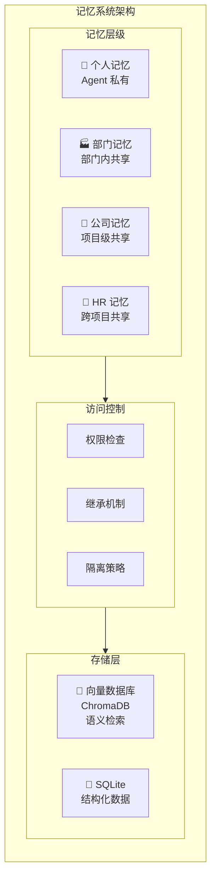

# BeesTown 记忆系统架构设计

## 1. 概述

BeesTown 采用**四层记忆架构**，结合向量数据库（语义检索）和 SQLite（结构化存储），实现高效的记忆存储、检索和共享。



---

## 2. 四层记忆模型

### 2.1 记忆层级定义

| 层级 | 作用域 | 访问权限 | 存储位置 | 生命周期 |
|------|--------|----------|----------|----------|
| **个人记忆** | Agent 私有 | 仅自己 | 向量DB + SQLite | 随 Agent 销毁 |
| **部门记忆** | 部门内共享 | 部门成员 | 向量DB + SQLite | 随部门销毁 |
| **公司记忆** | 项目级共享 | 全员只读 | SQLite | 随项目归档 |
| **HR 记忆** | 跨项目共享 | 仅 HR | SQLite | 永久保留 |

### 2.2 各层记忆详细设计

```typescript
// ==================== 个人记忆 ====================
interface PersonalMemory {
  // 短期记忆 - 当前会话上下文
  shortTerm: {
    conversationHistory: Message[];     // 最近对话历史（保留50轮）
    contextWindow: number;              // 上下文窗口大小
    currentFocus: string;               // 当前关注焦点
    workingMemory: WorkingMemoryItem[]; // 工作记忆项
  };

  // 中期记忆 - 任务和项目历史
  mediumTerm: {
    completedTasks: TaskSummary[];      // 已完成任务摘要
    decisions: DecisionRecord[];        // 重要决策记录
    interactions: InteractionLog[];     // 与其他 Agent 的交互
    learnings: Learning[];              // 学习积累
  };

  // 长期记忆 - 个人知识库
  longTerm: {
    knowledgeBase: KnowledgeItem[];     // 领域知识
    experiences: Experience[];          // 经验总结
    preferences: Preference;            // 工作偏好
    patterns: Pattern[];                // 行为模式
  };
}

// ==================== 部门记忆 ====================
interface DepartmentMemory {
  // 协作记忆
  collaboration: {
    discussions: Discussion[];          // 部门讨论记录
    meetings: MeetingRecord[];          // 会议纪要
    decisions: DepartmentDecision[];    // 部门决策
  };

  // 知识库
  knowledgeBase: {
    techStack: TechStackInfo;           // 技术栈信息
    bestPractices: BestPractice[];      // 最佳实践
    conventions: Convention[];          // 规范约定
    documentation: Document[];          // 文档资料
  };

  // 项目历史
  projectHistory: {
    completedProjects: ProjectSummary[];
    lessonsLearned: Lesson[];
    reusableAssets: Asset[];
  };
}

// ==================== 公司记忆 ====================
interface CompanyMemory {
  // 战略决策
  strategy: {
    decisions: StrategicDecision[];     // 战略决策
    goals: Goal[];                      // 公司目标
    milestones: Milestone[];            // 里程碑
  };

  // 跨部门协作
  crossDepartment: {
    collaborations: Collaboration[];    // 跨部门协作记录
    interfaces: InterfaceDefinition[];  // 部门间接口定义
    sharedResources: SharedResource[];  // 共享资源
  };

  // 公司级知识
  knowledge: {
    architecture: ArchitectureDoc;      // 架构文档
    standards: Standard[];              // 标准规范
    policies: Policy[];                 // 公司政策
  };
}

// ==================== HR 记忆 ====================
interface HRMemory {
  // 用户画像
  userProfile: {
    preferences: UserPreference;        // 用户偏好
    history: ProjectHistory[];          // 项目历史
    feedback: Feedback[];               // 反馈记录
  };

  // 组织知识
  organization: {
    templates: ProjectTemplate[];       // 项目模板
    roleDefinitions: RoleDefinition[];  // 角色定义
    bestPractices: HRBestPractice[];    // HR 最佳实践
  };

  // 员工档案（跨项目）
  agentProfiles: {
    [agentName: string]: {
      roles: string[];                  // 担任过的角色
      projects: string[];               // 参与过的项目
      performance: PerformanceRecord[]; // 绩效记录
      skills: SkillRecord[];            // 技能记录
    };
  };
}
```

---

## 3. 记忆存储实现

### 3.1 向量数据库存储（短期/语义记忆）

```typescript
class VectorMemoryStore {
  private client: ChromaClient;

  constructor(config: VectorDBConfig) {
    this.client = new ChromaClient({ path: config.path });
  }

  // 存储记忆片段
  async store(memory: MemoryFragment): Promise<void> {
    const collection = await this.getCollection(memory.layer);
    
    // 生成嵌入向量
    const embedding = await this.generateEmbedding(memory.content);
    
    await collection.add({
      ids: [memory.id],
      embeddings: [embedding],
      documents: [memory.content],
      metadatas: [{
        layer: memory.layer,
        ownerId: memory.ownerId,
        timestamp: memory.timestamp,
        type: memory.type,
        importance: memory.importance,
        tags: memory.tags
      }]
    });
  }

  // 语义检索
  async retrieve(query: string, options: RetrieveOptions): Promise<MemoryFragment[]> {
    const collection = await this.getCollection(options.layer);
    
    const queryEmbedding = await this.generateEmbedding(query);
    
    const results = await collection.query({
      queryEmbeddings: [queryEmbedding],
      nResults: options.limit || 10,
      where: this.buildFilter(options),
      include: ['documents', 'metadatas', 'distances']
    });

    return this.formatResults(results);
  }

  // 获取最近记忆
  async getRecent(ownerId: string, layer: MemoryLayer, limit: number = 50): Promise<MemoryFragment[]> {
    const collection = await this.getCollection(layer);
    
    return await collection.get({
      where: { ownerId },
      limit,
      sort: { timestamp: 'desc' }
    });
  }

  // 归档旧记忆到 SQLite
  async archiveOldMemories(layer: MemoryLayer, maxAge: number): Promise<void> {
    const cutoff = Date.now() - maxAge;
    
    const oldMemories = await this.client.getCollection(layer).get({
      where: {
        timestamp: { $lt: cutoff },
        importance: { $lt: 0.5 }
      }
    });

    for (const memory of oldMemories) {
      // 归档到长期存储
      await this.archiveToSQLite(memory);
      // 从向量库删除
      await this.client.getCollection(layer).delete({ ids: [memory.id] });
    }
  }
}
```

### 3.2 SQLite 存储（长期/结构化记忆）

```typescript
class StructuredMemoryStore {
  private db: Database;

  constructor(dbPath: string) {
    this.db = new Database(dbPath);
    this.initTables();
  }

  private initTables(): void {
    // 个人记忆表
    this.db.exec(`
      CREATE TABLE IF NOT EXISTS personal_memories (
        id TEXT PRIMARY KEY,
        agent_id TEXT NOT NULL,
        memory_type TEXT NOT NULL,
        category TEXT NOT NULL,
        content TEXT NOT NULL,
        summary TEXT,
        keywords TEXT,
        importance REAL NOT NULL,
        created_at INTEGER NOT NULL,
        last_accessed INTEGER,
        access_count INTEGER DEFAULT 0,
        vector_id TEXT
      );

      CREATE INDEX idx_personal_agent ON personal_memories(agent_id);
      CREATE INDEX idx_personal_type ON personal_memories(memory_type);
      CREATE INDEX idx_personal_keywords ON personal_memories(keywords);
    `);

    // 部门记忆表
    this.db.exec(`
      CREATE TABLE IF NOT EXISTS department_memories (
        id TEXT PRIMARY KEY,
        department_id TEXT NOT NULL,
        memory_type TEXT NOT NULL,
        content TEXT NOT NULL,
        contributors TEXT,  -- JSON array of agent IDs
        created_at INTEGER NOT NULL,
        updated_at INTEGER NOT NULL,
        vector_id TEXT
      );

      CREATE INDEX idx_dept_department ON department_memories(department_id);
    `);

    // 公司记忆表
    this.db.exec(`
      CREATE TABLE IF NOT EXISTS company_memories (
        id TEXT PRIMARY KEY,
        project_id TEXT NOT NULL,
        memory_type TEXT NOT NULL,
        content TEXT NOT NULL,
        created_by TEXT NOT NULL,
        created_at INTEGER NOT NULL,
        is_archived BOOLEAN DEFAULT FALSE
      );

      CREATE INDEX idx_company_project ON company_memories(project_id);
    `);

    // HR 记忆表
    this.db.exec(`
      CREATE TABLE IF NOT EXISTS hr_memories (
        id TEXT PRIMARY KEY,
        memory_type TEXT NOT NULL,
        category TEXT NOT NULL,
        content TEXT NOT NULL,
        related_projects TEXT,  -- JSON array
        created_at INTEGER NOT NULL
      );
    `);
  }

  // 存储结构化记忆
  async storePersonalMemory(memory: PersonalMemoryEntry): Promise<void> {
    const stmt = this.db.prepare(`
      INSERT INTO personal_memories 
      (id, agent_id, memory_type, category, content, summary, keywords, importance, created_at)
      VALUES (?, ?, ?, ?, ?, ?, ?, ?, ?)
    `);

    const summary = await this.generateSummary(memory.content);
    const keywords = await this.extractKeywords(memory.content);

    stmt.run(
      memory.id,
      memory.agentId,
      memory.type,
      memory.category,
      memory.content,
      summary,
      keywords.join(','),
      memory.importance,
      Date.now()
    );
  }

  // 检索记忆
  async retrievePersonalMemories(
    agentId: string,
    query: string,
    options: RetrieveOptions
  ): Promise<PersonalMemoryEntry[]> {
    let sql = `
      SELECT * FROM personal_memories
      WHERE agent_id = ?
    `;
    const params: any[] = [agentId];

    if (options.type) {
      sql += ' AND memory_type = ?';
      params.push(options.type);
    }

    if (options.keywords?.length) {
      const keywordConditions = options.keywords.map(() => 'keywords LIKE ?').join(' OR ');
      sql += ` AND (${keywordConditions})`;
      params.push(...options.keywords.map(k => `%${k}%`));
    }

    sql += ' ORDER BY importance DESC, last_accessed DESC';

    if (options.limit) {
      sql += ' LIMIT ?';
      params.push(options.limit);
    }

    return this.db.prepare(sql).all(...params);
  }
}
```

---

## 4. 记忆访问控制

### 4.1 权限模型

```typescript
interface MemoryAccessPolicy {
  // 个人记忆
  personal: {
    read: ['self'];
    write: ['self'];
    delete: ['self'];
  };

  // 部门记忆
  department: {
    read: ['self', 'same_department', 'department_head'];
    write: ['self', 'department_head'];
    delete: ['department_head'];
  };

  // 公司记忆
  company: {
    read: ['all'];
    write: ['executive', 'hr'];
    delete: ['hr'];
  };

  // HR 记忆
  hr: {
    read: ['hr_only'];
    write: ['hr_only'];
    delete: ['hr_only'];
  };
}

class MemoryAccessController {
  async checkAccess(
    agentId: string,
    memoryLayer: MemoryLayer,
    operation: 'read' | 'write' | 'delete',
    targetId?: string
  ): Promise<boolean> {
    const agent = await this.getAgent(agentId);

    switch (memoryLayer) {
      case 'personal':
        return targetId === agentId;

      case 'department':
        if (operation === 'read') {
          return await this.isSameDepartment(agentId, targetId) ||
                 await this.isDepartmentHead(agentId, targetId);
        }
        return await this.isDepartmentHead(agentId, targetId);

      case 'company':
        if (operation === 'read') return true;
        return agent.level <= 1; // L0 或 L1

      case 'hr':
        return agent.role === 'HR';

      default:
        return false;
    }
  }
}
```

### 4.2 记忆继承机制

```typescript
class MemoryInheritance {
  // 获取 Agent 可访问的所有记忆
  async getAccessibleMemories(agentId: string, query: string): Promise<MemorySet> {
    const agent = await this.getAgent(agentId);

    // 并行检索各层记忆
    const [
      personalMemories,
      departmentMemories,
      companyMemories
    ] = await Promise.all([
      this.retrievePersonal(agentId, query),
      this.retrieveDepartment(agent.departmentId, query),
      this.retrieveCompany(agent.projectId, query)
    ]);

    // 合并并按相关性排序
    return this.mergeAndRank(
      personalMemories,
      departmentMemories,
      companyMemories
    );
  }

  // 记忆合并策略
  private mergeAndRank(...memorySets: MemoryFragment[][]): MemorySet {
    const seen = new Set<string>();
    const merged: MemoryFragment[] = [];

    for (const memories of memorySets) {
      for (const memory of memories) {
        if (!seen.has(memory.id)) {
          seen.add(memory.id);
          merged.push({
            ...memory,
            // 标记来源
            source: this.getMemoryLayer(memory)
          });
        }
      }
    }

    // 按重要性 + 时间排序
    return merged.sort((a, b) => {
      const scoreA = a.importance * 0.7 + this.timeDecay(a.timestamp) * 0.3;
      const scoreB = b.importance * 0.7 + this.timeDecay(b.timestamp) * 0.3;
      return scoreB - scoreA;
    });
  }

  private timeDecay(timestamp: number): number {
    const age = Date.now() - timestamp;
    const halfLife = 7 * 24 * 60 * 60 * 1000; // 7天半衰期
    return Math.exp(-age / halfLife);
  }
}
```

---

## 5. 记忆生命周期管理

```typescript
class MemoryLifecycleManager {
  // 记忆创建
  async createMemory(input: MemoryInput): Promise<Memory> {
    // 评估重要性
    const importance = await this.assessImportance(input);
    
    const memory: Memory = {
      id: generateId(),
      ...input,
      importance,
      createdAt: Date.now(),
      accessCount: 0
    };

    // 根据重要性决定存储位置
    if (importance > 0.7) {
      // 同时存储到向量和结构化存储
      await Promise.all([
        this.vectorStore.store(memory),
        this.structuredStore.store(memory)
      ]);
    } else {
      // 只存储到向量库
      await this.vectorStore.store(memory);
    }

    return memory;
  }

  // 记忆巩固（从短期到长期）
  async consolidateMemories(agentId: string): Promise<void> {
    const shortTermMemories = await this.vectorStore.getRecent(agentId, 'personal', 100);

    for (const memory of shortTermMemories) {
      // 访问频率高 -> 转为长期记忆
      if (memory.accessCount > 5) {
        await this.promoteToLongTerm(memory);
      }

      // 重要性高 -> 立即归档
      if (memory.importance > 0.8) {
        await this.archiveToLongTerm(memory);
      }
    }
  }

  // 记忆遗忘（清理旧记忆）
  async forgetOldMemories(agentId: string): Promise<void> {
    const oldMemories = await this.vectorStore.getBefore(
      agentId,
      Date.now() - 30 * 24 * 60 * 60 * 1000 // 30天前
    );

    for (const memory of oldMemories) {
      // 低重要性且少访问 -> 删除
      if (memory.importance < 0.3 && memory.accessCount < 3) {
        await this.vectorStore.delete(memory.id);
      }
    }
  }

  // 评估重要性
  private async assessImportance(input: MemoryInput): Promise<number> {
    let score = 0.5;

    // 包含决策关键词
    if (/decision|conclusion|agreed/i.test(input.content)) score += 0.2;

    // 包含错误/异常
    if (/error|exception|failed/i.test(input.content)) score += 0.15;

    // 长度因素
    if (input.content.length > 500) score += 0.1;

    // 用户标记
    if (input.userMarkedImportant) score = 0.95;

    return Math.min(score, 1.0);
  }
}
```

---

## 6. 记忆共享与同步

```typescript
class MemorySharing {
  // 分享记忆到部门
  async shareToDepartment(
    agentId: string,
    memoryId: string,
    departmentId: string
  ): Promise<void> {
    const memory = await this.getPersonalMemory(agentId, memoryId);
    
    // 创建部门记忆副本
    const deptMemory: DepartmentMemory = {
      ...memory,
      id: generateId(),
      layer: 'department',
      ownerId: departmentId,
      sharedBy: agentId,
      sharedAt: Date.now()
    };

    await this.structuredStore.storeDepartmentMemory(deptMemory);
  }

  // 同步部门记忆到个人
  async syncDepartmentMemory(
    agentId: string,
    deptMemoryId: string
  ): Promise<void> {
    const deptMemory = await this.getDepartmentMemory(deptMemoryId);
    
    // 创建个人副本（带引用）
    const personalCopy: PersonalMemory = {
      ...deptMemory,
      id: generateId(),
      layer: 'personal',
      ownerId: agentId,
      sourceId: deptMemoryId,
      syncedAt: Date.now()
    };

    await this.structuredStore.storePersonalMemory(personalCopy);
  }
}
```

---

## 7. 总结

BeesTown 记忆系统的核心设计：

1. **四层架构**：个人 → 部门 → 公司 → HR，层层递进
2. **双存储引擎**：向量DB（语义检索）+ SQLite（结构化）
3. **智能分层**：自动评估重要性，决定存储位置
4. **权限控制**：严格的读写权限，确保数据安全
5. **生命周期**：创建 → 巩固 → 归档 → 遗忘
6. **共享机制**：支持跨层共享，保持数据一致性
