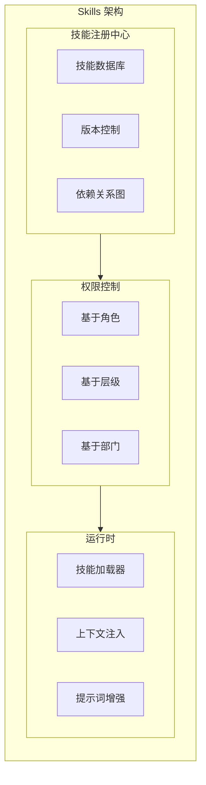

# BeesTown Skills 架构设计

## 1. 概述

Skills 是 Agent 的能力单元，定义了 Agent 可以执行的任务类型。Skills 支持分层继承（部门共享 + 个人专属）和细粒度权限控制。



---

## 2. Skill 定义模型

```typescript
interface Skill {
  id: string;
  name: string;
  description: string;
  category: SkillCategory;
  
  // 版本
  version: string;
  
  // 依赖
  dependencies: string[];        // 依赖的其他 skill IDs
  
  // 能力定义
  capabilities: SkillCapability[];
  
  // 提示词增强
  promptTemplate: string;
  
  // 工具关联
  tools: string[];               // 关联的工具名
  
  // 权限配置
  permissions: SkillPermissions;
  
  // 元数据
  author: string;
  createdAt: number;
  updatedAt: number;
  tags: string[];
}

type SkillCategory = 
  | 'coding'         // 编程开发
  | 'analysis'       // 分析能力
  | 'communication'  // 沟通交流
  | 'management'     // 管理协调
  | 'creative'       // 创意设计
  | 'technical'      // 技术专长
  | 'domain';        // 领域知识

interface SkillCapability {
  name: string;
  description: string;
  inputSchema: JSONSchema;
  outputSchema: JSONSchema;
}

interface SkillPermissions {
  // 最小角色要求
  minRole: 'junior' | 'senior' | 'lead' | 'expert';
  
  // 部门限制
  allowedDepartments: string[];
  
  // 层级限制
  minLevel: number;
  maxLevel: number;
  
  // 特殊授权
  requireCertification: boolean;
  certificationId?: string;
}
```

---

## 3. 技能权限控制

```typescript
class SkillPermissionManager {
  // 检查 Agent 是否有权使用技能
  async canUseSkill(agent: Agent, skill: Skill): Promise<PermissionResult> {
    const perm = skill.permissions;
    
    // 1. 检查角色
    if (!this.meetsRoleRequirement(agent.role, perm.minRole)) {
      return {
        allowed: false,
        reason: `Role ${agent.role} does not meet minimum requirement ${perm.minRole}`
      };
    }
    
    // 2. 检查部门
    if (perm.allowedDepartments.length > 0) {
      if (!perm.allowedDepartments.includes(agent.departmentId)) {
        return {
          allowed: false,
          reason: `Department ${agent.departmentId} not in allowed list`
        };
      }
    }
    
    // 3. 检查层级
    if (agent.level < perm.minLevel || agent.level > perm.maxLevel) {
      return {
        allowed: false,
        reason: `Level ${agent.level} not in range [${perm.minLevel}, ${perm.maxLevel}]`
      };
    }
    
    // 4. 检查认证
    if (perm.requireCertification) {
      const hasCert = await this.checkCertification(agent.id, perm.certificationId!);
      if (!hasCert) {
        return {
          allowed: false,
          reason: `Missing required certification: ${perm.certificationId}`
        };
      }
    }
    
    return { allowed: true };
  }
  
  // 角色等级映射
  private roleHierarchy = {
    junior: 1,
    senior: 2,
    lead: 3,
    expert: 4
  };
  
  private meetsRoleRequirement(agentRole: string, minRole: string): boolean {
    return this.roleHierarchy[agentRole] >= this.roleHierarchy[minRole];
  }
}
```

---

## 4. 技能继承与组合

```typescript
class SkillComposer {
  // 组合 Agent 的所有技能
  async composeAgentSkills(agent: Agent): Promise<ComposedSkills> {
    // 1. 获取部门共享技能
    const deptSkills = await this.getDepartmentSkills(agent.departmentId);
    
    // 2. 获取个人技能
    const personalSkills = agent.personal.personalSkills;
    
    // 3. 合并技能（个人覆盖部门）
    const skillMap = new Map<string, Skill>();
    
    for (const skill of deptSkills) {
      skillMap.set(skill.id, skill);
    }
    
    for (const skill of personalSkills) {
      // 个人技能优先级更高
      skillMap.set(skill.id, skill);
    }
    
    // 4. 解析依赖
    const resolvedSkills = await this.resolveDependencies(Array.from(skillMap.values()));
    
    // 5. 生成组合提示词
    const combinedPrompt = this.generateCombinedPrompt(resolvedSkills);
    
    return {
      skills: resolvedSkills,
      combinedPrompt,
      toolSet: this.extractToolSet(resolvedSkills),
      capabilityMap: this.buildCapabilityMap(resolvedSkills)
    };
  }
  
  // 解析技能依赖
  private async resolveDependencies(skills: Skill[]): Promise<Skill[]> {
    const resolved: Skill[] = [];
    const visited = new Set<string>();
    
    const visit = async (skill: Skill) => {
      if (visited.has(skill.id)) return;
      visited.add(skill.id);
      
      // 先解析依赖
      for (const depId of skill.dependencies) {
        const dep = await this.getSkill(depId);
        if (dep) await visit(dep);
      }
      
      resolved.push(skill);
    };
    
    for (const skill of skills) {
      await visit(skill);
    }
    
    return resolved;
  }
  
  // 生成组合提示词
  private generateCombinedPrompt(skills: Skill[]): string {
    const sections = skills.map(skill => `
## ${skill.name}
${skill.description}

${skill.promptTemplate}
    `.trim());
    
    return sections.join('\n\n---\n\n');
  }
}
```

---

## 5. 技能运行时

```typescript
class SkillRuntime {
  private skillLoader: SkillLoader;
  private contextProvider: ContextProvider;
  
  // 执行技能
  async executeSkill(
    agentId: string,
    skillId: string,
    input: any,
    context: ExecutionContext
  ): Promise<SkillResult> {
    // 1. 加载技能
    const skill = await this.skillLoader.load(skillId);
    
    // 2. 权限检查
    const agent = await this.getAgent(agentId);
    const permission = await this.permissionManager.canUseSkill(agent, skill);
    if (!permission.allowed) {
      throw new PermissionDeniedError(permission.reason);
    }
    
    // 3. 准备上下文
    const enrichedContext = await this.contextProvider.enrich(context, skill);
    
    // 4. 执行
    const startTime = Date.now();
    try {
      const result = await this.runSkill(skill, input, enrichedContext);
      
      // 5. 记录执行
      await this.recordExecution({
        agentId,
        skillId,
        input,
        result,
        duration: Date.now() - startTime,
        success: true
      });
      
      return result;
    } catch (error) {
      await this.recordExecution({
        agentId,
        skillId,
        input,
        error: error.message,
        duration: Date.now() - startTime,
        success: false
      });
      throw error;
    }
  }
}
```

---

## 6. 总结

BeesTown Skills 架构的核心设计：

1. **分层继承**：部门共享 + 个人专属，个人可覆盖
2. **权限控制**：基于角色、部门、层级的多重控制
3. **依赖管理**：自动解析和加载技能依赖
4. **运行时注入**：动态组合提示词和工具集
5. **执行追踪**：完整的技能使用记录
