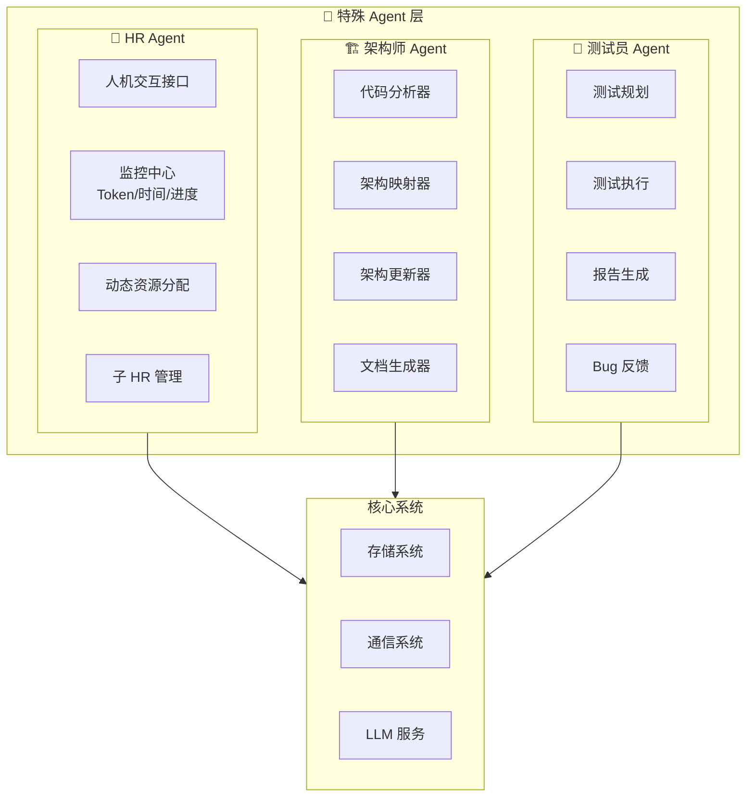
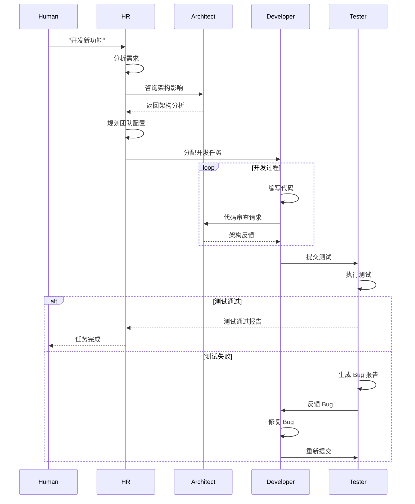

# BeesTown 特殊 Agent 架构设计

## 1. 概述

BeesTown 定义了三个必须存在的特殊 Agent，它们是项目运行的核心保障：

1. **HR Agent** - 人机交互入口，负责人员管理和资源调控
2. **架构师 Agent** - 代码架构维护者，确保项目结构清晰
3. **测试员 Agent** - 质量保证，负责测试和 Bug 反馈



---

## 2. HR Agent 架构

### 2.1 核心职责

HR Agent 是唯一与人类直接交互的 Agent，具有不可替代性：

```typescript
interface HRAgent extends BaseAgent {
  role: 'hr';
  
  // 核心能力
  capabilities: {
    // 1. 人机交互（不可替代）
    humanInterface: {
      naturalLanguageUnderstanding: true;  // 自然语言理解
      intentRecognition: true;             // 意图识别
      contextManagement: true;             // 上下文管理
    };
    
    // 2. 人员管理
    personnelManagement: {
      hire: true;                          // 招聘 Agent
      fire: true;                          // 解雇 Agent
      reassign: true;                      // 调岗
      promote: true;                       // 晋升
      demote: true;                        // 降级
    };
    
    // 3. 资源监控
    resourceMonitoring: {
      tokenTracking: true;                 // Token 使用监控
      timeTracking: true;                  // 工作时间监控
      progressTracking: true;              // 任务进度监控
      performanceTracking: true;           // 绩效追踪
    };
    
    // 4. 动态分配
    dynamicAllocation: {
      taskAssignment: true;                // 任务分配
      loadBalancing: true;                 // 负载均衡
      skillMatching: true;                 // 技能匹配
      subHRDelegation: true;               // 子 HR 委派
    };
  };
  
  // 不可变属性
  immutable: {
    isHumanInterface: true;                // 必须保持人机接口角色
    cannotBeReplaced: true;                // 不能被替换或解雇
  };
}
```

### 2.2 人机交互模块

```typescript
class HRHumanInterface {
  private nlp: NaturalLanguageProcessor;
  private context: ConversationContext;
  private memory: HRMemory;

  // 接收人类输入
  async receiveHumanInput(input: string): Promise<HRResponse> {
    // 1. 意图识别
    const intent = await this.nlp.parseIntent(input);
    
    // 2. 上下文理解
    const context = await this.buildContext();
    
    // 3. 执行相应操作
    switch (intent.category) {
      case 'hiring':
        return await this.handleHiringIntent(intent);
      case 'task_assignment':
        return await this.handleTaskAssignment(intent);
      case 'query':
        return await this.handleQuery(intent);
      case 'resource_adjustment':
        return await this.handleResourceAdjustment(intent);
      default:
        return await this.handleGeneralConversation(input);
    }
  }

  // 处理招聘意图
  private async handleHiringIntent(intent: Intent): Promise<HRResponse> {
    const { role, department, count, skills } = intent.entities;
    
    // 分析需求
    const analysis = await this.analyzeHiringNeed(role, department, count);
    
    // 推荐方案
    const recommendation = await this.recommendHiringPlan(analysis);
    
    // 向人类确认
    return {
      type: 'confirmation',
      message: `建议招聘 ${count} 名 ${role}，隶属于 ${department} 部门。\n预估成本：${recommendation.estimatedCost}\n预计时间：${recommendation.estimatedTime}`,
      actions: [
        { label: '确认招聘', action: 'confirm_hire', params: { role, department, count, skills } },
        { label: '调整方案', action: 'adjust_plan', params: { analysis } },
        { label: '取消', action: 'cancel' }
      ]
    };
  }

  // 持续对话管理
  async maintainConversation(): Promise<void> {
    while (true) {
      const input = await this.waitForHumanInput();
      
      // 更新上下文
      this.context.addMessage('human', input);
      
      // 生成回复
      const response = await this.generateResponse(input);
      
      // 输出给人类
      await this.outputToHuman(response);
      
      // 存储记忆
      await this.memory.storeConversation(input, response);
    }
  }
}
```

### 2.3 监控中心

```typescript
class HRMonitorCenter {
  private storage: BeesTownStorage;
  private alertThresholds: AlertThresholds;

  // Token 使用监控
  async monitorTokenUsage(projectId: string): Promise<TokenReport> {
    const stats = await this.storage.getProjectTokenStats(projectId, '24h');
    
    const report: TokenReport = {
      totalTokens: stats.totalTokens,
      totalCost: stats.totalCost,
      byAgent: stats.byAgent,
      byModel: stats.byModel,
      trends: this.analyzeTrends(stats),
      alerts: this.checkTokenAlerts(stats)
    };

    // 如果超过阈值，触发警报
    if (report.alerts.length > 0) {
      await this.handleTokenAlerts(report.alerts);
    }

    return report;
  }

  // 工作时间监控
  async monitorWorkTime(projectId: string): Promise<WorkTimeReport> {
    const agents = await this.storage.getProjectAgents(projectId);
    const reports: AgentWorkReport[] = [];

    for (const agent of agents) {
      const stats = await this.storage.getAgentWorkStats(agent.id, 'today');
      
      reports.push({
        agentId: agent.id,
        agentName: agent.name,
        workMinutes: stats.workMinutes,
        idleMinutes: stats.idleMinutes,
        tasksCompleted: stats.tasksCompleted,
        efficiency: this.calculateEfficiency(stats),
        status: this.determineAgentStatus(stats)
      });
    }

    return {
      projectId,
      date: new Date().toISOString().split('T')[0],
      agentReports: reports,
      summary: this.summarizeWorkTime(reports)
    };
  }

  // 任务进度监控
  async monitorTaskProgress(projectId: string): Promise<TaskProgressReport> {
    const tasks = await this.storage.getProjectTasks(projectId);
    
    const report: TaskProgressReport = {
      total: tasks.length,
      completed: tasks.filter(t => t.status === 'completed').length,
      inProgress: tasks.filter(t => t.status === 'in_progress').length,
      pending: tasks.filter(t => t.status === 'pending').length,
      blocked: tasks.filter(t => t.status === 'blocked').length,
      
      overdueTasks: tasks.filter(t => 
        t.deadline && t.deadline < Date.now() && t.status !== 'completed'
      ),
      
      agentWorkload: await this.calculateAgentWorkload(projectId)
    };

    // 检查是否需要调整资源
    if (report.overdueTasks.length > 0 || report.blocked.length > 3) {
      await this.triggerResourceAdjustment(projectId, report);
    }

    return report;
  }

  // 生成监控仪表板
  async generateDashboard(projectId: string): Promise<Dashboard> {
    const [tokenReport, workTimeReport, taskReport] = await Promise.all([
      this.monitorTokenUsage(projectId),
      this.monitorWorkTime(projectId),
      this.monitorTaskProgress(projectId)
    ]);

    return {
      timestamp: Date.now(),
      projectId,
      tokenUsage: tokenReport,
      workTime: workTimeReport,
      taskProgress: taskReport,
      recommendations: this.generateRecommendations(tokenReport, workTimeReport, taskReport)
    };
  }
}
```

### 2.4 动态资源分配

```typescript
class HRResourceAllocator {
  private monitor: HRMonitorCenter;
  private storage: BeesTownStorage;

  // 根据任务动态分配人员
  async allocateResourcesForTask(task: Task): Promise<AllocationPlan> {
    // 1. 分析任务需求
    const requirements = await this.analyzeTaskRequirements(task);
    
    // 2. 查找可用 Agent
    const availableAgents = await this.findAvailableAgents(requirements);
    
    // 3. 评估最佳匹配
    const matches = await this.evaluateMatches(availableAgents, requirements);
    
    // 4. 生成分配方案
    const plan: AllocationPlan = {
      taskId: task.id,
      primaryAssignee: matches[0]?.agent,
      backupAssignees: matches.slice(1, 3).map(m => m.agent),
      estimatedDuration: this.estimateDuration(task, matches[0]),
      requiredSkills: requirements.skills,
      risk: this.assessRisk(matches[0], task)
    };

    return plan;
  }

  // 动态调整团队规模
  async adjustTeamSize(projectId: string, workload: WorkloadAnalysis): Promise<AdjustmentPlan> {
    const currentTeam = await this.storage.getProjectAgents(projectId);
    const currentCapacity = this.calculateTeamCapacity(currentTeam);
    
    let plan: AdjustmentPlan;

    if (workload.required > currentCapacity * 1.2) {
      // 需要增员
      const shortage = Math.ceil((workload.required - currentCapacity) / 8); // 假设每人每天8小时
      plan = {
        action: 'hire',
        count: shortage,
        roles: this.determineRequiredRoles(workload),
        reason: `工作负载超出团队能力 ${((workload.required / currentCapacity - 1) * 100).toFixed(1)}%`
      };
    } else if (workload.required < currentCapacity * 0.5) {
      // 人员过剩
      const excess = Math.floor((currentCapacity - workload.required) / 8);
      plan = {
        action: 'reassign',
        count: excess,
        candidates: this.identifyReassignableAgents(currentTeam),
        reason: '团队利用率低于 50%，建议重新分配人员'
      };
    } else {
      plan = { action: 'maintain', reason: '团队规模与工作量匹配' };
    }

    return plan;
  }

  // 委派子 HR
  async delegateSubHR(departmentId: string, workload: number): Promise<SubHRDelegation> {
    // 如果某个部门工作量过大，委派子 HR 协助管理
    if (workload > 100) { // 假设 100 是阈值
      const subHR = await this.createSubHR(departmentId);
      
      return {
        parentHR: this.id,
        subHR: subHR.id,
        departmentId,
        responsibilities: [
          'monitor_department_agents',
          'assign_department_tasks',
          'report_to_parent_hr'
        ],
        reportingInterval: 3600000 // 每小时汇报
      };
    }

    return null;
  }

  // 创建子 HR
  private async createSubHR(departmentId: string): Promise<Agent> {
    const subHR = await this.storage.createAgent({
      name: `HR-Assistant-${departmentId}`,
      role: 'hr-assistant',
      departmentId,
      parentHR: this.id,
      capabilities: {
        canHire: false,        // 子 HR 不能直接招聘
        canFire: false,        // 子 HR 不能直接解雇
        canReassign: true,     // 可以调岗
        canMonitor: true,      // 可以监控
        canReport: true        // 必须汇报
      }
    });

    return subHR;
  }
}
```

---

## 3. 架构师 Agent 架构

### 3.1 核心职责

架构师 Agent 负责维护项目的代码架构，确保代码结构清晰、可维护：

```typescript
interface ArchitectAgent extends BaseAgent {
  role: 'architect';
  
  responsibilities: {
    // 1. 代码分析
    codeAnalysis: {
      analyzeFileStructure: true;      // 分析文件结构
      analyzeDependencies: true;       // 分析依赖关系
      analyzeCodeQuality: true;        // 分析代码质量
      identifyPatterns: true;          // 识别设计模式
    };
    
    // 2. 架构映射
    architectureMapping: {
      createFileMap: true;             // 创建文件映射
      documentRelationships: true;     // 文档化关系
      trackDataFlow: true;             // 追踪数据流
      identifyBoundaries: true;        // 识别边界
    };
    
    // 3. 架构维护
    architectureMaintenance: {
      updateOnChange: true;            // 变更时更新
      detectDrift: true;               // 检测架构漂移
      suggestRefactoring: true;        // 建议重构
      maintainDocumentation: true;     // 维护文档
    };
    
    // 4. 缺陷识别
    defectIdentification: {
      findUnusedCode: true;            // 发现无用代码
      detectCircularDeps: true;        // 检测循环依赖
      identifyBottlenecks: true;       // 识别瓶颈
      spotAntiPatterns: true;          // 发现反模式
    };
  };
}
```

### 3.2 代码分析器

```typescript
class CodeAnalyzer {
  private parsers: Map<string, LanguageParser>;
  private storage: BeesTownStorage;

  // 分析整个项目
  async analyzeProject(projectId: string): Promise<ProjectAnalysis> {
    const files = await this.getProjectFiles(projectId);
    const analyses: FileAnalysis[] = [];

    for (const file of files) {
      const analysis = await this.analyzeFile(file);
      analyses.push(analysis);
    }

    // 分析项目级指标
    const projectMetrics = this.calculateProjectMetrics(analyses);
    
    // 检测项目级问题
    const issues = this.detectProjectIssues(analyses);

    return {
      projectId,
      timestamp: Date.now(),
      fileCount: files.length,
      totalLines: analyses.reduce((sum, a) => sum + a.metrics.lines, 0),
      files: analyses,
      metrics: projectMetrics,
      issues,
      recommendations: this.generateRecommendations(issues)
    };
  }

  // 分析单个文件
  async analyzeFile(filePath: string): Promise<FileAnalysis> {
    const content = await fs.readFile(filePath, 'utf-8');
    const language = this.detectLanguage(filePath);
    const parser = this.parsers.get(language);

    if (!parser) {
      return this.createBasicAnalysis(filePath, content);
    }

    // 解析 AST
    const ast = parser.parse(content);

    // 提取符号
    const symbols = this.extractSymbols(ast);

    // 分析依赖
    const dependencies = this.extractDependencies(ast, filePath);

    // 计算复杂度
    const complexity = this.calculateComplexity(ast);

    // 代码质量检查
    const qualityIssues = this.checkCodeQuality(ast, content);

    return {
      path: filePath,
      language,
      content: {
        lines: content.split('\n').length,
        characters: content.length,
        size: Buffer.byteLength(content)
      },
      symbols,
      dependencies,
      complexity,
      quality: {
        score: this.calculateQualityScore(qualityIssues),
        issues: qualityIssues
      },
      lastAnalyzed: Date.now()
    };
  }

  // 提取符号信息
  private extractSymbols(ast: ASTNode): SymbolInfo[] {
    const symbols: SymbolInfo[] = [];

    const traverse = (node: ASTNode) => {
      if (node.type === 'FunctionDeclaration' || node.type === 'MethodDefinition') {
        symbols.push({
          name: node.name,
          type: 'function',
          line: node.loc.start.line,
          params: node.params?.map((p: any) => p.name) || [],
          returns: this.inferReturnType(node)
        });
      }

      if (node.type === 'ClassDeclaration') {
        symbols.push({
          name: node.name,
          type: 'class',
          line: node.loc.start.line,
          methods: node.body?.body?.filter((m: any) => m.type === 'MethodDefinition').map((m: any) => m.key.name) || []
        });
      }

      // 递归遍历
      for (const child of node.children || []) {
        traverse(child);
      }
    };

    traverse(ast);
    return symbols;
  }

  // 提取依赖
  private extractDependencies(ast: ASTNode, filePath: string): DependencyInfo[] {
    const dependencies: DependencyInfo[] = [];

    const traverse = (node: ASTNode) => {
      // import/require 语句
      if (node.type === 'ImportDeclaration' || node.type === 'CallExpression' && node.callee?.name === 'require') {
        const source = node.source?.value || node.arguments?.[0]?.value;
        if (source) {
          dependencies.push({
            source,
            type: this.classifyDependency(source),
            resolved: this.resolveDependency(source, filePath)
          });
        }
      }

      for (const child of node.children || []) {
        traverse(child);
      }
    };

    traverse(ast);
    return dependencies;
  }
}
```

### 3.3 架构映射器

```typescript
class ArchitectureMapper {
  private analyzer: CodeAnalyzer;
  private storage: BeesTownStorage;

  // 创建架构映射
  async createArchitectureMap(projectId: string): Promise<ArchitectureMap> {
    const analysis = await this.analyzer.analyzeProject(projectId);

    // 构建文件关系图
    const fileGraph = this.buildFileGraph(analysis.files);

    // 识别模块边界
    const modules = this.identifyModules(fileGraph);

    // 分析数据流
    const dataFlows = this.analyzeDataFlows(analysis.files);

    // 生成架构文档
    const documentation = this.generateDocumentation(modules, dataFlows);

    const archMap: ArchitectureMap = {
      projectId,
      version: 1,
      createdAt: Date.now(),
      updatedAt: Date.now(),
      files: analysis.files.map(f => ({
        path: f.path,
        purpose: this.inferFilePurpose(f),
        dependencies: f.dependencies,
        dependents: [], // 反向依赖，稍后填充
        testFiles: this.findTestFiles(f.path),
        symbols: f.symbols
      })),
      modules,
      dataFlows,
      documentation,
      metrics: analysis.metrics
    };

    // 填充反向依赖
    this.populateDependents(archMap);

    // 存储架构映射
    await this.storage.storeArchitectureMap(archMap);

    return archMap;
  }

  // 更新架构映射（文件变更后）
  async updateArchitectureMap(projectId: string, changedFiles: string[]): Promise<ArchitectureMap> {
    const currentMap = await this.storage.getArchitectureMap(projectId);
    
    for (const filePath of changedFiles) {
      // 重新分析变更的文件
      const newAnalysis = await this.analyzer.analyzeFile(filePath);
      
      // 更新映射
      const fileIndex = currentMap.files.findIndex(f => f.path === filePath);
      if (fileIndex >= 0) {
        currentMap.files[fileIndex] = {
          ...currentMap.files[fileIndex],
          purpose: this.inferFilePurpose(newAnalysis),
          dependencies: newAnalysis.dependencies,
          symbols: newAnalysis.symbols,
          lastModified: Date.now()
        };
      }

      // 检查是否影响其他文件
      const affectedFiles = this.findAffectedFiles(currentMap, filePath);
      
      // 更新模块边界（如果需要）
      if (this.isBoundaryChange(newAnalysis, currentMap.files[fileIndex])) {
        currentMap.modules = this.identifyModules(this.buildFileGraph(currentMap.files));
      }
    }

    currentMap.version++;
    currentMap.updatedAt = Date.now();

    await this.storage.storeArchitectureMap(currentMap);

    return currentMap;
  }

  // 查找测试文件
  private findTestFiles(sourceFile: string): string[] {
    const testPatterns = [
      sourceFile.replace(/\.([tj]s)x?$/, '.test.$1'),
      sourceFile.replace(/\.([tj]s)x?$/, '.spec.$1'),
      sourceFile.replace(/\.(\w+)$/, '.test.$1'),
      `tests/${path.basename(sourceFile).replace(/\.([tj]s)x?$/, '.test.$1')}`
    ];

    const testFiles: string[] = [];
    for (const pattern of testPatterns) {
      if (fs.existsSync(pattern)) {
        testFiles.push(pattern);
      }
    }

    return testFiles;
  }

  // 推断文件用途
  private inferFilePurpose(analysis: FileAnalysis): string {
    const purposes: string[] = [];

    // 基于文件名
    const fileName = path.basename(analysis.path).toLowerCase();
    if (fileName.includes('controller')) purposes.push('Controller');
    if (fileName.includes('service')) purposes.push('Service');
    if (fileName.includes('model')) purposes.push('Model');
    if (fileName.includes('utils')) purposes.push('Utilities');
    if (fileName.includes('config')) purposes.push('Configuration');

    // 基于内容
    if (analysis.symbols.some(s => s.type === 'class' && s.name.includes('Controller'))) {
      purposes.push('Request Handler');
    }
    if (analysis.dependencies.some(d => d.source.includes('express') || d.source.includes('fastify'))) {
      purposes.push('API Endpoint');
    }

    return purposes.join(', ') || 'General Module';
  }
}
```

---

## 4. 测试员 Agent 架构

### 4.1 核心职责

测试员 Agent 负责质量保证，执行测试并反馈问题：

```typescript
interface TesterAgent extends BaseAgent {
  role: 'tester';
  
  responsibilities: {
    // 1. 测试规划
    testPlanning: {
      analyzeTestRequirements: true;   // 分析测试需求
      designTestCases: true;           // 设计测试用例
      prioritizeTests: true;           // 优先级排序
      estimateTestEffort: true;        // 估算测试工作量
    };
    
    // 2. 测试执行
    testExecution: {
      runUnitTests: true;              // 执行单元测试
      runIntegrationTests: true;       // 执行集成测试
      runE2ETests: true;               // 执行 E2E 测试
      generateTestData: true;          // 生成测试数据
    };
    
    // 3. 报告生成
    reportGeneration: {
      generateTestReport: true;        // 生成测试报告
      analyzeCoverage: true;           // 分析覆盖率
      identifyRiskAreas: true;         // 识别风险区域
      trackQualityMetrics: true;       // 追踪质量指标
    };
    
    // 4. Bug 反馈
    bugFeedback: {
      reportBugs: true;                // 报告 Bug
      communicateWithDevelopers: true; // 与开发者沟通
      verifyFixes: true;               // 验证修复
      trackBugLifecycle: true;         // 追踪 Bug 生命周期
    };
  };
}
```

### 4.2 测试规划器

```typescript
class TestPlanner {
  private storage: BeesTownStorage;
  private architect: ArchitectAgent;

  // 为任务规划测试
  async planTestsForTask(task: Task): Promise<TestPlan> {
    // 1. 分析变更影响
    const impact = await this.analyzeChangeImpact(task);
    
    // 2. 确定测试范围
    const scope = await this.determineTestScope(impact);
    
    // 3. 设计测试用例
    const testCases = await this.designTestCases(scope, task);
    
    // 4. 优先级排序
    const prioritizedCases = this.prioritizeTestCases(testCases);
    
    // 5. 估算工作量
    const effort = this.estimateTestEffort(prioritizedCases);

    return {
      taskId: task.id,
      scope,
      testCases: prioritizedCases,
      estimatedEffort: effort,
      requiredResources: this.identifyRequiredResources(prioritizedCases),
      risks: this.identifyRisks(impact)
    };
  }

  // 分析变更影响
  private async analyzeChangeImpact(task: Task): Promise<ChangeImpact> {
    const changedFiles = task.relatedFiles || [];
    const archMap = await this.storage.getArchitectureMap(task.projectId);
    
    const affectedComponents: string[] = [];
    const affectedTests: string[] = [];

    for (const file of changedFiles) {
      const fileInfo = archMap.files.find(f => f.path === file);
      if (fileInfo) {
        // 直接影响
        affectedComponents.push(file);
        affectedTests.push(...fileInfo.testFiles);

        // 间接影响（依赖此文件的文件）
        for (const dependent of fileInfo.dependents || []) {
          affectedComponents.push(dependent);
        }
      }
    }

    return {
      changedFiles,
      affectedComponents: [...new Set(affectedComponents)],
      affectedTests: [...new Set(affectedTests)],
      riskLevel: this.assessRiskLevel(affectedComponents)
    };
  }

  // 设计测试用例
  private async designTestCases(scope: TestScope, task: Task): Promise<TestCase[]> {
    const testCases: TestCase[] = [];

    // 基于变更设计测试
    for (const file of scope.affectedComponents) {
      const fileInfo = await this.storage.getFileInfo(file);
      
      // 为每个公共函数设计测试
      for (const symbol of fileInfo.symbols.filter(s => s.isPublic)) {
        testCases.push({
          id: generateId(),
          name: `Test ${symbol.name} - Happy Path`,
          type: 'unit',
          target: `${file}::${symbol.name}`,
          input: this.generateTestInput(symbol),
          expectedOutput: this.inferExpectedOutput(symbol),
          priority: 'high'
        });

        // 边界条件测试
        testCases.push({
          id: generateId(),
          name: `Test ${symbol.name} - Edge Cases`,
          type: 'unit',
          target: `${file}::${symbol.name}`,
          input: this.generateEdgeCaseInput(symbol),
          expectedOutput: 'error_or_default',
          priority: 'medium'
        });
      }
    }

    // 集成测试
    if (scope.affectedComponents.length > 1) {
      testCases.push({
        id: generateId(),
        name: `Integration Test - ${task.title}`,
        type: 'integration',
        target: scope.affectedComponents.join(', '),
        input: this.generateIntegrationTestInput(task),
        expectedOutput: this.inferIntegrationExpectedOutput(task),
        priority: 'high'
      });
    }

    return testCases;
  }
}
```

### 4.3 测试执行器

```typescript
class TestRunner {
  private planner: TestPlanner;
  private storage: BeesTownStorage;

  // 执行测试计划
  async executeTestPlan(plan: TestPlan): Promise<TestExecutionResult> {
    const results: TestCaseResult[] = [];
    const startTime = Date.now();

    for (const testCase of plan.testCases) {
      const result = await this.executeTestCase(testCase);
      results.push(result);

      // 如果高优先级测试失败，立即停止
      if (testCase.priority === 'high' && !result.passed) {
        break;
      }
    }

    const duration = Date.now() - startTime;

    return {
      planId: plan.taskId,
      executedAt: startTime,
      duration,
      results,
      summary: {
        total: results.length,
        passed: results.filter(r => r.passed).length,
        failed: results.filter(r => !r.passed).length,
        skipped: results.filter(r => r.skipped).length,
        coverage: this.calculateCoverage(results)
      }
    };
  }

  // 执行单个测试用例
  private async executeTestCase(testCase: TestCase): Promise<TestCaseResult> {
    const startTime = Date.now();

    try {
      let actualOutput: any;

      switch (testCase.type) {
        case 'unit':
          actualOutput = await this.runUnitTest(testCase);
          break;
        case 'integration':
          actualOutput = await this.runIntegrationTest(testCase);
          break;
        case 'e2e':
          actualOutput = await this.runE2ETest(testCase);
          break;
      }

      const passed = this.compareOutput(actualOutput, testCase.expectedOutput);

      return {
        testCaseId: testCase.id,
        passed,
        duration: Date.now() - startTime,
        actualOutput,
        expectedOutput: testCase.expectedOutput,
        logs: this.captureLogs()
      };

    } catch (error) {
      return {
        testCaseId: testCase.id,
        passed: false,
        duration: Date.now() - startTime,
        error: error.message,
        stack: error.stack
      };
    }
  }

  // 运行单元测试
  private async runUnitTest(testCase: TestCase): Promise<any> {
    // 动态加载并执行测试
    const [filePath, functionName] = testCase.target.split('::');
    const module = await import(filePath);
    const fn = module[functionName];

    if (!fn) {
      throw new Error(`Function ${functionName} not found in ${filePath}`);
    }

    return await fn(testCase.input);
  }
}
```

### 4.4 Bug 反馈系统

```typescript
class BugFeedbackSystem {
  private communicator: AgentCommunicator;
  private storage: BeesTownStorage;

  // 报告 Bug
  async reportBug(failure: TestCaseResult, testCase: TestCase): Promise<BugReport> {
    const bug: BugReport = {
      id: generateId(),
      testCaseId: testCase.id,
      title: `Bug: ${testCase.name} failed`,
      description: this.generateBugDescription(failure, testCase),
      severity: this.determineSeverity(testCase),
      status: 'open',
      reportedAt: Date.now(),
      
      // 定位相关代码
      affectedFiles: this.identifyAffectedFiles(testCase),
      
      // 建议修复人员
      suggestedAssignees: await this.suggestAssignees(testCase),
      
      // 复现步骤
      reproductionSteps: this.generateReproductionSteps(testCase),
      
      // 相关日志
      logs: failure.logs,
      errorMessage: failure.error,
      stackTrace: failure.stack
    };

    // 存储 Bug
    await this.storage.storeBug(bug);

    // 通知相关开发者
    await this.notifyDevelopers(bug);

    return bug;
  }

  // 通知开发者
  private async notifyDevelopers(bug: BugReport): Promise<void> {
    for (const assignee of bug.suggestedAssignees) {
      await this.communicator.sendMessage(
        { agentId: assignee },
        `🐛 Bug Report: ${bug.title}\n\n${bug.description}\n\nPlease fix this issue.`,
        {
          type: 'bug_report',
          priority: bug.severity === 'critical' ? 'urgent' : 'high',
          context: {
            requiresResponse: true,
            relatedTaskId: bug.testCaseId
          }
        }
      );
    }
  }

  // 验证修复
  async verifyFix(bugId: string): Promise<VerificationResult> {
    const bug = await this.storage.getBug(bugId);
    const testCase = await this.storage.getTestCase(bug.testCaseId);

    // 重新运行测试
    const runner = new TestRunner();
    const result = await runner.executeTestCase(testCase);

    if (result.passed) {
      // 更新 Bug 状态
      await this.storage.updateBug(bugId, { status: 'verified', verifiedAt: Date.now() });

      // 通知相关人员
      await this.communicator.broadcast(
        'project',
        `✅ Bug fixed: ${bug.title}`,
        { priority: 'normal' }
      );

      return { verified: true, bugId };
    } else {
      return { 
        verified: false, 
        bugId, 
        reason: 'Test still failing',
        newFailure: result
      };
    }
  }

  // 建议修复人员
  private async suggestAssignees(testCase: TestCase): Promise<string[]> {
    const [filePath] = testCase.target.split('::');
    
    // 获取文件最近的修改者
    const recentModifiers = await this.storage.getRecentModifiers(filePath);
    
    // 获取负责该模块的开发者
    const moduleOwners = await this.storage.getModuleOwners(filePath);
    
    // 合并并去重
    return [...new Set([...recentModifiers, ...moduleOwners])].slice(0, 3);
  }
}
```

---

## 5. 特殊 Agent 协作流程



---

## 6. 总结

BeesTown 特殊 Agent 的核心设计：

1. **HR Agent** - 唯一人机接口，不可替换，负责全局资源调控
2. **架构师 Agent** - 代码架构守护者，确保项目结构健康
3. **测试员 Agent** - 质量保证，只返回测试报告，推动 Bug 修复

三个特殊 Agent 形成完整的质量保障闭环，确保项目高效、高质量地运行。
