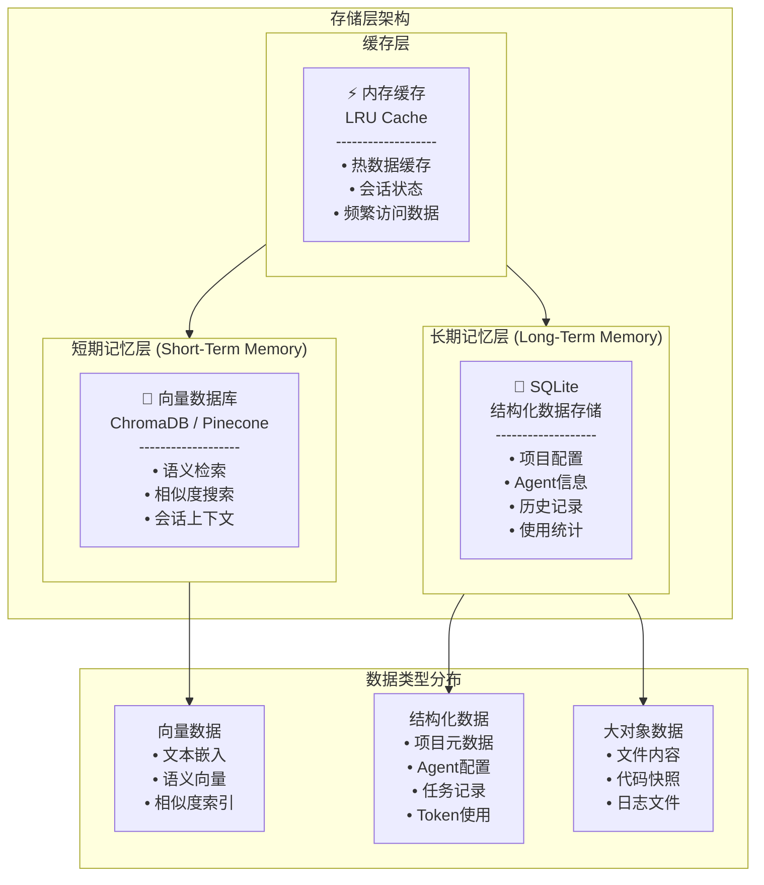

# BeesTown 存储架构设计

## 1. 概述

BeesTown 采用**分层存储架构**，结合向量数据库（短期记忆）和 SQLite（长期记忆/结构化数据），实现高效的记忆检索和数据持久化。



---

## 2. 短期记忆存储（向量数据库）

### 2.1 技术选型

| 特性 | 方案 | 说明 |
|------|------|------|
| 默认方案 | **ChromaDB** | 本地嵌入式，无需外部服务 |
| 云端方案 | Pinecone | 大规模项目，需要API Key |
| 混合方案 | ChromaDB + 可选Pinecone | 本地优先，云端扩展 |

### 2.2 数据模型

```typescript
// 向量集合定义
interface VectorCollections {
  // 会话上下文集合
  session_context: {
    id: string;                    // 唯一标识
    projectId: string;             // 所属项目
    agentId: string;               // 所属Agent
    sessionId: string;             // 会话ID
    content: string;               // 原始内容
    embedding: number[];           // 向量嵌入 (1536维)
    metadata: {
      timestamp: number;           // 时间戳
      type: 'thought' | 'action' | 'observation' | 'conversation';
      importance: number;          // 重要性评分 (0-1)
      relatedFiles?: string[];     // 相关文件
      relatedAgents?: string[];    // 相关Agent
    };
  };

  // 代码语义集合
  code_semantics: {
    id: string;
    projectId: string;
    filePath: string;              // 文件路径
    content: string;               // 代码内容/摘要
    embedding: number[];
    metadata: {
      language: string;            // 编程语言
      symbols: string[];           // 定义的符号
      dependencies: string[];      // 依赖文件
      lastModified: number;        // 最后修改时间
    };
  };

  // 知识片段集合
  knowledge_snippets: {
    id: string;
    projectId: string;
    content: string;               // 知识内容
    embedding: number[];
    metadata: {
      category: string;            // 知识类别
      source: string;              // 来源
      confidence: number;          // 可信度
      usageCount: number;          // 使用次数
    };
  };
}
```

### 2.3 存储策略

```typescript
class ShortTermMemoryStore {
  private client: ChromaClient;
  private embeddingFunction: OpenAIEmbeddingFunction;

  constructor(config: VectorDBConfig) {
    this.client = new ChromaClient({ path: config.path });
    this.embeddingFunction = new OpenAIEmbeddingFunction({
      apiKey: config.apiKey,
      model: 'text-embedding-3-small'
    });
  }

  // 存储记忆片段
  async store(memory: MemoryFragment): Promise<void> {
    const collection = await this.getCollection(memory.type);
    
    // 生成嵌入向量
    const embedding = await this.embeddingFunction.generate(memory.content);
    
    // 存储到向量数据库
    await collection.add({
      ids: [memory.id],
      embeddings: [embedding],
      documents: [memory.content],
      metadatas: [memory.metadata]
    });

    // 同步到长期记忆（如果重要性高）
    if (memory.metadata.importance > 0.7) {
      await this.archiveToLongTerm(memory);
    }
  }

  // 语义检索
  async retrieve(query: string, options: RetrieveOptions): Promise<MemoryFragment[]> {
    const collection = await this.getCollection(options.type);
    
    // 生成查询向量
    const queryEmbedding = await this.embeddingFunction.generate(query);
    
    // 向量相似度搜索
    const results = await collection.query({
      queryEmbeddings: [queryEmbedding],
      nResults: options.limit || 10,
      where: options.filter,
      include: ['documents', 'metadatas', 'distances']
    });

    return this.formatResults(results);
  }

  // 时间窗口检索（获取最近N条）
  async retrieveRecent(agentId: string, limit: number = 50): Promise<MemoryFragment[]> {
    const collection = await this.getCollection('session_context');
    
    return await collection.get({
      where: { agentId },
      limit,
      sort: { timestamp: 'desc' }
    });
  }

  // 清理过期短期记忆
  async cleanup(maxAge: number = 7 * 24 * 60 * 60 * 1000): Promise<void> {
    const cutoffTime = Date.now() - maxAge;
    
    for (const collection of this.collections) {
      const oldMemories = await collection.get({
        where: { 
          timestamp: { $lt: cutoffTime },
          importance: { $lt: 0.5 }  // 只删除不重要的
        }
      });

      // 归档重要记忆后删除
      for (const memory of oldMemories) {
        if (memory.metadata.importance > 0.3) {
          await this.archiveToLongTerm(memory);
        }
        await collection.delete({ ids: [memory.id] });
      }
    }
  }
}
```

### 2.4 记忆生命周期

```mermaid
graph LR
    A["新记忆产生"] --> B{"重要性评估"}
    B -->|高重要性 (>0.7)| C["立即归档到长期记忆"]
    B -->|中等重要性| D["短期记忆存储"]
    D --> E{"7天后"}
    E -->|重要性>0.3| F["归档到长期记忆"]
    E -->|重要性<0.3| G["删除"]
    C --> H["长期记忆 SQLite"]
    F --> H
```

---

## 3. 长期记忆存储（SQLite）

### 3.1 数据库设计

```sql
-- 项目表
CREATE TABLE projects (
    id TEXT PRIMARY KEY,
    name TEXT NOT NULL,
    description TEXT,
    created_at INTEGER NOT NULL,
    updated_at INTEGER NOT NULL,
    status TEXT CHECK(status IN ('active', 'paused', 'archived')),
    config_json TEXT  -- JSON格式存储项目配置
);

-- Agent表
CREATE TABLE agents (
    id TEXT PRIMARY KEY,
    project_id TEXT NOT NULL,
    name TEXT NOT NULL,
    role TEXT NOT NULL,
    department_id TEXT,
    level INTEGER NOT NULL,
    reports_to TEXT,
    state_json TEXT NOT NULL,  -- Agent状态
    performance_json TEXT,     -- 绩效数据
    created_at INTEGER NOT NULL,
    FOREIGN KEY (project_id) REFERENCES projects(id),
    FOREIGN KEY (reports_to) REFERENCES agents(id)
);

-- 部门表
CREATE TABLE departments (
    id TEXT PRIMARY KEY,
    project_id TEXT NOT NULL,
    name TEXT NOT NULL,
    code TEXT NOT NULL,
    level INTEGER NOT NULL,
    parent_id TEXT,
    head_id TEXT,
    shared_resources_json TEXT,  -- 共享资源配置
    FOREIGN KEY (project_id) REFERENCES projects(id),
    FOREIGN KEY (head_id) REFERENCES agents(id)
);

-- 长期记忆表
CREATE TABLE long_term_memories (
    id TEXT PRIMARY KEY,
    project_id TEXT NOT NULL,
    agent_id TEXT,
    department_id TEXT,
    memory_type TEXT NOT NULL CHECK(memory_type IN ('personal', 'department', 'company', 'hr')),
    category TEXT NOT NULL,  -- 记忆类别
    content TEXT NOT NULL,
    summary TEXT,            -- 内容摘要
    keywords TEXT,           -- 关键词，逗号分隔
    importance REAL NOT NULL,
    access_count INTEGER DEFAULT 0,
    last_accessed INTEGER,
    created_at INTEGER NOT NULL,
    vector_id TEXT,          -- 关联的向量ID
    FOREIGN KEY (project_id) REFERENCES projects(id),
    FOREIGN KEY (agent_id) REFERENCES agents(id)
);

-- 任务表
CREATE TABLE tasks (
    id TEXT PRIMARY KEY,
    project_id TEXT NOT NULL,
    title TEXT NOT NULL,
    description TEXT,
    assignee_id TEXT,
    creator_id TEXT NOT NULL,
    parent_task_id TEXT,
    status TEXT CHECK(status IN ('pending', 'in_progress', 'reviewing', 'completed', 'cancelled')),
    priority INTEGER DEFAULT 3,
    started_at INTEGER,
    completed_at INTEGER,
    estimated_hours INTEGER,
    actual_hours INTEGER,
    result_json TEXT,        -- 任务结果
    FOREIGN KEY (project_id) REFERENCES projects(id),
    FOREIGN KEY (assignee_id) REFERENCES agents(id)
);

-- Token使用统计表
CREATE TABLE token_usage (
    id INTEGER PRIMARY KEY AUTOINCREMENT,
    project_id TEXT NOT NULL,
    agent_id TEXT NOT NULL,
    session_id TEXT NOT NULL,
    timestamp INTEGER NOT NULL,
    model TEXT NOT NULL,
    input_tokens INTEGER NOT NULL,
    output_tokens INTEGER NOT NULL,
    total_tokens INTEGER NOT NULL,
    cost_usd REAL,
    request_type TEXT,       -- 'chat', 'embedding', 'tool_call'
    task_id TEXT,
    FOREIGN KEY (project_id) REFERENCES projects(id),
    FOREIGN KEY (agent_id) REFERENCES agents(id)
);

-- Agent工作时间统计表
CREATE TABLE agent_work_stats (
    id INTEGER PRIMARY KEY AUTOINCREMENT,
    agent_id TEXT NOT NULL,
    date TEXT NOT NULL,      -- YYYY-MM-DD
    project_id TEXT NOT NULL,
    tasks_completed INTEGER DEFAULT 0,
    tasks_created INTEGER DEFAULT 0,
    messages_sent INTEGER DEFAULT 0,
    messages_received INTEGER DEFAULT 0,
    work_minutes INTEGER DEFAULT 0,
    idle_minutes INTEGER DEFAULT 0,
    token_input_total INTEGER DEFAULT 0,
    token_output_total INTEGER DEFAULT 0,
    UNIQUE(agent_id, date)
);

-- 文件操作日志表
CREATE TABLE file_operations (
    id INTEGER PRIMARY KEY AUTOINCREMENT,
    project_id TEXT NOT NULL,
    agent_id TEXT NOT NULL,
    timestamp INTEGER NOT NULL,
    operation TEXT NOT NULL CHECK(operation IN ('read', 'write', 'edit', 'delete', 'create', 'search')),
    file_path TEXT NOT NULL,
    content_hash TEXT,       -- 内容哈希，用于版本控制
    diff_patch TEXT,         -- 变更补丁（如果是编辑）
    success BOOLEAN NOT NULL,
    error_message TEXT
);

-- Agent通信记录表
CREATE TABLE agent_communications (
    id TEXT PRIMARY KEY,
    project_id TEXT NOT NULL,
    sender_id TEXT NOT NULL,
    receiver_id TEXT NOT NULL,
    message_type TEXT CHECK(message_type IN ('direct', 'broadcast', 'task_assignment', 'report')),
    content TEXT NOT NULL,
    context_json TEXT,       -- 通信上下文
    timestamp INTEGER NOT NULL,
    read_at INTEGER,
    related_task_id TEXT
);

-- 代码架构索引表（架构师Agent维护）
CREATE TABLE code_architecture (
    id TEXT PRIMARY KEY,
    project_id TEXT NOT NULL,
    file_path TEXT NOT NULL,
    file_type TEXT NOT NULL,
    purpose TEXT,            -- 文件用途描述
    functions_json TEXT,     -- 函数/类列表
    dependencies TEXT,       -- 依赖文件，JSON数组
    dependents TEXT,         -- 被依赖文件，JSON数组
    test_files TEXT,         -- 关联测试文件
    last_analyzed INTEGER,
    architecture_version INTEGER DEFAULT 1
);

-- 索引优化
CREATE INDEX idx_agents_project ON agents(project_id);
CREATE INDEX idx_agents_department ON agents(department_id);
CREATE INDEX idx_memories_project ON long_term_memories(project_id);
CREATE INDEX idx_memories_agent ON long_term_memories(agent_id);
CREATE INDEX idx_memories_type ON long_term_memories(memory_type);
CREATE INDEX idx_token_usage_project ON token_usage(project_id, timestamp);
CREATE INDEX idx_token_usage_agent ON token_usage(agent_id, timestamp);
CREATE INDEX idx_file_ops_project ON file_operations(project_id, file_path);
CREATE INDEX idx_communications_project ON agent_communications(project_id, timestamp);
```

### 3.2 数据访问层

```typescript
class LongTermMemoryStore {
  private db: Database;

  constructor(dbPath: string) {
    this.db = new Database(dbPath);
    this.initTables();
  }

  // ==================== 项目操作 ====================
  
  async createProject(project: Project): Promise<void> {
    const stmt = this.db.prepare(`
      INSERT INTO projects (id, name, description, created_at, updated_at, status, config_json)
      VALUES (?, ?, ?, ?, ?, ?, ?)
    `);
    
    stmt.run(
      project.id,
      project.name,
      project.description,
      Date.now(),
      Date.now(),
      'active',
      JSON.stringify(project.config)
    );
  }

  // ==================== Agent操作 ====================

  async createAgent(agent: Agent): Promise<void> {
    const stmt = this.db.prepare(`
      INSERT INTO agents (id, project_id, name, role, department_id, level, reports_to, state_json, created_at)
      VALUES (?, ?, ?, ?, ?, ?, ?, ?, ?)
    `);

    stmt.run(
      agent.id,
      agent.projectId,
      agent.name,
      agent.role,
      agent.departmentId,
      agent.level,
      agent.reportsTo,
      JSON.stringify(agent.state),
      Date.now()
    );
  }

  async updateAgentState(agentId: string, state: Partial<AgentState>): Promise<void> {
    const current = await this.getAgent(agentId);
    const newState = { ...JSON.parse(current.state_json), ...state };
    
    const stmt = this.db.prepare(`
      UPDATE agents SET state_json = ?, updated_at = ? WHERE id = ?
    `);
    
    stmt.run(JSON.stringify(newState), Date.now(), agentId);
  }

  // ==================== 长期记忆操作 ====================

  async storeLongTermMemory(memory: LongTermMemory): Promise<void> {
    const stmt = this.db.prepare(`
      INSERT INTO long_term_memories 
      (id, project_id, agent_id, department_id, memory_type, category, content, summary, keywords, importance, created_at)
      VALUES (?, ?, ?, ?, ?, ?, ?, ?, ?, ?, ?)
    `);

    const summary = await this.generateSummary(memory.content);
    const keywords = await this.extractKeywords(memory.content);

    stmt.run(
      memory.id,
      memory.projectId,
      memory.agentId,
      memory.departmentId,
      memory.memoryType,
      memory.category,
      memory.content,
      summary,
      keywords.join(','),
      memory.importance,
      Date.now()
    );
  }

  async retrieveLongTermMemories(options: RetrieveOptions): Promise<LongTermMemory[]> {
    let query = `
      SELECT * FROM long_term_memories 
      WHERE project_id = ?
    `;
    const params: any[] = [options.projectId];

    if (options.agentId) {
      query += ' AND agent_id = ?';
      params.push(options.agentId);
    }

    if (options.memoryType) {
      query += ' AND memory_type = ?';
      params.push(options.memoryType);
    }

    if (options.category) {
      query += ' AND category = ?';
      params.push(options.category);
    }

    if (options.keywords?.length) {
      const keywordConditions = options.keywords.map(() => 'keywords LIKE ?').join(' OR ');
      query += ` AND (${keywordConditions})`;
      params.push(...options.keywords.map(k => `%${k}%`));
    }

    query += ' ORDER BY importance DESC, created_at DESC';

    if (options.limit) {
      query += ' LIMIT ?';
      params.push(options.limit);
    }

    return this.db.prepare(query).all(...params);
  }

  // ==================== Token使用统计 ====================

  async recordTokenUsage(usage: TokenUsage): Promise<void> {
    const stmt = this.db.prepare(`
      INSERT INTO token_usage 
      (project_id, agent_id, session_id, timestamp, model, input_tokens, output_tokens, total_tokens, cost_usd, request_type, task_id)
      VALUES (?, ?, ?, ?, ?, ?, ?, ?, ?, ?, ?)
    `);

    const cost = this.calculateCost(usage.model, usage.inputTokens, usage.outputTokens);

    stmt.run(
      usage.projectId,
      usage.agentId,
      usage.sessionId,
      Date.now(),
      usage.model,
      usage.inputTokens,
      usage.outputTokens,
      usage.inputTokens + usage.outputTokens,
      cost,
      usage.requestType,
      usage.taskId
    );

    // 更新工作统计
    await this.updateWorkStats(usage.agentId, usage.projectId, usage);
  }

  async getTokenUsageStats(options: StatsOptions): Promise<TokenStats> {
    const query = `
      SELECT 
        SUM(input_tokens) as total_input,
        SUM(output_tokens) as total_output,
        SUM(total_tokens) as total_tokens,
        SUM(cost_usd) as total_cost,
        COUNT(*) as request_count,
        model
      FROM token_usage
      WHERE project_id = ? AND timestamp BETWEEN ? AND ?
      ${options.agentId ? 'AND agent_id = ?' : ''}
      GROUP BY model
    `;

    const params = [options.projectId, options.startTime, options.endTime];
    if (options.agentId) params.push(options.agentId);

    return this.db.prepare(query).all(...params);
  }

  // ==================== Agent工作统计 ====================

  async updateWorkStats(agentId: string, projectId: string, usage: TokenUsage): Promise<void> {
    const date = new Date().toISOString().split('T')[0];
    
    const stmt = this.db.prepare(`
      INSERT INTO agent_work_stats 
      (agent_id, date, project_id, token_input_total, token_output_total)
      VALUES (?, ?, ?, ?, ?)
      ON CONFLICT(agent_id, date) DO UPDATE SET
        token_input_total = token_input_total + excluded.token_input_total,
        token_output_total = token_output_total + excluded.token_output_total
    `);

    stmt.run(agentId, date, projectId, usage.inputTokens, usage.outputTokens);
  }

  async getAgentWorkStats(agentId: string, days: number = 30): Promise<WorkStats[]> {
    const query = `
      SELECT * FROM agent_work_stats
      WHERE agent_id = ? AND date >= date('now', '-${days} days')
      ORDER BY date DESC
    `;

    return this.db.prepare(query).all(agentId);
  }

  // ==================== 文件操作日志 ====================

  async logFileOperation(operation: FileOperation): Promise<void> {
    const stmt = this.db.prepare(`
      INSERT INTO file_operations
      (project_id, agent_id, timestamp, operation, file_path, content_hash, diff_patch, success, error_message)
      VALUES (?, ?, ?, ?, ?, ?, ?, ?, ?)
    `);

    stmt.run(
      operation.projectId,
      operation.agentId,
      Date.now(),
      operation.operation,
      operation.filePath,
      operation.contentHash,
      operation.diffPatch,
      operation.success,
      operation.errorMessage
    );
  }

  async getFileHistory(projectId: string, filePath: string): Promise<FileOperation[]> {
    const query = `
      SELECT * FROM file_operations
      WHERE project_id = ? AND file_path = ?
      ORDER BY timestamp DESC
    `;

    return this.db.prepare(query).all(projectId, filePath);
  }

  // ==================== 代码架构索引 ====================

  async updateCodeArchitecture(arch: CodeArchitecture): Promise<void> {
    const stmt = this.db.prepare(`
      INSERT INTO code_architecture
      (id, project_id, file_path, file_type, purpose, functions_json, dependencies, dependents, test_files, last_analyzed, architecture_version)
      VALUES (?, ?, ?, ?, ?, ?, ?, ?, ?, ?, ?)
      ON CONFLICT(id) DO UPDATE SET
        purpose = excluded.purpose,
        functions_json = excluded.functions_json,
        dependencies = excluded.dependencies,
        dependents = excluded.dependents,
        test_files = excluded.test_files,
        last_analyzed = excluded.last_analyzed,
        architecture_version = architecture_version + 1
    `);

    stmt.run(
      arch.id,
      arch.projectId,
      arch.filePath,
      arch.fileType,
      arch.purpose,
      JSON.stringify(arch.functions),
      JSON.stringify(arch.dependencies),
      JSON.stringify(arch.dependents),
      JSON.stringify(arch.testFiles),
      Date.now(),
      1
    );
  }

  // ==================== 辅助方法 ====================

  private async generateSummary(content: string): Promise<string> {
    // 使用LLM或规则生成摘要
    if (content.length < 200) return content;
    return content.substring(0, 200) + '...';
  }

  private async extractKeywords(content: string): Promise<string[]> {
    // 简单的关键词提取，实际可用NLP库
    const words = content.toLowerCase().split(/\s+/);
    const stopWords = new Set(['the', 'a', 'an', 'is', 'are', 'was', 'were']);
    return words.filter(w => w.length > 3 && !stopWords.has(w)).slice(0, 10);
  }

  private calculateCost(model: string, inputTokens: number, outputTokens: number): number {
    const pricing: Record<string, { input: number; output: number }> = {
      'gpt-4': { input: 0.03, output: 0.06 },
      'gpt-4-turbo': { input: 0.01, output: 0.03 },
      'gpt-3.5-turbo': { input: 0.0005, output: 0.0015 }
    };

    const price = pricing[model] || pricing['gpt-3.5-turbo'];
    return (inputTokens * price.input + outputTokens * price.output) / 1000;
  }
}
```

---

## 4. 缓存层设计

### 4.1 内存缓存

```typescript
class MemoryCache {
  private cache: Map<string, CacheEntry>;
  private maxSize: number;
  private ttl: number;

  constructor(maxSize: number = 1000, ttl: number = 5 * 60 * 1000) {
    this.cache = new Map();
    this.maxSize = maxSize;
    this.ttl = ttl;
  }

  get<T>(key: string): T | undefined {
    const entry = this.cache.get(key);
    
    if (!entry) return undefined;
    
    if (Date.now() - entry.timestamp > this.ttl) {
      this.cache.delete(key);
      return undefined;
    }

    entry.accessCount++;
    return entry.value as T;
  }

  set<T>(key: string, value: T): void {
    if (this.cache.size >= this.maxSize) {
      this.evictLRU();
    }

    this.cache.set(key, {
      value,
      timestamp: Date.now(),
      accessCount: 1
    });
  }

  private evictLRU(): void {
    let oldestKey: string | null = null;
    let oldestTime = Infinity;

    for (const [key, entry] of this.cache.entries()) {
      if (entry.timestamp < oldestTime) {
        oldestTime = entry.timestamp;
        oldestKey = key;
      }
    }

    if (oldestKey) {
      this.cache.delete(oldestKey);
    }
  }

  invalidate(pattern: RegExp): void {
    for (const key of this.cache.keys()) {
      if (pattern.test(key)) {
        this.cache.delete(key);
      }
    }
  }
}
```

---

## 5. 统一存储接口

```typescript
class BeesTownStorage {
  private shortTerm: ShortTermMemoryStore;
  private longTerm: LongTermMemoryStore;
  private cache: MemoryCache;

  constructor(config: StorageConfig) {
    this.shortTerm = new ShortTermMemoryStore(config.vectorDB);
    this.longTerm = new LongTermMemoryStore(config.sqlitePath);
    this.cache = new MemoryCache();
  }

  // 智能存储：自动决定存储位置
  async store(data: MemoryData): Promise<void> {
    // 评估重要性
    const importance = await this.assessImportance(data);

    if (importance > 0.7) {
      // 高重要性：同时存储到短期和长期
      await Promise.all([
        this.shortTerm.store({ ...data, metadata: { ...data.metadata, importance } }),
        this.longTerm.storeLongTermMemory({ ...data, importance })
      ]);
    } else {
      // 低重要性：仅短期存储
      await this.shortTerm.store({ ...data, metadata: { ...data.metadata, importance } });
    }
  }

  // 智能检索：多源聚合
  async retrieve(query: string, options: RetrieveOptions): Promise<RetrievalResult[]> {
    const cacheKey = `retrieve:${query}:${JSON.stringify(options)}`;
    const cached = this.cache.get<RetrievalResult[]>(cacheKey);
    if (cached) return cached;

    // 并行检索短期和长期记忆
    const [shortTermResults, longTermResults] = await Promise.all([
      this.shortTerm.retrieve(query, options),
      this.longTerm.retrieveLongTermMemories(options)
    ]);

    // 合并和排序结果
    const merged = this.mergeResults(shortTermResults, longTermResults);
    
    this.cache.set(cacheKey, merged);
    return merged;
  }

  // 获取Agent完整记忆上下文
  async getAgentContext(agentId: string, projectId: string): Promise<AgentContext> {
    const [recentMemories, longTermMemories, workStats] = await Promise.all([
      this.shortTerm.retrieveRecent(agentId, 50),
      this.longTerm.retrieveLongTermMemories({
        projectId,
        agentId,
        limit: 20
      }),
      this.longTerm.getAgentWorkStats(agentId, 7)
    ]);

    return {
      shortTerm: recentMemories,
      longTerm: longTermMemories,
      workStats,
      summary: this.generateContextSummary(recentMemories, longTermMemories)
    };
  }

  // 记录Token使用
  async recordTokenUsage(usage: TokenUsage): Promise<void> {
    await this.longTerm.recordTokenUsage(usage);
  }

  // 获取项目统计
  async getProjectStats(projectId: string): Promise<ProjectStats> {
    const cacheKey = `stats:${projectId}`;
    const cached = this.cache.get<ProjectStats>(cacheKey);
    if (cached) return cached;

    const stats = await this.longTerm.getProjectStats(projectId);
    this.cache.set(cacheKey, stats);
    return stats;
  }

  private async assessImportance(data: MemoryData): Promise<number> {
    // 基于内容特征评估重要性
    let score = 0.5;

    // 包含关键决策词汇
    if (/decision|conclusion|agreed|approved/i.test(data.content)) score += 0.2;
    
    // 包含错误/异常
    if (/error|exception|failed|bug/i.test(data.content)) score += 0.15;
    
    // 长度因素
    if (data.content.length > 500) score += 0.1;

    // 用户明确标记
    if (data.metadata?.importance) score = data.metadata.importance;

    return Math.min(score, 1.0);
  }

  private mergeResults(shortTerm: any[], longTerm: any[]): RetrievalResult[] {
    // 合并并去重
    const seen = new Set<string>();
    const merged: RetrievalResult[] = [];

    for (const item of [...shortTerm, ...longTerm]) {
      const key = item.id || item.content?.substring(0, 100);
      if (!seen.has(key)) {
        seen.add(key);
        merged.push({
          source: item.vector_id ? 'short_term' : 'long_term',
          content: item.content || item.document,
          relevance: item.distance || item.importance,
          metadata: item.metadata
        });
      }
    }

    return merged.sort((a, b) => b.relevance - a.relevance);
  }
}
```

---

## 6. 数据迁移与备份

```typescript
class StorageMigration {
  // 从短期记忆归档到长期记忆
  async archiveOldMemories(ageDays: number = 7): Promise<void> {
    const cutoff = Date.now() - ageDays * 24 * 60 * 60 * 1000;
    
    const oldMemories = await this.shortTerm.getMemoriesBefore(cutoff);
    
    for (const memory of oldMemories) {
      if (memory.metadata.importance > 0.3) {
        await this.longTerm.storeLongTermMemory({
          ...memory,
          vectorId: memory.id
        });
      }
      
      await this.shortTerm.delete(memory.id);
    }
  }

  // 项目备份
  async backupProject(projectId: string, backupPath: string): Promise<void> {
    const data = {
      project: await this.longTerm.getProject(projectId),
      agents: await this.longTerm.getProjectAgents(projectId),
      departments: await this.longTerm.getProjectDepartments(projectId),
      memories: await this.longTerm.retrieveLongTermMemories({ projectId, limit: 10000 }),
      timestamp: Date.now()
    };

    await fs.writeFile(
      path.join(backupPath, `${projectId}_backup_${Date.now()}.json`),
      JSON.stringify(data, null, 2)
    );
  }

  // 项目恢复
  async restoreProject(backupPath: string): Promise<void> {
    const data = JSON.parse(await fs.readFile(backupPath, 'utf-8'));
    
    await this.longTerm.createProject(data.project);
    
    for (const agent of data.agents) {
      await this.longTerm.createAgent(agent);
    }
    
    for (const memory of data.memories) {
      await this.longTerm.storeLongTermMemory(memory);
    }
  }
}
```

---

## 7. 性能优化

### 7.1 查询优化

```typescript
// 索引策略
const INDEXES = [
  'CREATE INDEX IF NOT EXISTS idx_memories_search ON long_term_memories(project_id, memory_type, category)',
  'CREATE INDEX IF NOT EXISTS idx_token_time ON token_usage(project_id, agent_id, timestamp)',
  'CREATE INDEX IF NOT EXISTS idx_files_path ON file_operations(project_id, file_path, timestamp)'
];

// 批量操作
class BatchOperations {
  private batch: any[] = [];
  private maxBatchSize = 100;

  async add(operation: any): Promise<void> {
    this.batch.push(operation);
    
    if (this.batch.length >= this.maxBatchSize) {
      await this.flush();
    }
  }

  async flush(): Promise<void> {
    if (this.batch.length === 0) return;

    const transaction = this.db.transaction(() => {
      for (const op of this.batch) {
        op.execute();
      }
    });

    transaction();
    this.batch = [];
  }
}
```

### 7.2 存储配额管理

```typescript
class StorageQuota {
  private limits = {
    maxVectorMemories: 100000,    // 最大向量记忆数
    maxDailyTokens: 10000000,     // 每日最大Token数
    maxFileHistory: 1000,         // 每文件最大历史记录
    maxProjectAge: 365            // 项目最大保留天数
  };

  async enforceQuota(projectId: string): Promise<void> {
    // 清理过期向量记忆
    await this.shortTerm.cleanup();
    
    // 归档旧文件历史
    await this.archiveOldFileOperations(projectId);
    
    // 压缩长期记忆
    await this.compressLongTermMemories(projectId);
  }
}
```

---

## 8. 总结

BeesTown 存储架构的核心设计：

1. **分层存储**：向量数据库（短期）+ SQLite（长期）
2. **智能归档**：基于重要性自动决定存储位置
3. **统一接口**：对外提供简洁的存储/检索API
4. **完整统计**：Token使用、工作时间、文件操作全记录
5. **性能优化**：缓存、索引、批量操作
6. **数据安全**：备份、恢复、配额管理
