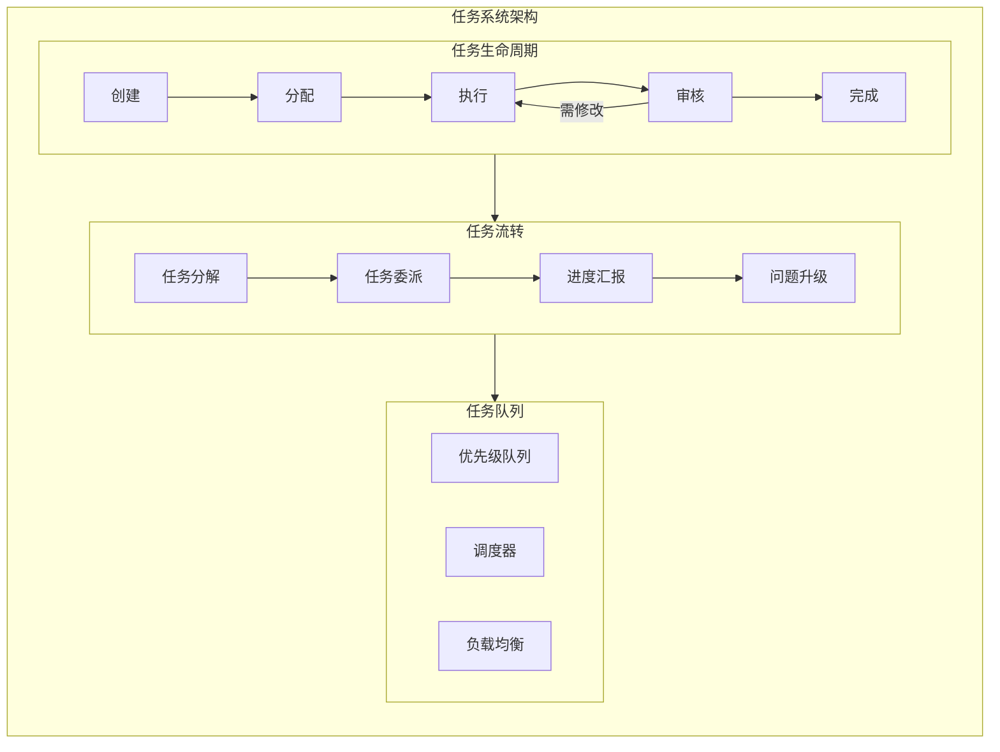

# BeesTown 任务系统架构设计

## 1. 概述

BeesTown 任务系统采用分层汇报机制，支持任务分解、动态分配、进度跟踪和自动化执行。



---

## 2. 任务模型

```typescript
interface Task {
  id: string;
  title: string;
  description: string;
  
  // 层级关系
  parentId?: string;           // 父任务ID
  subtasks: string[];          // 子任务IDs
  
  // 分配信息
  creatorId: string;           // 创建者
  assigneeId?: string;         // 执行者
  reviewerId?: string;         // 审核者
  
  // 状态
  status: TaskStatus;
  priority: TaskPriority;
  
  // 时间
  createdAt: number;
  startedAt?: number;
  deadline?: number;
  completedAt?: number;
  
  // 工作量
  estimatedHours?: number;
  actualHours?: number;
  
  // 关联
  projectId: string;
  relatedFiles: string[];
  relatedAgents: string[];
  
  // 结果
  result?: TaskResult;
  
  // 元数据
  tags: string[];
  metadata: Record<string, any>;
}

type TaskStatus = 
  | 'pending'      // 待处理
  | 'assigned'     // 已分配
  | 'in_progress'  // 进行中
  | 'reviewing'    // 审核中
  | 'completed'    // 已完成
  | 'cancelled'    // 已取消
  | 'blocked';     // 被阻塞

type TaskPriority = 'low' | 'medium' | 'high' | 'urgent';

interface TaskResult {
  success: boolean;
  output: any;
  summary: string;
  artifacts: string[];         // 产出物（文件等）
  metrics: {
    tokenUsed: number;
    timeSpent: number;
    filesModified: number;
  };
}
```

---

## 3. 任务流转机制

### 3.1 汇报链任务分配

```typescript
class TaskDelegationFlow {
  private storage: BeesTownStorage;
  private communicator: AgentCommunicator;

  // 创建任务并沿汇报链分配
  async createAndDelegate(taskInput: TaskInput): Promise<Task> {
    // 1. 创建任务
    const task = await this.createTask(taskInput);
    
    // 2. 确定汇报链
    const chain = await this.getReportingChain(taskInput.assigneeId);
    
    // 3. 沿汇报链分解任务
    let currentTask = task;
    for (let i = chain.length - 1; i >= 0; i--) {
      const manager = chain[i];
      
      // 上级审核并分解
      const subtasks = await this.decomposeTask(currentTask, manager);
      
      // 分配给下级
      if (i > 0) {
        const subordinate = chain[i - 1];
        for (const subtask of subtasks) {
          await this.assignTask(subtask, subordinate.id);
        }
      }
      
      currentTask = subtasks[0]; // 继续处理第一个子任务
    }

    return task;
  }

  // 获取汇报链
  private async getReportingChain(agentId: string): Promise<Agent[]> {
    const chain: Agent[] = [];
    let currentId = agentId;

    while (currentId) {
      const agent = await this.storage.getAgent(currentId);
      chain.push(agent);
      currentId = agent.reportsTo;
    }

    return chain.reverse(); // 从CEO到执行者
  }

  // 任务分解
  private async decomposeTask(task: Task, manager: Agent): Promise<Task[]> {
    // 使用 LLM 分析如何分解任务
    const decomposition = await manager.decomposeTask(task);
    
    const subtasks: Task[] = [];
    for (const item of decomposition.subtasks) {
      const subtask = await this.createTask({
        title: item.title,
        description: item.description,
        parentId: task.id,
        estimatedHours: item.estimatedHours,
        priority: item.priority
      });
      subtasks.push(subtask);
    }

    return subtasks;
  }

  // 进度汇报
  async reportProgress(taskId: string, progress: ProgressReport): Promise<void> {
    const task = await this.storage.getTask(taskId);
    const assignee = await this.storage.getAgent(task.assigneeId!);
    
    // 更新任务进度
    await this.storage.updateTask(taskId, {
      progress: progress.percentage,
      actualHours: progress.timeSpent
    });

    // 向直接上级汇报
    if (assignee.reportsTo) {
      await this.communicator.sendMessage(
        { agentId: assignee.reportsTo },
        `任务进度汇报: ${task.title}\n进度: ${progress.percentage}%\n${progress.summary}`,
        { type: 'progress_report', taskId }
      );
    }

    // 如果任务完成，触发审核流程
    if (progress.percentage === 100) {
      await this.initiateReview(task);
    }
  }

  // 审核流程
  private async initiateReview(task: Task): Promise<void> {
    await this.storage.updateTask(task.id, { status: 'reviewing' });
    
    // 通知审核者
    if (task.reviewerId) {
      await this.communicator.sendMessage(
        { agentId: task.reviewerId },
        `任务待审核: ${task.title}\n请审核任务完成质量。`,
        { type: 'review_request', taskId: task.id }
      );
    }
  }
}
```

---

## 4. 任务调度器

```typescript
class TaskScheduler {
  private queue: PriorityQueue<Task>;
  private storage: BeesTownStorage;

  // 添加任务到队列
  async enqueue(task: Task): Promise<void> {
    const priority = this.calculatePriority(task);
    this.queue.enqueue(task, priority);
    
    // 触发调度
    await this.schedule();
  }

  // 计算任务优先级
  private calculatePriority(task: Task): number {
    let score = 0;

    // 基础优先级
    const priorityWeights = { low: 1, medium: 2, high: 3, urgent: 5 };
    score += priorityWeights[task.priority] * 10;

    // 截止时间权重
    if (task.deadline) {
      const hoursUntilDeadline = (task.deadline - Date.now()) / (1000 * 60 * 60);
      if (hoursUntilDeadline < 24) score += 50;
      else if (hoursUntilDeadline < 72) score += 30;
      else if (hoursUntilDeadline < 168) score += 10;
    }

    // 任务层级权重（子任务优先级更高）
    if (task.parentId) {
      score += 5;
    }

    // 阻塞其他任务的数量
    const blockedTasks = this.getBlockedTasks(task.id);
    score += blockedTasks.length * 3;

    return score;
  }

  // 调度任务
  async schedule(): Promise<void> {
    const availableAgents = await this.getAvailableAgents();
    
    for (const agent of availableAgents) {
      if (this.queue.isEmpty()) break;
      
      // 找到最适合该Agent的任务
      const suitableTask = this.findSuitableTask(agent);
      if (suitableTask) {
        await this.assignTask(suitableTask, agent.id);
        this.queue.remove(suitableTask);
      }
    }
  }

  // 找到适合Agent的任务
  private findSuitableTask(agent: Agent): Task | null {
    const candidates = this.queue.peekMultiple(10);
    
    for (const task of candidates) {
      // 检查技能匹配
      const requiredSkills = this.extractRequiredSkills(task);
      const agentSkills = [...agent.shared.deptSkills, ...agent.personal.personalSkills];
      
      const hasAllSkills = requiredSkills.every(skill => 
        agentSkills.some(s => s.id === skill)
      );
      
      if (hasAllSkills) {
        return task;
      }
    }
    
    // 如果没有完全匹配的，返回优先级最高的
    return candidates[0] || null;
  }

  // 负载均衡
  async balanceWorkload(): Promise<void> {
    const agents = await this.storage.getActiveAgents();
    const workloads = await Promise.all(
      agents.map(async agent => ({
        agent,
        load: await this.calculateWorkload(agent.id)
      }))
    );

    // 找出负载过重和过轻的Agent
    const avgLoad = workloads.reduce((sum, w) => sum + w.load, 0) / workloads.length;
    const overloaded = workloads.filter(w => w.load > avgLoad * 1.5);
    const underloaded = workloads.filter(w => w.load < avgLoad * 0.5);

    // 重新分配任务
    for (const { agent: heavyAgent } of overloaded) {
      const tasks = await this.getAgentTasks(heavyAgent.id);
      const transferable = tasks.filter(t => t.status === 'pending');
      
      for (const task of transferable.slice(0, 2)) {
        const lightAgent = underloaded.find(w => 
          this.hasRequiredSkills(w.agent, task)
        );
        
        if (lightAgent) {
          await this.reassignTask(task, lightAgent.agent.id);
        }
      }
    }
  }
}
```

---

## 5. 任务执行引擎

```typescript
class TaskExecutionEngine {
  private agent: Agent;
  private tools: ToolRegistry;
  private memory: AgentMemory;

  async execute(task: Task): Promise<TaskResult> {
    // 1. 加载任务上下文
    const context = await this.loadTaskContext(task);
    
    // 2. 制定执行计划
    const plan = await this.createExecutionPlan(task, context);
    
    // 3. 执行计划
    const results: StepResult[] = [];
    for (const step of plan.steps) {
      const result = await this.executeStep(step, context);
      results.push(result);
      
      // 更新进度
      await this.reportProgress(task, results.length / plan.steps.length);
      
      if (!result.success) {
        // 处理失败
        const recovery = await this.handleFailure(step, result);
        if (!recovery.success) {
          return this.createFailureResult(task, results);
        }
      }
    }

    // 4. 汇总结果
    return this.createSuccessResult(task, results);
  }

  // 加载任务上下文
  private async loadTaskContext(task: Task): Promise<TaskContext> {
    // 获取相关记忆
    const memories = await this.memory.retrieve(task.description);
    
    // 获取相关文件
    const files = await Promise.all(
      task.relatedFiles.map(path => this.tools.execute('file_read', { path }))
    );

    // 获取相关Agent的信息
    const agents = await Promise.all(
      task.relatedAgents.map(id => this.storage.getAgent(id))
    );

    return {
      task,
      memories,
      files,
      agents,
      parentTask: task.parentId ? await this.storage.getTask(task.parentId) : null
    };
  }

  // 创建执行计划
  private async createExecutionPlan(task: Task, context: TaskContext): Promise<ExecutionPlan> {
    // 使用 LLM 制定计划
    const plan = await this.agent.planExecution(task, context);
    
    return {
      steps: plan.steps.map((step, idx) => ({
        id: `step-${idx}`,
        description: step.description,
        tool: step.tool,
        parameters: step.parameters,
        expectedOutput: step.expectedOutput,
        fallback: step.fallback
      })),
      estimatedDuration: plan.estimatedDuration,
      checkpoints: plan.checkpoints
    };
  }

  // 执行单个步骤
  private async executeStep(step: ExecutionStep, context: TaskContext): Promise<StepResult> {
    try {
      const result = await this.tools.execute(step.tool, step.parameters);
      
      return {
        stepId: step.id,
        success: true,
        output: result,
        timestamp: Date.now()
      };
    } catch (error) {
      return {
        stepId: step.id,
        success: false,
        error: error.message,
        timestamp: Date.now()
      };
    }
  }

  // 处理失败
  private async handleFailure(step: ExecutionStep, result: StepResult): Promise<RecoveryResult> {
    // 尝试备用方案
    if (step.fallback) {
      try {
        const fallbackResult = await this.tools.execute(
          step.fallback.tool,
          step.fallback.parameters
        );
        return { success: true, method: 'fallback', result: fallbackResult };
      } catch {
        // 备用方案也失败
      }
    }

    // 请求人工干预或升级
    await this.escalateIssue(step, result);
    
    return { success: false, reason: 'escalated' };
  }
}
```

---

## 6. 总结

BeesTown 任务系统的核心设计：

1. **层级汇报**：任务沿汇报链分解和分配
2. **智能调度**：优先级队列 + 负载均衡
3. **自动执行**：计划-执行-反馈循环
4. **容错机制**：失败恢复和问题升级
5. **进度透明**：实时进度汇报和审核
