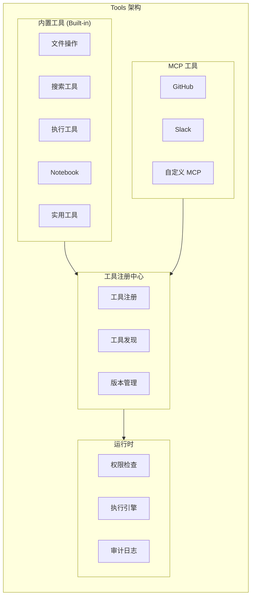

# BeesTown Tools 架构设计

## 1. 概述

Tools 是 Agent 执行具体任务的能力单元。BeesTown 采用分层工具架构，支持内置工具、MCP 工具和自定义工具三类。



---

## 2. 工具分类

### 2.1 三层工具架构

| 层级 | 类型 | 说明 | 示例 |
|------|------|------|------|
| **L1: 内置工具** | 核心能力 | 系统自带，所有 Agent 可用 | Read, Edit, Bash, Grep |
| **L2: MCP 工具** | 外部集成 | 通过 MCP 协议连接外部服务 | GitHub, Slack, Notion |
| **L3: 自定义工具** | 扩展能力 | 插件或项目特定工具 | 内部 API, 专用脚本 |

### 2.2 工具定义模型

```typescript
interface Tool {
  // 基础信息
  id: string;
  name: string;
  description: string;
  category: ToolCategory;
  
  // 类型
  type: 'builtin' | 'mcp' | 'custom';
  
  // 输入输出定义
  inputSchema: JSONSchema;
  outputSchema: JSONSchema;
  
  // 执行配置
  handler: ToolHandler;
  
  // 权限配置
  permissions: ToolPermissions;
  
  // 元数据
  version: string;
  author: string;
  tags: string[];
}

type ToolCategory = 
  | 'file'       // 文件操作
  | 'search'     // 搜索查询
  | 'execution'  // 命令执行
  | 'communication' // 通讯协作
  | 'data'       // 数据处理
  | 'analysis'   // 分析工具
  | 'utility';   // 实用工具

interface ToolPermissions {
  // 可用角色
  allowedRoles: string[];
  
  // 可用部门
  allowedDepartments: string[];
  
  // 最小层级
  minLevel: number;
  
  // 是否需要确认
  requireConfirmation: boolean;
  
  // 危险操作标记
  isDangerous: boolean;
  
  // 使用限制
  rateLimit: {
    maxCallsPerMinute: number;
    maxCallsPerHour: number;
  };
}
```

---

## 3. 内置工具集

### 3.1 文件操作类

#### Read - 读取文件
```typescript
{
  name: 'Read',
  category: 'file',
  description: '读取文件内容，支持文本、图片、PDF、Jupyter Notebook',
  
  inputSchema: {
    file_path: 'string',      // 文件路径
    offset: 'number?',        // 起始行号（1-based）
    limit: 'number?',         // 读取行数，默认 2000
    encoding: 'string?'       // 编码，默认 'utf-8'
  },
  
  outputSchema: {
    content: 'string',        // 文件内容
    total_lines: 'number',    // 总行数
    encoding: 'string',       // 实际编码
    truncated: 'boolean'      // 是否被截断
  },
  
  permissions: {
    requireConfirmation: false,
    isDangerous: false
  }
}
```

#### Edit - 编辑文件
```typescript
{
  name: 'Edit',
  category: 'file',
  description: '精准编辑文件内容，支持行级和块级修改',
  
  inputSchema: {
    file_path: 'string',
    old_string: 'string?',    // 搜索替换模式
    new_string: 'string?',
    start_line: 'number?',    // 行号模式
    end_line: 'number?',
    new_content: 'string?',
    preview: 'boolean?',      // 预览模式
    create_backup: 'boolean?' // 创建备份
  },
  
  permissions: {
    requireConfirmation: true,
    isDangerous: true,
    rateLimit: { maxCallsPerMinute: 30, maxCallsPerHour: 500 }
  }
}
```

#### Glob - 文件匹配
```typescript
{
  name: 'Glob',
  category: 'file',
  description: '按模式匹配查找文件',
  
  inputSchema: {
    pattern: 'string',        // 匹配模式，如 "src/**/*.ts"
    exclude: 'string[]?',     // 排除模式
    limit: 'number?'          // 最大返回数量
  },
  
  outputSchema: {
    files: 'string[]',        // 匹配的文件路径
    total: 'number'           // 总匹配数
  }
}
```

### 3.2 搜索类

#### Grep - 内容搜索
```typescript
{
  name: 'Grep',
  category: 'search',
  description: '基于 ripgrep 的内容搜索',
  
  inputSchema: {
    pattern: 'string',        // 搜索正则
    path: 'string?',          // 搜索路径
    include: 'string?',       // 包含文件模式
    exclude: 'string?',       // 排除文件模式
    context_lines: 'number?', // 上下文行数
    ignore_case: 'boolean?',  // 忽略大小写
    max_results: 'number?'    // 最大结果数
  },
  
  outputSchema: {
    matches: [{
      file: 'string',
      line: 'number',
      column: 'number',
      match: 'string',
      context: { before: 'string[]', after: 'string[]' }
    }],
    total: 'number'
  }
}
```

### 3.3 执行类

#### Bash - 终端命令
```typescript
{
  name: 'Bash',
  category: 'execution',
  description: '执行终端命令',
  
  inputSchema: {
    command: 'string',        // 要执行的命令
    working_dir: 'string?',   // 工作目录
    timeout: 'number?',       // 超时时间（秒）
    env: 'object?',           // 环境变量
    require_confirmation: 'boolean?'
  },
  
  outputSchema: {
    exit_code: 'number',
    stdout: 'string',
    stderr: 'string',
    duration: 'number'
  },
  
  permissions: {
    requireConfirmation: true,
    isDangerous: true,
    allowedRoles: ['developer', 'devops', 'architect']
  }
}
```

### 3.4 Notebook 类

#### NotebookRead / NotebookEdit
```typescript
{
  name: 'NotebookRead',
  category: 'data',
  description: '读取 Jupyter Notebook',
  
  inputSchema: {
    file_path: 'string'
  },
  
  outputSchema: {
    cells: [{
      type: "'code' | 'markdown'",
      source: 'string',
      outputs: 'any[]?',
      execution_count: 'number?'
    }],
    metadata: 'object'
  }
}
```

### 3.5 实用工具类

#### TodoWrite - 任务管理
```typescript
{
  name: 'TodoWrite',
  category: 'utility',
  description: '创建和管理任务清单',
  
  inputSchema: {
    operation: "'create' | 'update' | 'delete' | 'list'",
    todo: {
      title: 'string',
      description: 'string?',
      priority: "'low' | 'medium' | 'high' | 'urgent'",
      status: "'pending' | 'in_progress' | 'completed'",
      assignee: 'string?',
      deadline: 'number?',
      tags: 'string[]?'
    }
  }
}
```

---

## 4. 工具注册中心

### 4.1 工具注册

```typescript
class ToolRegistry {
  private tools: Map<string, Tool> = new Map();
  private builtinTools: Map<string, BuiltinTool> = new Map();
  private mcpTools: Map<string, MCPTool> = new Map();

  // 注册内置工具
  registerBuiltin(tool: BuiltinTool): void {
    this.builtinTools.set(tool.name, tool);
    this.tools.set(tool.name, {
      ...tool,
      type: 'builtin'
    });
  }

  // 注册 MCP 工具
  registerMCP(mcpName: string, tools: MCPTool[]): void {
    for (const tool of tools) {
      const fullName = `mcp:${mcpName}:${tool.name}`;
      this.mcpTools.set(fullName, tool);
      this.tools.set(fullName, {
        ...tool,
        type: 'mcp',
        mcpName
      });
    }
  }

  // 获取工具
  getTool(name: string): Tool | undefined {
    return this.tools.get(name);
  }

  // 列出所有可用工具
  listTools(filter?: ToolFilter): Tool[] {
    const tools = Array.from(this.tools.values());
    
    if (filter?.category) {
      return tools.filter(t => t.category === filter.category);
    }
    
    if (filter?.type) {
      return tools.filter(t => t.type === filter.type);
    }
    
    return tools;
  }

  // 获取工具描述（用于 LLM）
  getToolDescriptions(): ToolDescription[] {
    return Array.from(this.tools.values()).map(tool => ({
      name: tool.name,
      description: tool.description,
      parameters: tool.inputSchema
    }));
  }
}
```

### 4.2 工具发现

```typescript
class ToolDiscovery {
  private registry: ToolRegistry;

  // 为 Agent 发现可用工具
  async discoverToolsForAgent(agentId: string): Promise<Tool[]> {
    const agent = await this.getAgent(agentId);
    const allTools = this.registry.listTools();

    return allTools.filter(tool => 
      this.isToolAvailableToAgent(tool, agent)
    );
  }

  // 检查 Agent 是否可用某工具
  private isToolAvailableToAgent(tool: Tool, agent: Agent): boolean {
    const perm = tool.permissions;

    // 检查角色
    if (perm.allowedRoles.length > 0) {
      if (!perm.allowedRoles.includes(agent.role)) {
        return false;
      }
    }

    // 检查部门
    if (perm.allowedDepartments.length > 0) {
      if (!perm.allowedDepartments.includes(agent.departmentId)) {
        return false;
      }
    }

    // 检查层级
    if (agent.level < perm.minLevel) {
      return false;
    }

    return true;
  }
}
```

---

## 5. 工具执行引擎

### 5.1 执行流程

```typescript
class ToolExecutionEngine {
  private registry: ToolRegistry;
  private permissionManager: ToolPermissionManager;
  private auditLogger: ToolAuditLogger;

  async execute(
    agentId: string,
    toolName: string,
    params: any,
    context: ExecutionContext
  ): Promise<ToolResult> {
    // 1. 获取工具
    const tool = this.registry.getTool(toolName);
    if (!tool) {
      throw new ToolNotFoundError(toolName);
    }

    // 2. 权限检查
    const agent = await this.getAgent(agentId);
    const permission = await this.permissionManager.checkPermission(
      agent, tool, params
    );
    
    if (!permission.allowed) {
      throw new PermissionDeniedError(permission.reason);
    }

    // 3. 危险操作确认
    if (tool.permissions.requireConfirmation || permission.requiresConfirmation) {
      const confirmed = await this.requestConfirmation(agent, tool, params);
      if (!confirmed) {
        throw new ExecutionCancelledError();
      }
    }

    // 4. 记录审计日志
    const executionId = generateId();
    await this.auditLogger.logStart({
      id: executionId,
      agentId,
      toolName,
      params: this.sanitizeParams(params),
      timestamp: Date.now()
    });

    // 5. 执行工具
    const startTime = Date.now();
    try {
      const result = await this.invokeTool(tool, params, context);
      
      // 6. 记录成功
      await this.auditLogger.logSuccess({
        id: executionId,
        duration: Date.now() - startTime,
        result: this.truncateResult(result),
        timestamp: Date.now()
      });

      return result;
    } catch (error) {
      // 7. 记录失败
      await this.auditLogger.logFailure({
        id: executionId,
        duration: Date.now() - startTime,
        error: error.message,
        timestamp: Date.now()
      });
      throw error;
    }
  }

  private async invokeTool(
    tool: Tool,
    params: any,
    context: ExecutionContext
  ): Promise<any> {
    switch (tool.type) {
      case 'builtin':
        return await this.invokeBuiltinTool(tool, params, context);
      case 'mcp':
        return await this.invokeMCPTool(tool, params, context);
      case 'custom':
        return await this.invokeCustomTool(tool, params, context);
      default:
        throw new Error(`Unknown tool type: ${tool.type}`);
    }
  }

  private async invokeBuiltinTool(
    tool: Tool,
    params: any,
    context: ExecutionContext
  ): Promise<any> {
    const builtin = this.registry.getBuiltinTool(tool.name);
    return await builtin.handler(params, context);
  }

  private async invokeMCPTool(
    tool: Tool,
    params: any,
    context: ExecutionContext
  ): Promise<any> {
    const mcpClient = await this.getMCPClient(tool.mcpName!);
    return await mcpClient.callTool(tool.name, params);
  }
}
```

### 5.2 工具权限管理

```typescript
class ToolPermissionManager {
  async checkPermission(
    agent: Agent,
    tool: Tool,
    params: any
  ): Promise<PermissionCheckResult> {
    const perm = tool.permissions;

    // 1. 角色检查
    if (perm.allowedRoles.length > 0) {
      if (!perm.allowedRoles.includes(agent.role)) {
        return {
          allowed: false,
          reason: `Role ${agent.role} not in allowed roles`
        };
      }
    }

    // 2. 部门检查
    if (perm.allowedDepartments.length > 0) {
      if (!perm.allowedDepartments.includes(agent.departmentId)) {
        return {
          allowed: false,
          reason: `Department ${agent.departmentId} not allowed`
        };
      }
    }

    // 3. 层级检查
    if (agent.level < perm.minLevel) {
      return {
        allowed: false,
        reason: `Level ${agent.level} below minimum ${perm.minLevel}`
      };
    }

    // 4. 速率限制检查
    const rateCheck = await this.checkRateLimit(agent.id, tool.name, perm.rateLimit);
    if (!rateCheck.allowed) {
      return rateCheck;
    }

    // 5. 资源访问检查
    if (params.file_path || params.path) {
      const resourceCheck = await this.checkResourceAccess(
        agent,
        params.file_path || params.path
      );
      if (!resourceCheck.allowed) {
        return resourceCheck;
      }
    }

    return {
      allowed: true,
      requiresConfirmation: perm.requireConfirmation || perm.isDangerous
    };
  }

  private async checkRateLimit(
    agentId: string,
    toolName: string,
    limit: RateLimit
  ): Promise<PermissionCheckResult> {
    const usage = await this.getRecentUsage(agentId, toolName, '1 hour');
    
    if (usage.count >= limit.maxCallsPerHour) {
      return {
        allowed: false,
        reason: `Rate limit exceeded: ${limit.maxCallsPerHour} calls per hour`
      };
    }

    const recentUsage = await this.getRecentUsage(agentId, toolName, '1 minute');
    if (recentUsage.count >= limit.maxCallsPerMinute) {
      return {
        allowed: false,
        reason: `Rate limit exceeded: ${limit.maxCallsPerMinute} calls per minute`
      };
    }

    return { allowed: true };
  }
}
```

---

## 6. 工具与 Agent 的关系

```mermaid
graph TB
    subgraph Relationship["Tools 与 Agent 的关系"]
        Agent["Agent"]
        
        subgraph ToolSources["工具来源"]
            PersonalTools["个人工具"]
            DeptTools["部门共享工具"]
            Builtin["系统内置"]
            MCP["MCP 连接"]
        end
        
        subgraph Execution["执行流程"]
            Discovery["工具发现"]
            Permission["权限检查"]
            Execution["工具执行"]
        end
    end

    Agent --> PersonalTools
    Agent --> DeptTools
    Agent --> Builtin
    Agent --> MCP
    
    PersonalTools --> Discovery
    DeptTools --> Discovery
    Builtin --> Discovery
    MCP --> Discovery
    
    Discovery --> Permission
    Permission --> Execution
```

---

## 7. 总结

BeesTown Tools 架构的核心设计：

1. **三层架构**：内置工具 + MCP 工具 + 自定义工具
2. **统一接口**：所有工具遵循相同的输入输出规范
3. **权限控制**：基于角色、部门、层级的细粒度控制
4. **安全机制**：危险操作确认、速率限制、审计日志
5. **动态发现**：Agent 自动发现可用的工具集
6. **分层继承**：个人工具覆盖部门工具，部门工具覆盖系统默认
