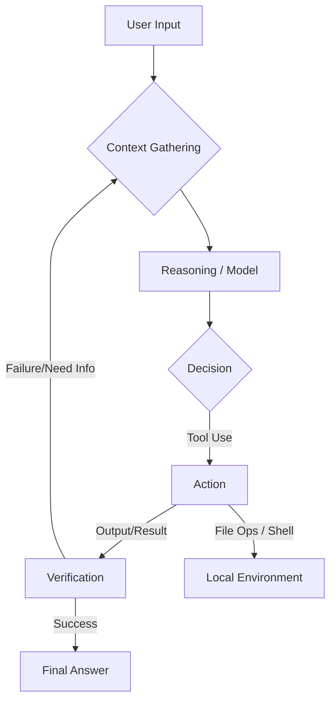

# Claude Code Architecture

## 1. Overview
Claude Code is an agentic coding assistant designed to run directly in the terminal. Unlike traditional IDE extensions that primarily offer code completion, Claude Code operates as an **autonomous agent** capable of understanding context, executing commands, and managing complex workflows through a "human-in-the-loop" approach.

## 2. Core Architecture: The Agentic Loop
At the heart of Claude Code is the **Agentic Loop**, which allows the system to iteratively solve problems rather than just providing a single-shot answer.

*   **Gather Context**: Analyzes file structure, reads code, and checks git status.
*   **Reasoning**: The LLM (Claude 3.5 Sonnet/Opus) determines the next best step.
*   **Action**: Executes local tools (edit files, run tests, install packages).
*   **Verify**: Reads command outputs to ensure success, auto-correcting if errors occur.

## 3. Technology Stack
Claude Code is built with a modern, performance-oriented stack designed for CLI experiences:

*   **Runtime**: **Bun** (High-performance JavaScript runtime).
*   **Language**: **TypeScript**.
*   **UI Framework**: **React** (via **Ink** for terminal rendering).
*   **Layout Engine**: **Yoga** (Flexbox layout for the terminal).
*   **Integration**: Deep integration with the host OS shell (Bash, Zsh, PowerShell).

## 4. Key Components

### 4.1. Models (The Brain)
*   **Claude 3.5 Sonnet**: The workhorse model, balanced for speed and coding capability. Handles most read/write/refactor tasks.
*   **Claude 3 Opus**: Utilized for high-level architectural reasoning and complex problem-solving.

### 4.2. Tooling Layer (The Hands)
Claude Code interfaces with the local machine through a set of privileged tools:
*   **File Operations**: `Read`, `Edit`, `Create`, `LS`, `Grep`.
*   **Execution**: `RunCommand` (Shell access for builds, tests, git).
*   **Code Intelligence**: LSP integration for finding definitions and references.
*   **Web**: Search capabilities to fetch documentation or debug errors.

### 4.3. Context Management
*   **Smart Context Window**: Automatically manages token usage by summarizing past interactions and truncating non-essential tool outputs.
*   **`CLAUDE.md`**: A project-specific configuration file that serves as "long-term memory" for project conventions, architecture notes, and build instructions.

### 4.4. Extensibility
*   **MCP (Model Context Protocol)**: Connects to external data sources (GitHub, Linear, Slack, databases).
*   **Subagents**: Spawns specialized sub-processes for parallelizable or isolated tasks.

## 5. Security & Permissions
*   **Human-in-the-loop**: Critical commands (like file deletion or deploying) often require explicit user approval.
*   **Permission Scoping**: Configurable permissions for read/write access to specific directories.
