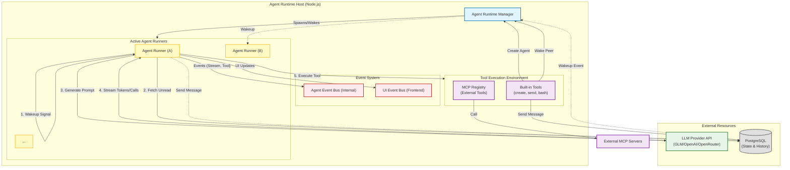
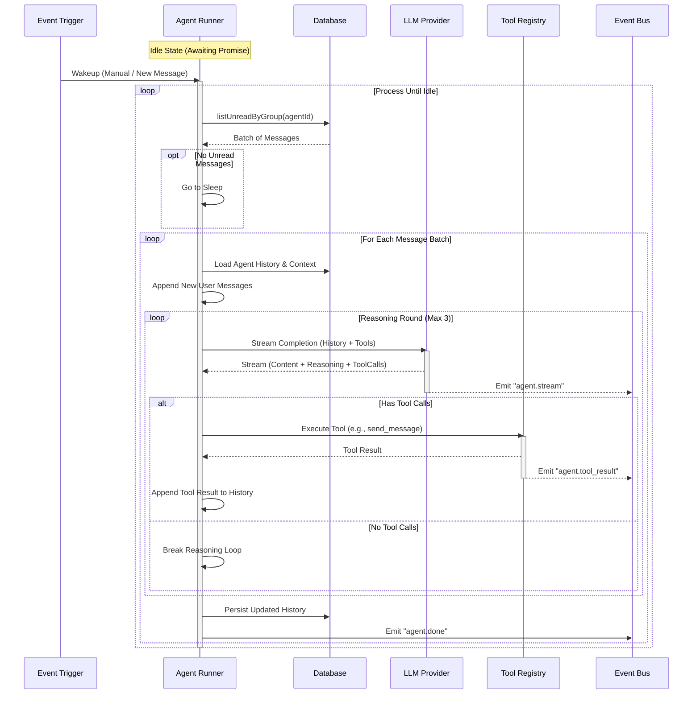

# Agent Cluster Architecture

This document details the internal architecture of the Agent Swarm (Cluster) system.

## Core Concepts

The system follows a **Multi-Agent System (MAS)** architecture where each agent operates as an independent "process" (Runner) managed by a central Runtime. Agents communicate exclusively through message passing (IM paradigm) and share a common persistent storage.

## Detailed Agent Lifecycle (The Loop)

Each Agent Runner executes a continuous event loop designed to be stateless between wakeups but stateful during execution (via DB history).

## Key Mechanisms

### 1. The Wakeup Mechanism
Agents are **reactive**. They do not run in the background unless triggered.
- **Triggers**:
  - `manual`: Admin/User manually wakes an agent.
  - `group_message`: Receiving a message in a group.
  - `direct_message`: Receiving a DM.
- **Process**: When Agent A sends a message to Agent B, the `send` tool implementation explicitly calls `runtime.wakeAgent(B)`.

### 2. Tool-Use & Delegation
The swarm capabilities come from the built-in tools:
- **`create(role, guidance)`**: Spawns a new sub-agent. The runtime immediately instantiates a runner for it.
- **`send(to, content)`**: Direct P2P communication.
- **`send_group_message(groupId, content)`**: Broadcast communication.
- **`bash(command)`**: Ability to interact with the host system (files, git, etc.).

### 3. State Management
- **LLM History**: Stored as a JSON blob in the `agents` table. Includes System prompt, User messages, Assistant replies, and Tool outputs.
- **Context Window**: Managed by `drizzle-orm` and raw JSON manipulation.
- **Short-term Memory**: In-memory `HistoryMessage[]` array during the runner loop.
- **Long-term Memory**: Persisted to Postgres.

### 4. Event Bus
- **AgentEventBus**: High-frequency internal events (token streaming, tool status). Used for real-time logs.
- **UIBus**: Lower-frequency events for the frontend (new message, agent created).
