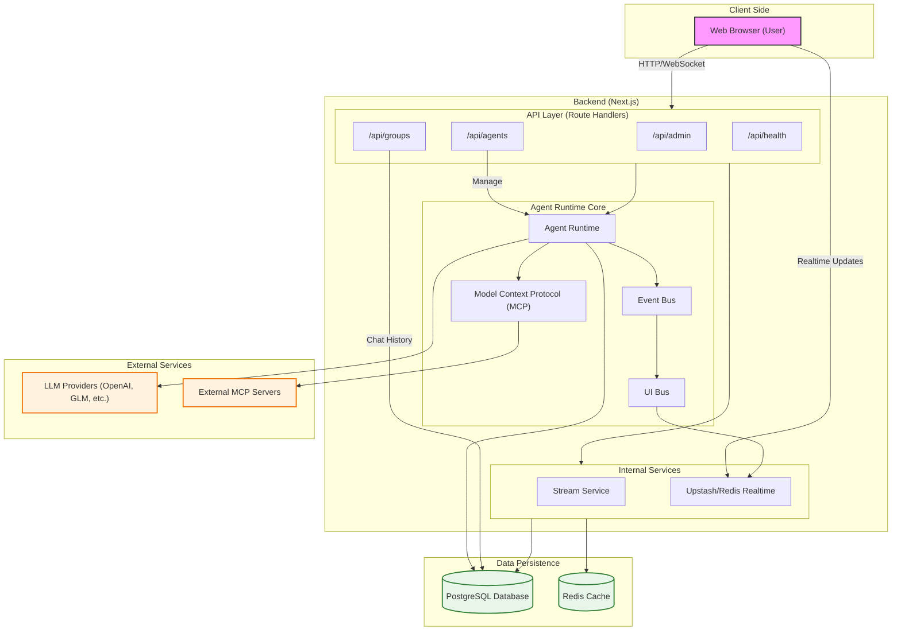

# System Architecture

This document describes the high-level architecture of the Swarm IDE project.

## Overview

The system is built primarily on a **Next.js** full-stack architecture, integrating an AI Agent Runtime, Real-time communication, and a relational database.

## Component Details

### 1. Client Side
- **Web Browser**: The user interface, built with React and Tailwind CSS.
- **Features**: 
  - IM Interface (`/app/im`) for chatting with agents.
  - Graph View (`/app/graph`) for visualizing agent relationships.
  - Admin controls.

### 2. Backend (Next.js)
- **API Layer**: Handles HTTP requests for managing agents, groups, and messages.
- **Agent Runtime**: The core brain.
  - Manages agent lifecycles.
  - Handles context and history (`llm_history`).
  - Integrates with MCP for tools and context.
- **Event Bus**: Decouples components, allowing asynchronous communication.
- **Realtime Service**: Pushes updates to the client (e.g., new messages, agent status) using Redis/Upstash.

### 3. Data Persistence
- **PostgreSQL**: Stores persistent data using Drizzle ORM.
  - `workspaces`: Projects/Tenants.
  - `agents`: AI entities.
  - `groups` & `messages`: Chat data.
- **Redis**: Used for caching and real-time pub/sub.

### 4. External Integrations
- **LLM Providers**: The actual intelligence behind agents (e.g., GPT-4, GLM).
- **MCP Servers**: Provides external tools and data context to agents via the Model Context Protocol.

## Directory Structure Mapping

- **`backend/app/api`**: API Layer.
- **`backend/src/runtime`**: Runtime Core (`agent-runtime.ts`, `event-bus.ts`).
- **`backend/src/db`**: Database configuration and schema.
- **`backend/src/lib`**: Utility libraries (LLM streams, storage).
